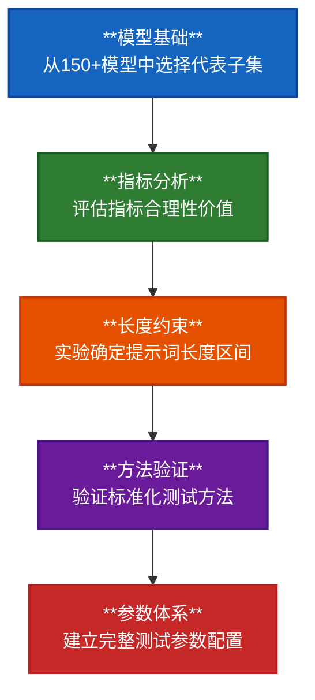

# EAO基准测试项目预备阶段任务规划

## 一、总体目标

为端侧LLM推理性能数学建模建立科学、系统的测试基础，通过5步递进式论证确定完整的基准测试体系。

## 二、工作逻辑

### 2.1 科学递进原则

### 2.2 依赖关系

每步工作为后续步骤提供基础约束：
- **1号报告** → 为所有报告提供模型基础
- **2号报告** → 为3-5号报告提供指标合理性基础
- **3号报告** → 为4号报告提供长度约束
- **4号报告** → 为5号报告提供方法保障
- **5号报告** → 整合全部结论，完成预备阶段

## 三、五步任务分解

### 第1步：模型基础建立
- **任务**：从150+模型中选择代表性子集
- **输出**：1号报告 - 基准测试大模型集选用合理性分析
- **价值**：为后续所有测试提供模型基础

### 第2步：指标体系分析
- **任务**：分析MNN_LLM_Benchmark四项性能指标(pp、tg、pp+tg、执行时间)合理性
- **输出**：2号报告 - 基准测试性能指标合理性分析
- **价值**：为后续测试提供指标合理性基础和评价维度

### 第3步：长度约束验证
- **任务**：实验选定稳定且高效的提示词长度区间
- **输出**：3号报告 - 基准测试提示词长度选定合理性分析
- **价值**：平衡稳定性与效率，为方法验证提供约束

### 第4步：测试方法验证
- **任务**：验证llama.cpp固定提示词模式的适用性
- **输出**：4号报告 - llama.cpp固定提示词模式可行性论证
- **价值**：建立标准化测试方法

### 第5步：参数体系整合
- **任务**：整合前序结论，排除无意义参数，建立完整体系
- **输出**：5号报告 - 基准测试变量参数集选定合理性分析
- **价值**：为初测、详测、硅前阶段提供完整测试基础

## 四、完成标志

- **科学基础建立**：5个分析报告全部完成
- **逻辑链条完整**：递进依赖关系清晰验证
- **测试体系确定**：为后续阶段提供完整基础
- **预备阶段验收**：进入初测阶段

---

**核心价值**：为端侧LLM推理性能数学模型建立科学、可靠、高效的基准测试基础