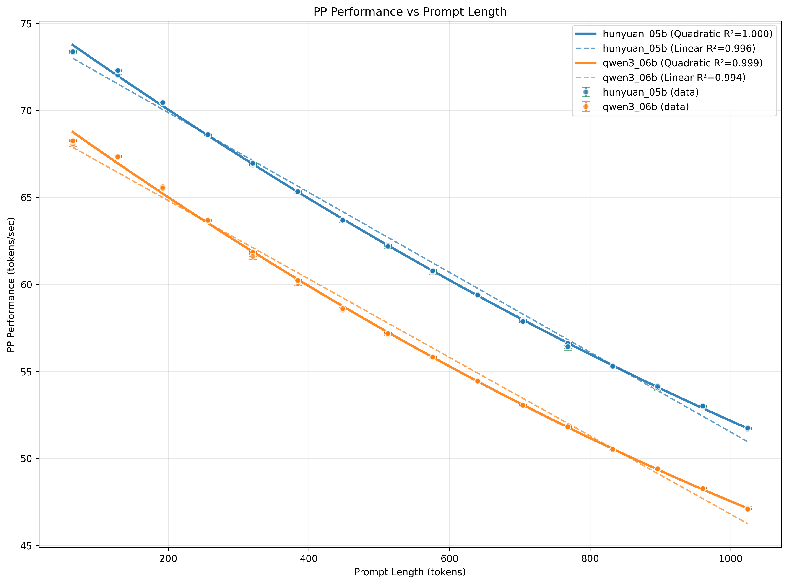
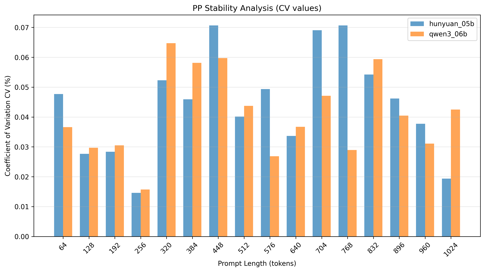
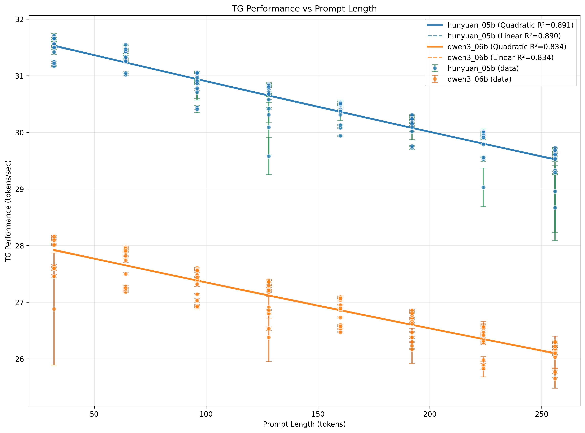
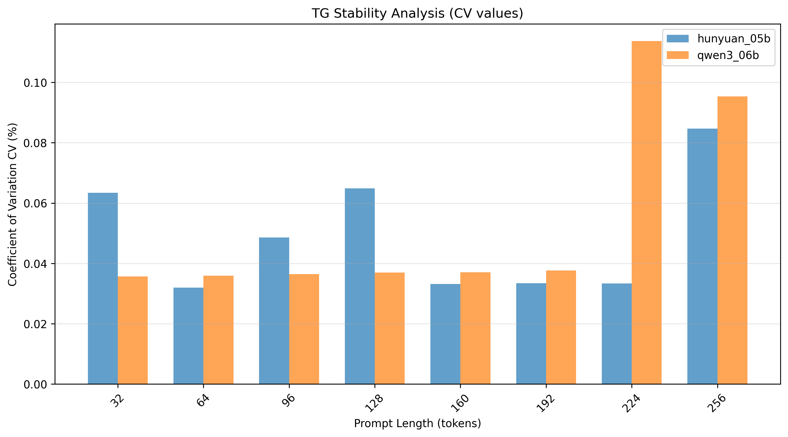

# EAO初测结果数据报告

## 基本信息
生成时间: 2025年11月28日 15:44:53
数据来源: benchmark_results.db

---

## PP(Prefill阶段)数据结果

### hunyuan_05b

#### 基础统计数据
- 数据点: 128
- 提示词长度范围: 64 - 1024 tokens
- 性能值范围: 51.67 - 73.43 tokens/sec
- CV值:
  - 平均: 0.052%
  - 最小: 0.014%
  - 最大: 0.319%

#### 回归分析结果
- 线性回归: y = -0.0230x + 74.4546 (R²=0.9958)
- 二次回归: y = 0.000005x² + -0.0288x + 75.5719 (R²=0.9996)
- 最佳模型: quadratic (R²=0.9996)
- 线性回归斜率: -0.0230

### qwen3_06b

#### 基础统计数据
- 数据点: 128
- 提示词长度范围: 64 - 1024 tokens
- 性能值范围: 47.06 - 68.28 tokens/sec
- CV值:
  - 平均: 0.048%
  - 最小: 0.000%
  - 最大: 0.276%

#### 回归分析结果
- 线性回归: y = -0.0225x + 69.3122 (R²=0.9940)
- 二次回归: y = 0.000006x² + -0.0292x + 70.5931 (R²=0.9991)
- 最佳模型: quadratic (R²=0.9991)
- 线性回归斜率: -0.0225

---

## TG(Decode阶段)数据结果

### hunyuan_05b

#### 基础统计数据
- 数据点: 128
- 提示词长度范围: 32 - 256 tokens
- 性能值范围: 28.67 - 31.71 tokens/sec
- CV值:
  - 平均: 0.151%
  - 最小: 0.000%
  - 最大: 2.521%

#### 回归分析结果
- 线性回归: y = -0.0090x + 31.8068 (R²=0.8905)
- 二次回归: y = 0.000002x² + -0.0095x + 31.8361 (R²=0.8907)
- 最佳模型: quadratic (R²=0.8907)
- 线性回归斜率: -0.0090

### qwen3_06b

#### 基础统计数据
- 数据点: 128
- 提示词长度范围: 32 - 256 tokens
- 性能值范围: 25.65 - 28.17 tokens/sec
- CV值:
  - 平均: 0.146%
  - 最小: 0.000%
  - 最大: 3.683%

#### 回归分析结果
- 线性回归: y = -0.0081x + 28.1705 (R²=0.8337)
- 二次回归: y = 0.000002x² + -0.0087x + 28.2014 (R²=0.8339)
- 最佳模型: quadratic (R²=0.8339)
- 线性回归斜率: -0.0081

---

## 数据汇总表

| 指标 | PP | TG |
|------|----|----|
| 平均CV | 0.052% | 0.151% |

数据处理完成