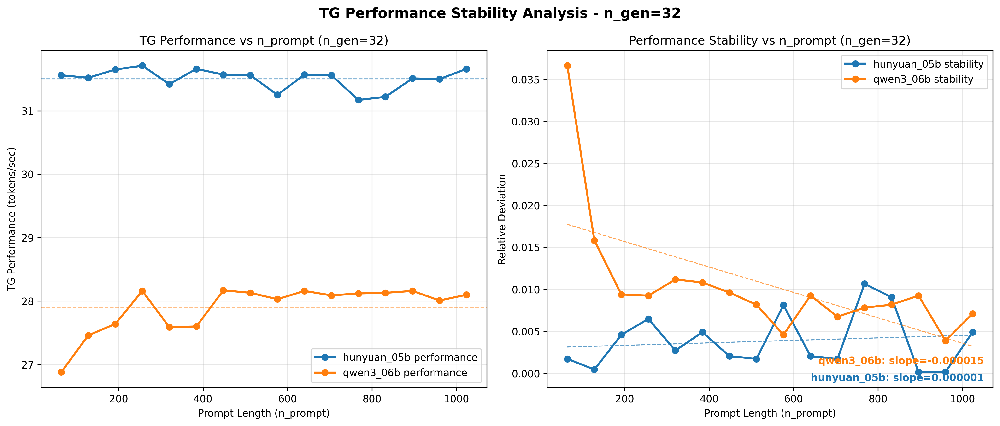
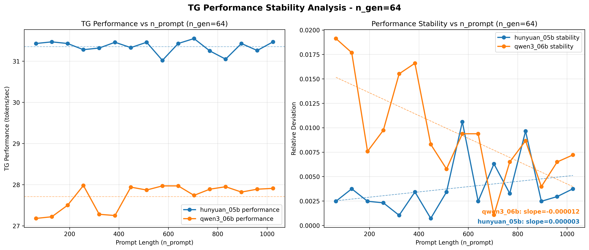
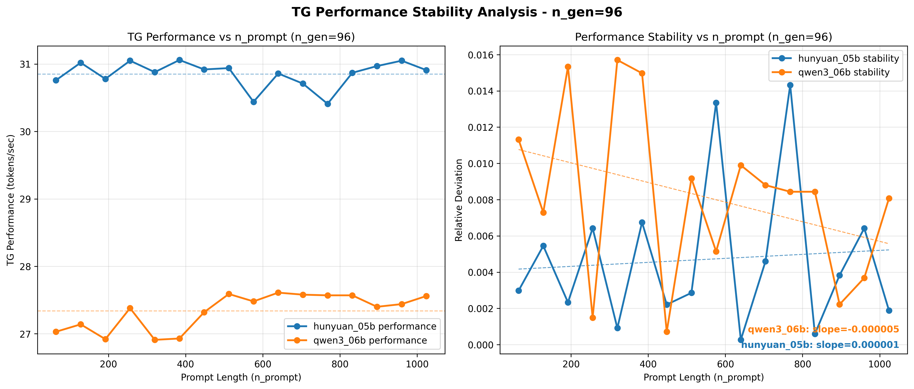
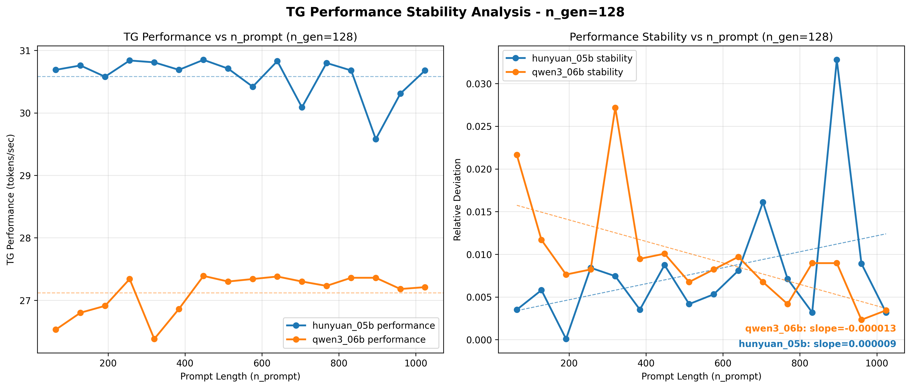
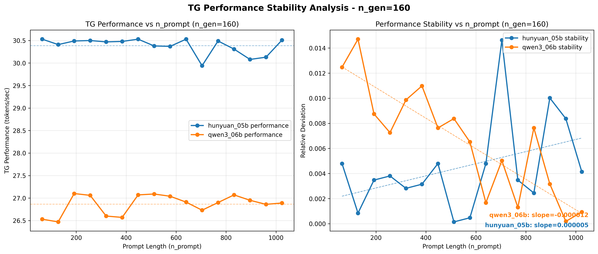
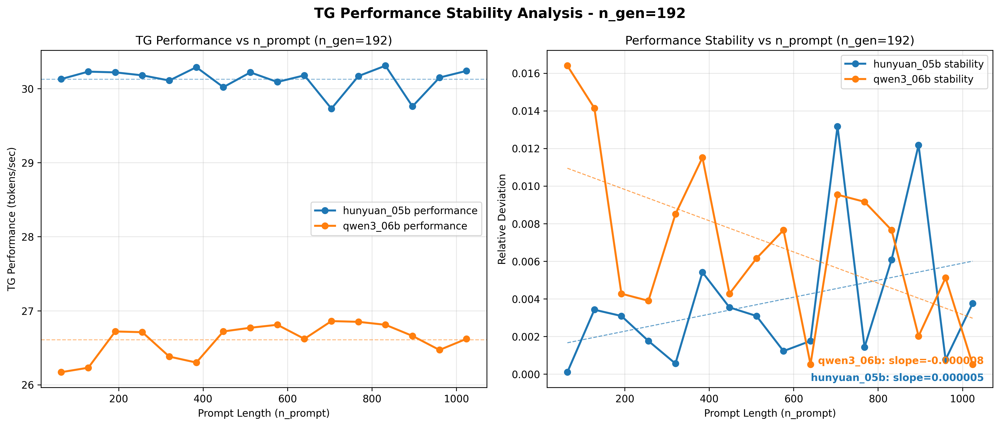
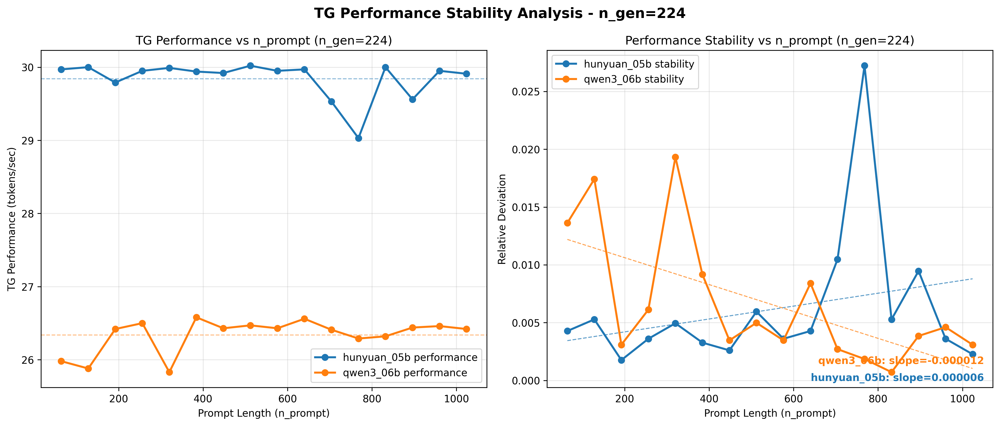
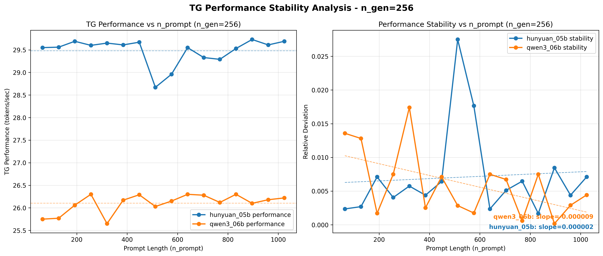

# TG性能稳定性分析报告

## 总览

- **总记录数**: 256
- **测试模型**: hunyuan_05b, qwen3_06b
- **提示词长度范围**: 64 - 1024
- **生成长度范围**: 32 - 256

## hunyuan_05b - 稳定性分析

### 汇总表格

| 生成长度 | 稳定性斜率 | R²值 | 起始偏离度 | 结束偏离度 |
|---------|--------------|-----|------------|------------|
| 32 | +0.000001 | 0.0189 | 0.0017 | 0.0049 |
| 64 | +0.000003 | 0.0883 | 0.0025 | 0.0037 |
| 96 | +0.000001 | 0.0066 | 0.0030 | 0.0019 |
| 128 | +0.000009 | 0.1426 | 0.0035 | 0.0032 |
| 160 | +0.000005 | 0.1557 | 0.0048 | 0.0041 |
| 192 | +0.000005 | 0.1288 | 0.0001 | 0.0038 |
| 224 | +0.000006 | 0.0775 | 0.0043 | 0.0023 |
| 256 | +0.000002 | 0.0061 | 0.0024 | 0.0071 |

### 分析图表

#### 生成长度 = 32

#### 生成长度 = 64

#### 生成长度 = 96

#### 生成长度 = 128

#### 生成长度 = 160

#### 生成长度 = 192

#### 生成长度 = 224

#### 生成长度 = 256

## qwen3_06b - 稳定性分析

### 汇总表格

| 生成长度 | 稳定性斜率 | R²值 | 起始偏离度 | 结束偏离度 |
|---------|--------------|-----|------------|------------|
| 32 | -0.000015 | 0.3788 | 0.0366 | 0.0071 |
| 64 | -0.000012 | 0.4845 | 0.0191 | 0.0072 |
| 96 | -0.000005 | 0.1220 | 0.0113 | 0.0081 |
| 128 | -0.000013 | 0.3656 | 0.0216 | 0.0034 |
| 160 | -0.000012 | 0.7354 | 0.0125 | 0.0009 |
| 192 | -0.000008 | 0.3085 | 0.0164 | 0.0005 |
| 224 | -0.000012 | 0.4017 | 0.0136 | 0.0031 |
| 256 | -0.000009 | 0.2814 | 0.0136 | 0.0044 |

### 分析图表

#### 生成长度 = 32

#### 生成长度 = 64

#### 生成长度 = 96

#### 生成长度 = 128

#### 生成长度 = 160

#### 生成长度 = 192

#### 生成长度 = 224

#### 生成长度 = 256

## 汇总图表

## 原始数据概览

### 数据样本 (前20条记录)

| 模型名称 | 提示词长度 | 生成长度 | TG性能(tokens/sec) | 标准差 |
|---------|----------|-------|------------------|---------|
| hunyuan_05b | 64 | 32 | 31.5600 | 0.0400 |
| hunyuan_05b | 64 | 64 | 31.4300 | 0.0100 |
| hunyuan_05b | 64 | 96 | 30.7600 | 0.0200 |
| hunyuan_05b | 64 | 128 | 30.6900 | 0.0000 |
| hunyuan_05b | 64 | 160 | 30.5300 | 0.0100 |
| hunyuan_05b | 64 | 192 | 30.1300 | 0.1100 |
| hunyuan_05b | 64 | 224 | 29.9700 | 0.0100 |
| hunyuan_05b | 64 | 256 | 29.5500 | 0.0600 |
| hunyuan_05b | 128 | 32 | 31.5200 | 0.0100 |
| hunyuan_05b | 128 | 64 | 31.4700 | 0.0100 |
| hunyuan_05b | 128 | 96 | 31.0200 | 0.0600 |
| hunyuan_05b | 128 | 128 | 30.7600 | 0.1200 |
| hunyuan_05b | 128 | 160 | 30.4100 | 0.0000 |
| hunyuan_05b | 128 | 192 | 30.2300 | 0.0000 |
| hunyuan_05b | 128 | 224 | 30.0000 | 0.0600 |
| hunyuan_05b | 128 | 256 | 29.5600 | 0.0000 |
| hunyuan_05b | 192 | 32 | 31.6500 | 0.0200 |
| hunyuan_05b | 192 | 64 | 31.4300 | 0.0400 |
| hunyuan_05b | 192 | 96 | 30.7800 | 0.1800 |
| hunyuan_05b | 192 | 128 | 30.5800 | 0.0500 |

### 性能统计

#### hunyuan_05b

- **记录数**: 128 条
- **性能范围**: 28.6700 - 31.7100 tokens/sec
- **平均性能**: 30.5159 tokens/sec
- **标准差**: 0.6993

#### qwen3_06b

- **记录数**: 128 条
- **性能范围**: 25.6500 - 28.1700 tokens/sec
- **平均性能**: 26.9978 tokens/sec
- **标准差**: 0.6565
