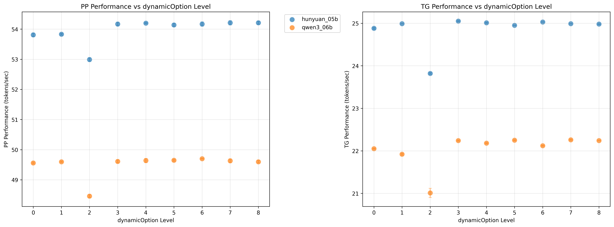
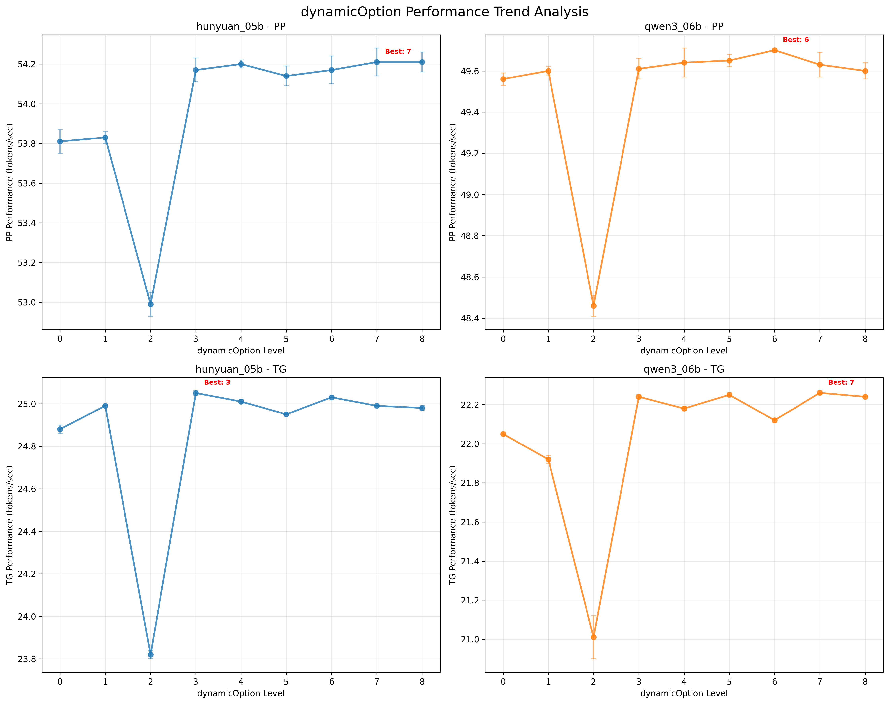
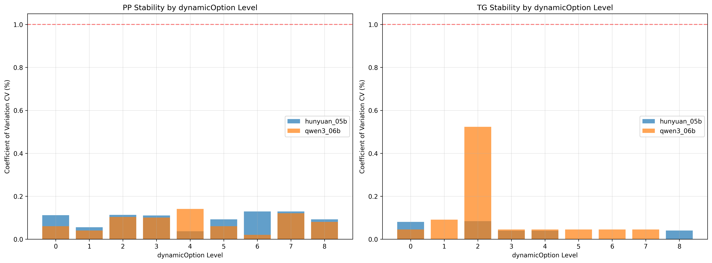

# dynamicOption参数影响分析报告

## 基本信息
生成时间: 2025年11月28日 15:30:24
数据来源: benchmark_results.db
分析范围: dynamic_option_effect_t1 test suite
参数范围: dynamicOption 0-8 (共9个级别)

---

## 分析结果

### hunyuan_05b

#### PP 结果
- 数据点数: 9
- dynamicOption范围: 0 - 8
- 性能范围: 52.99 - 54.21 tokens/sec
- 平均性能: 53.97 ± 0.40 tokens/sec
- 性能变化范围: 1.22 tokens/sec
- 最大性能变化百分比: 2.26%
- CV值范围: 0.037% - 0.129% (平均: 0.097%)
- 最优设置: dynamicOption=7, 性能=54.21 tokens/sec
- 最差设置: dynamicOption=2, 性能=52.99 tokens/sec
- 性能提升潜在: 1.22 tokens/sec

#### TG 结果
- 数据点数: 9
- dynamicOption范围: 0 - 8
- 性能范围: 23.82 - 25.05 tokens/sec
- 平均性能: 24.86 ± 0.39 tokens/sec
- 性能变化范围: 1.23 tokens/sec
- 最大性能变化百分比: 4.95%
- CV值范围: 0.000% - 0.084% (平均: 0.032%)
- 最优设置: dynamicOption=3, 性能=25.05 tokens/sec
- 最差设置: dynamicOption=2, 性能=23.82 tokens/sec
- 性能提升潜在: 1.23 tokens/sec

---

### qwen3_06b

#### PP 结果
- 数据点数: 9
- dynamicOption范围: 0 - 8
- 性能范围: 48.46 - 49.70 tokens/sec
- 平均性能: 49.49 ± 0.39 tokens/sec
- 性能变化范围: 1.24 tokens/sec
- 最大性能变化百分比: 2.51%
- CV值范围: 0.020% - 0.141% (平均: 0.081%)
- 最优设置: dynamicOption=6, 性能=49.70 tokens/sec
- 最差设置: dynamicOption=2, 性能=48.46 tokens/sec
- 性能提升潜在: 1.24 tokens/sec

#### TG 结果
- 数据点数: 9
- dynamicOption范围: 0 - 8
- 性能范围: 21.01 - 22.26 tokens/sec
- 平均性能: 22.03 ± 0.40 tokens/sec
- 性能变化范围: 1.25 tokens/sec
- 最大性能变化百分比: 5.67%
- CV值范围: 0.000% - 0.524% (平均: 0.098%)
- 最优设置: dynamicOption=7, 性能=22.26 tokens/sec
- 最差设置: dynamicOption=2, 性能=21.01 tokens/sec
- 性能提升潜在: 1.25 tokens/sec

---

## dynamicOption优化建议

| 模型 | PP最优设置 | TG最优设置 | PP性能范围 | TG性能范围 |
|------|------------|------------|------------|------------|
| hunyuan_05b | Level 7 | Level 3 | 53.0-54.2 | 23.8-25.1 |
| qwen3_06b | Level 6 | Level 7 | 48.5-49.7 | 21.0-22.3 |

