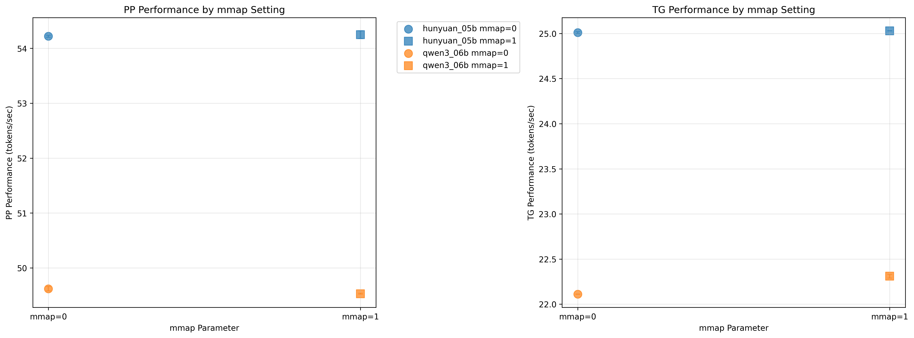
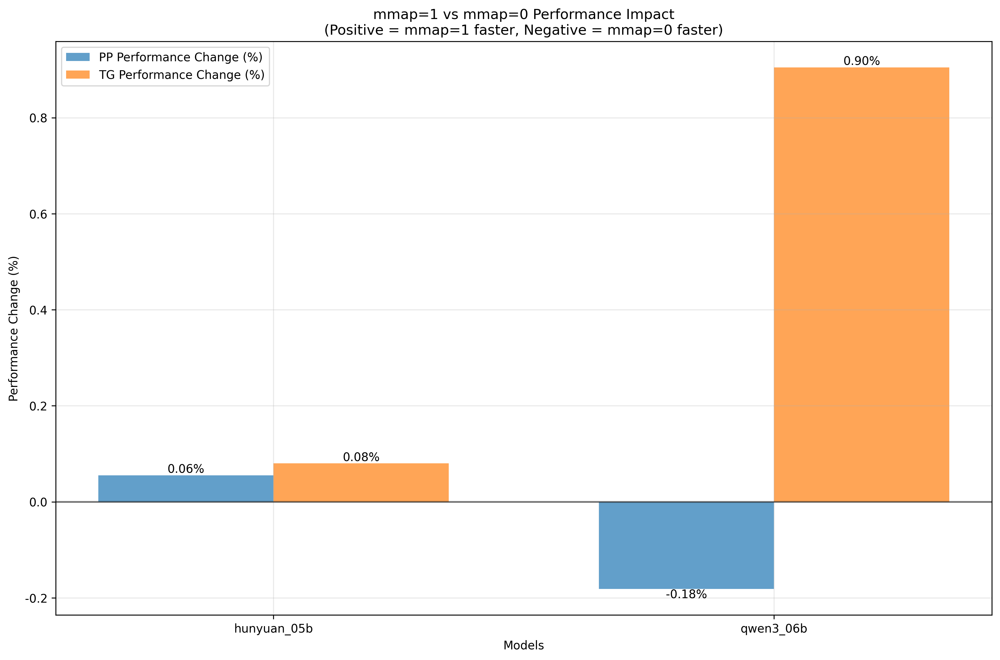

# mmap参数影响分析报告

## 基本信息
生成时间: 2025年11月28日 15:30:07
数据来源: benchmark_results.db
分析范围: mmap_effect_t1 test suite
参数对比: mmap="0" vs mmap="1"

---

## 分析结果

### hunyuan_05b

#### PP 结果
- mmap=0 性能: 54.22 ± nan tokens/sec
- mmap=1 性能: 54.25 ± nan tokens/sec
- 性能差异: 0.03 tokens/sec
- 相对变化: 0.06%
- mmap=0 平均CV: 0.037%
- mmap=1 平均CV: 0.129%

#### TG 结果
- mmap=0 性能: 25.01 ± nan tokens/sec
- mmap=1 性能: 25.03 ± nan tokens/sec
- 性能差异: 0.02 tokens/sec
- 相对变化: 0.08%
- mmap=0 平均CV: 0.040%
- mmap=1 平均CV: 0.000%

---

### qwen3_06b

#### PP 结果
- mmap=0 性能: 49.62 ± nan tokens/sec
- mmap=1 性能: 49.53 ± nan tokens/sec
- 性能差异: -0.09 tokens/sec
- 相对变化: -0.18%
- mmap=0 平均CV: 0.081%
- mmap=1 平均CV: 0.020%

#### TG 结果
- mmap=0 性能: 22.11 ± nan tokens/sec
- mmap=1 性能: 22.31 ± nan tokens/sec
- 性能差异: 0.20 tokens/sec
- 相对变化: 0.90%
- mmap=0 平均CV: 0.000%
- mmap=1 平均CV: 0.090%

---

## 性能影响汇总表

| 模型 | PP变化 | TG变化 | PP mmap=0 | PP mmap=1 | TG mmap=0 | TG mmap=1 |
|------|--------|--------|-----------|-----------|-----------|-----------|
| hunyuan_05b | 0.06% | 0.08% | 54.22 | 54.25 | 25.01 | 25.03 |
| qwen3_06b | -0.18% | 0.90% | 49.62 | 49.53 | 22.11 | 22.31 |

