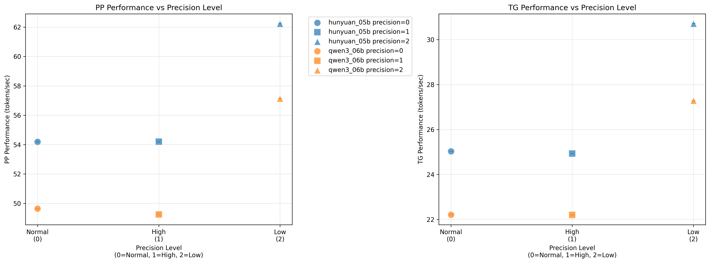
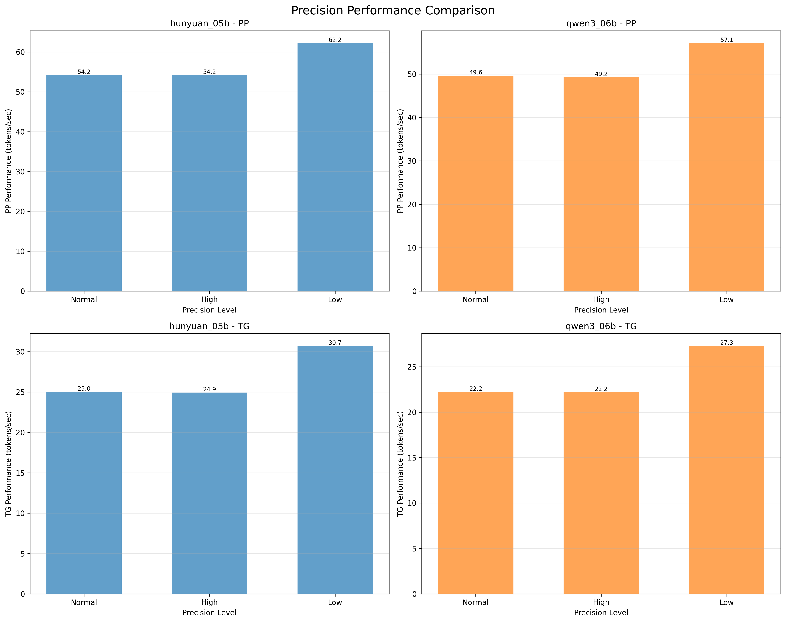

# precision参数影响分析报告

## 基本信息
生成时间: 2025年11月30日 13:02:05
数据来源: benchmark_results.db
分析范围: precision_effect_t1 test suite
参数对比: precision=0 (Normal) vs 1 (High) vs 2 (Low)
精度说明:
- Normal (0): 基础精度，CPU后端为High精度
- High (1): 高精度模式
- Low (2): 低精度模式，提升性能

---

## 分析结果

### hunyuan_05b

#### PP 结果
- 数据点数: 3
- 精度级别范围: 0 - 2
- 性能范围: 54.19 - 62.23 tokens/sec
- 平均性能: 56.87 ± 4.64 tokens/sec
- 性能变化范围: 8.04 tokens/sec
- 最大性能变化百分比: 14.14%
- CV值范围: 0.032% - 0.074% (平均: 0.054%)
- 最优精度: Low, 性能=62.23 tokens/sec
- 最差精度: Normal, 性能=54.19 tokens/sec

##### 各精度级别性能:
- Normal: 54.19 ± 0.00 tokens/sec (CV: 0.055%)
- High: 54.20 ± 0.00 tokens/sec (CV: 0.074%)
- Low: 62.23 ± 0.00 tokens/sec (CV: 0.032%)

##### Normal vs High 精度对比:
- 性能差异: -0.01 tokens/sec
- 相对变化: -0.02%

##### Normal vs Low 精度对比:
- 性能差异: -8.04 tokens/sec
- 相对变化: -12.92%

#### TG 结果
- 数据点数: 3
- 精度级别范围: 0 - 2
- 性能范围: 24.93 - 30.71 tokens/sec
- 平均性能: 26.89 ± 3.31 tokens/sec
- 性能变化范围: 5.78 tokens/sec
- 最大性能变化百分比: 21.49%
- CV值范围: 0.000% - 0.040% (平均: 0.024%)
- 最优精度: Low, 性能=30.71 tokens/sec
- 最差精度: High, 性能=24.93 tokens/sec

##### 各精度级别性能:
- Normal: 25.03 ± 0.00 tokens/sec (CV: 0.000%)
- High: 24.93 ± 0.00 tokens/sec (CV: 0.040%)
- Low: 30.71 ± 0.00 tokens/sec (CV: 0.033%)

##### Normal vs High 精度对比:
- 性能差异: 0.10 tokens/sec
- 相对变化: 0.40%

##### Normal vs Low 精度对比:
- 性能差异: -5.68 tokens/sec
- 相对变化: -18.50%

---

### qwen3_06b

#### PP 结果
- 数据点数: 3
- 精度级别范围: 0 - 2
- 性能范围: 49.25 - 57.13 tokens/sec
- 平均性能: 52.01 ± 4.44 tokens/sec
- 性能变化范围: 7.88 tokens/sec
- 最大性能变化百分比: 15.15%
- CV值范围: 0.035% - 0.102% (平均: 0.059%)
- 最优精度: Low, 性能=57.13 tokens/sec
- 最差精度: High, 性能=49.25 tokens/sec

##### 各精度级别性能:
- Normal: 49.64 ± 0.00 tokens/sec (CV: 0.040%)
- High: 49.25 ± 0.00 tokens/sec (CV: 0.102%)
- Low: 57.13 ± 0.00 tokens/sec (CV: 0.035%)

##### Normal vs High 精度对比:
- 性能差异: 0.39 tokens/sec
- 相对变化: 0.79%

##### Normal vs Low 精度对比:
- 性能差异: -7.49 tokens/sec
- 相对变化: -13.11%

#### TG 结果
- 数据点数: 3
- 精度级别范围: 0 - 2
- 性能范围: 22.20 - 27.28 tokens/sec
- 平均性能: 23.90 ± 2.93 tokens/sec
- 性能变化范围: 5.08 tokens/sec
- 最大性能变化百分比: 21.26%
- CV值范围: 0.037% - 0.045% (平均: 0.042%)
- 最优精度: Low, 性能=27.28 tokens/sec
- 最差精度: High, 性能=22.20 tokens/sec

##### 各精度级别性能:
- Normal: 22.21 ± 0.00 tokens/sec (CV: 0.045%)
- High: 22.20 ± 0.00 tokens/sec (CV: 0.045%)
- Low: 27.28 ± 0.00 tokens/sec (CV: 0.037%)

##### Normal vs High 精度对比:
- 性能差异: 0.01 tokens/sec
- 相对变化: 0.05%

##### Normal vs Low 精度对比:
- 性能差异: -5.07 tokens/sec
- 相对变化: -18.59%

---

## 精度模式优化建议表

| 模型 | PP最优精度 | TG最优精度 | PP性能范围 | TG性能范围 | PP Normal vs High | PP Normal vs Low | TG Normal vs High | TG Normal vs Low |
|------|------------|------------|------------|------------|------------------|------------------|------------------|------------------|
| hunyuan_05b | Low | Low | 54.2-62.2 | 24.9-30.7 | -0.02% | -12.92% | 0.40% | -18.50% |
| qwen3_06b | Low | Low | 49.2-57.1 | 22.2-27.3 | 0.79% | -13.11% | 0.05% | -18.59% |

