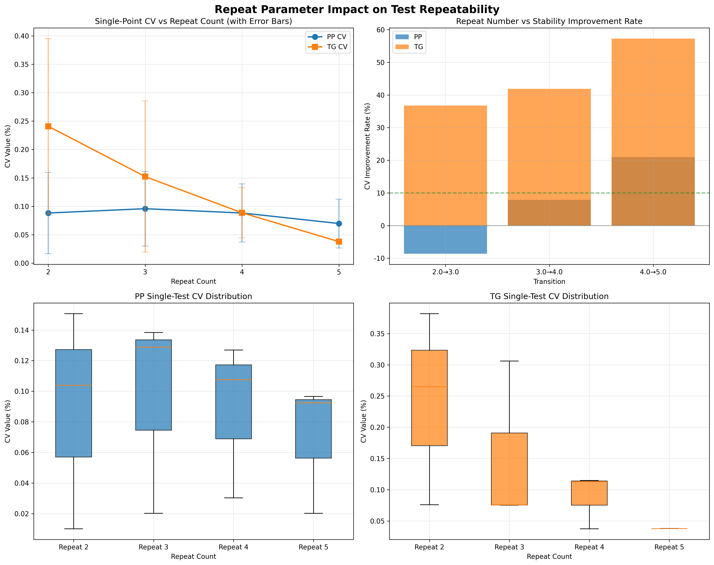

# Repeat参数对测试重复性影响分析报告
生成时间: 2025-11-30 14:15:26

## 测试设计概览
- **测试目标**: 确定合理的测试重复次数，在保证结果可信度的前提下最大化测试效率
- **涉及Suite**: rep_p_grid_t1 (任务8)
- **测试参数**: repeat [2,3,4,5] × n_prompt [192,384,512] × n_gen [64,128]
- **分析方法**: 聚焦单测试点重复性，避免参数性能聚合

## 数据概览
- 测试记录数: 24
- 涉及模型: hunyuan_05b_1t
- 性能指标类型: pp, tg
- Repeat次数范围: 2 - 5

## 单测试点重复性分析
### PP 重复性分析
- **Repeat 2.0**: 平均CV = 0.088% ±0.072% (优秀)
  - CV范围: 0.010% - 0.151%
  - 测试点数: 3.0
  - 适用场景: 高精度基准测试适用
  - 性能均值: 92.87 tokens/sec
- **Repeat 3.0**: 平均CV = 0.096% ±0.066% (优秀)
  - CV范围: 0.020% - 0.138%
  - 测试点数: 3.0
  - 适用场景: 高精度基准测试适用
  - 性能均值: 93.00 tokens/sec
- **Repeat 4.0**: 平均CV = 0.088% ±0.051% (优秀)
  - CV范围: 0.030% - 0.127%
  - 测试点数: 3.0
  - 适用场景: 高精度基准测试适用
  - 性能均值: 92.90 tokens/sec
- **Repeat 5.0**: 平均CV = 0.070% ±0.043% (优秀)
  - CV范围: 0.020% - 0.097%
  - 测试点数: 3.0
  - 适用场景: 高精度基准测试适用
  - 性能均值: 92.94 tokens/sec
### TG 重复性分析
- **Repeat 2.0**: 平均CV = 0.241% ±0.154% (优秀)
  - CV范围: 0.076% - 0.382%
  - 测试点数: 3.0
  - 适用场景: 高精度基准测试适用
  - 性能均值: 26.29 tokens/sec
- **Repeat 3.0**: 平均CV = 0.152% ±0.133% (优秀)
  - CV范围: 0.075% - 0.306%
  - 测试点数: 3.0
  - 适用场景: 高精度基准测试适用
  - 性能均值: 26.35 tokens/sec
- **Repeat 4.0**: 平均CV = 0.089% ±0.044% (优秀)
  - CV范围: 0.038% - 0.115%
  - 测试点数: 3.0
  - 适用场景: 高精度基准测试适用
  - 性能均值: 26.39 tokens/sec
- **Repeat 5.0**: 平均CV = 0.038% ±0.000% (优秀)
  - CV范围: 0.038% - 0.038%
  - 测试点数: 3.0
  - 适用场景: 高精度基准测试适用
  - 性能均值: 26.41 tokens/sec

## 重复次数效果量化评估
### PP 重复效果
- 从 2.0→3.0: CV改善 -8.6% (时间成本: 1.5x)
- 从 3.0→4.0: CV改善 7.9% (时间成本: 1.3x)
- 从 4.0→5.0: CV改善 21.0% (时间成本: 1.2x)
### TG 重复效果
- 从 2.0→3.0: CV改善 36.7% (时间成本: 1.5x)
- 从 3.0→4.0: CV改善 41.9% (时间成本: 1.3x)
- 从 4.0→5.0: CV改善 57.3% (时间成本: 1.2x)

## 可视化分析
