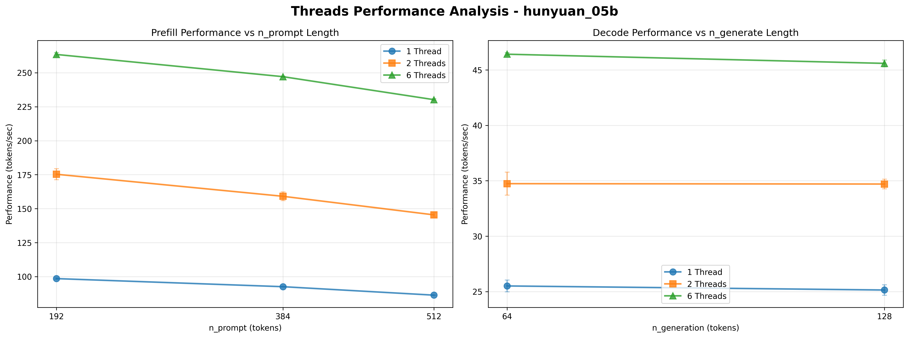
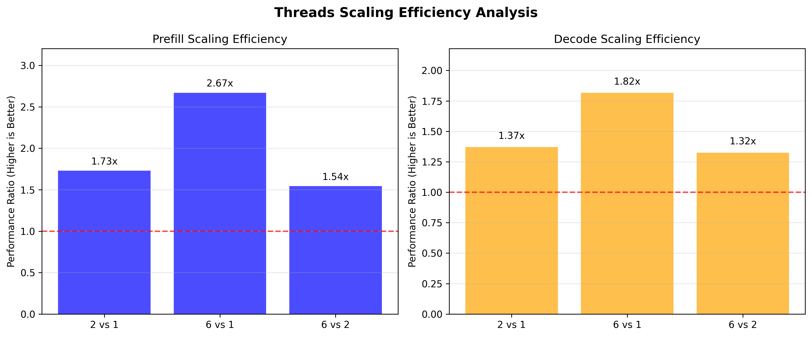

# Threads参数影响分析报告
生成时间: 2025-11-30 13:37:12

## 测试设计概览
- **测试模型**: hunyuan_05b (固定模型)
- **线程配置**: 1, 2, 6 线程对比测试
- **测试 Suite**: pn_grid_t1 (1线程), pn_grid_t2 (2线程), pn_grid_t6 (6线程)
- **变量设置**: n_prompt [192,384,512], n_gen [64,128]
- **分析维度**: PP性能(与n_prompt相关), TG性能(与n_gen相关)

## Prefill (PP) 性能分析
### 1 线程 PP 性能
- **平均性能**: 92.49 tokens/sec
- **性能范围**: 86.4 - 98.5 tokens/sec
- **平均CV**: 0.303%
- **各n_prompt性能**:
  - n_prompt 192.0: 98.53 ± 0.52 tokens/sec
  - n_prompt 384.0: 92.59 ± 0.23 tokens/sec
  - n_prompt 512.0: 86.36 ± 0.12 tokens/sec
### 2 线程 PP 性能
- **平均性能**: 159.95 tokens/sec
- **性能范围**: 145.4 - 175.3 tokens/sec
- **平均CV**: 1.809%
- **各n_prompt性能**:
  - n_prompt 192.0: 175.31 ± 4.09 tokens/sec
  - n_prompt 384.0: 159.10 ± 3.22 tokens/sec
  - n_prompt 512.0: 145.43 ± 1.56 tokens/sec
### 6 线程 PP 性能
- **平均性能**: 246.92 tokens/sec
- **性能范围**: 230.2 - 263.4 tokens/sec
- **平均CV**: 0.297%
- **各n_prompt性能**:
  - n_prompt 192.0: 263.45 ± 1.32 tokens/sec
  - n_prompt 384.0: 247.12 ± 0.30 tokens/sec
  - n_prompt 512.0: 230.19 ± 0.62 tokens/sec

## Decode (TG) 性能分析
### 1 线程 TG 性能
- **平均性能**: 25.33 tokens/sec
- **性能范围**: 25.1 - 25.5 tokens/sec
- **平均CV**: 1.988%
- **各n_gen性能**:
  - n_gen 64.0: 25.51 ± 0.53 tokens/sec
  - n_gen 128.0: 25.14 ± 0.48 tokens/sec
### 2 线程 TG 性能
- **平均性能**: 34.72 tokens/sec
- **性能范围**: 34.7 - 34.7 tokens/sec
- **平均CV**: 2.124%
- **各n_gen性能**:
  - n_gen 64.0: 34.74 ± 1.04 tokens/sec
  - n_gen 128.0: 34.70 ± 0.43 tokens/sec
### 6 线程 TG 性能
- **平均性能**: 46.00 tokens/sec
- **性能范围**: 45.6 - 46.4 tokens/sec
- **平均CV**: 0.488%
- **各n_gen性能**:
  - n_gen 64.0: 46.41 ± 0.14 tokens/sec
  - n_gen 128.0: 45.59 ± 0.31 tokens/sec

## 线程扩展效率分析
### PP 扩展效率
- **2线程 vs 1线程**: 1.73x
- **6线程 vs 1线程**: 2.67x
- **6线程 vs 2线程**: 1.54x
### TG 扩展效率
- **2线程 vs 1线程**: 1.37x
- **6线程 vs 1线程**: 1.82x
- **6线程 vs 2线程**: 1.32x

## CV稳定性分析 (测试可信度)
### 稳定性评价标准
- **优**: CV < 0.5% (高精度测试)
- **良**: CV < 1.0% (标准测试)
- **中**: CV < 2.0% (一般测试)
- **不稳定**: CV ≥ 2.0% (需改进)
### PP稳定性分析
- **1线程**: CV = 0.303% (优)
- **2线程**: CV = 1.809% (中)
- **6线程**: CV = 0.297% (优)
- **CV变化趋势**:
  - 1→2线程: CV变化+496.9% (恶)
  - 2→6线程: CV变化-83.6% (改善)
### TG稳定性分析
- **1线程**: CV = 1.988% (中)
- **2线程**: CV = 2.124% (不稳定)
- **6线程**: CV = 0.488% (优)
- **CV变化趋势**:
  - 1→2线程: CV变化+6.8% (恶)
  - 2→6线程: CV变化-77.0% (改善)

## 优化建议
### 性能导向推荐
1. **最优性能线程数**: 6
2. **PP性能提升**: 2.67x
3. **TG性能提升**: 1.82x
### 稳定性导向推荐
1. **最稳定线程数**: 6
2. **注意**: 稳定性最优配置(6)与性能最优(6)不同
3. **权衡**: 需在性能和稳定性间平衡

## 可视化分析

