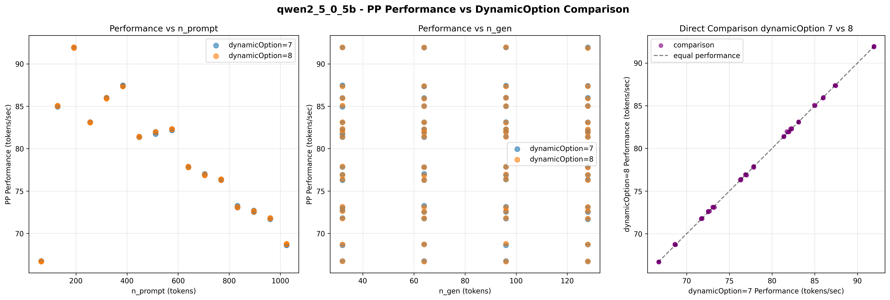
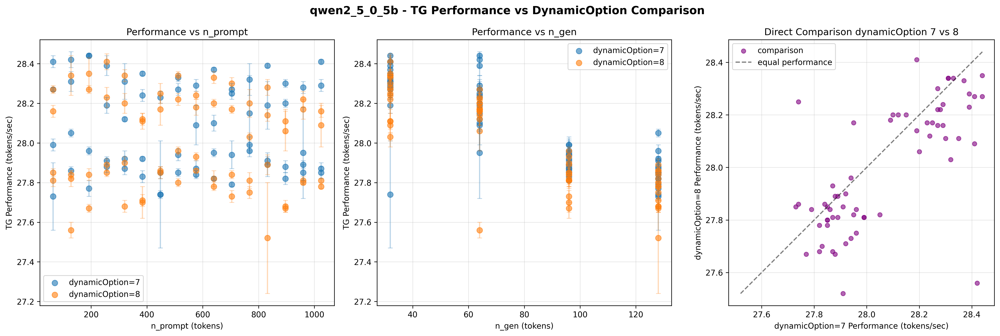
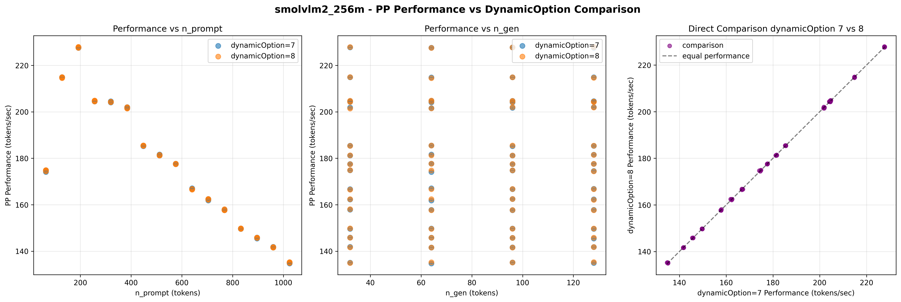
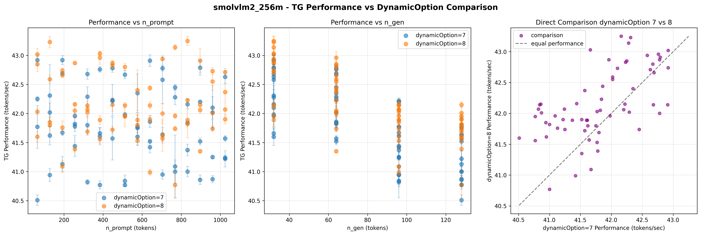
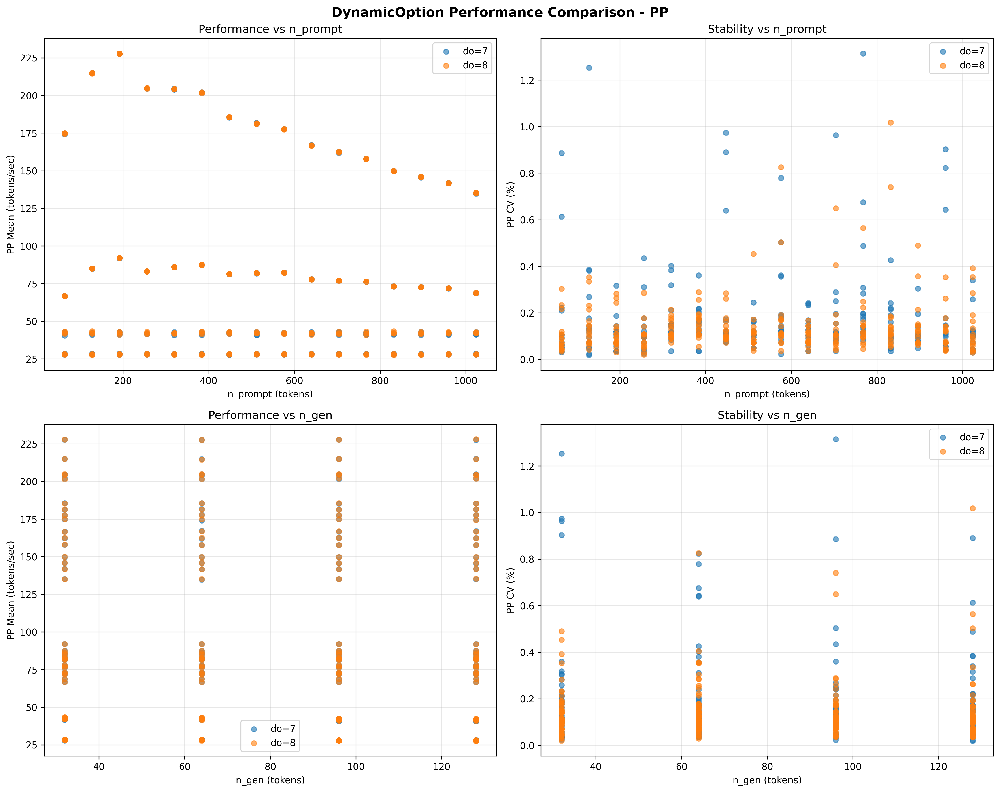

# dynamicOption深度扫描分析数据报告
生成时间: 2025年11月28日 16:47:36
数据来源: benchmark_results.db

## 数据概览
- 总测试记录数: 512
- 涉及模型: qwen2_5_0_5b, smolvlm2_256m
- 性能指标: pp, tg
- dynamicOption值: [np.int64(7), np.int64(8)]
- n_prompt范围: 64 - 1024
- n_gen范围: 32 - 128

## 测试记录统计
| dynamicOption值 | 模型 | 性能指标 | 测试记录数 |
|----------------|------|----------|------------|------------|
| 7 | qwen2_5_0_5b | pp | 64 |
| 7 | qwen2_5_0_5b | tg | 64 |
| 7 | smolvlm2_256m | pp | 64 |
| 7 | smolvlm2_256m | tg | 64 |
| 8 | qwen2_5_0_5b | pp | 64 |
| 8 | qwen2_5_0_5b | tg | 64 |
| 8 | smolvlm2_256m | pp | 64 |
| 8 | smolvlm2_256m | tg | 64 |

## 性能数据表格
### PP (Prefill阶段) 性能数据
| 模型 | dynamicOption值 | 数据点数 | 平均性能(tokens/sec) | 性能标准差 | 最小性能 | 最大性能 | 平均CV(%) | 最大CV(%) | n_prompt范围 | n_gen_range |
|------|--------------|----------|-------------------|------------|----------|----------|-----------|----------|-------------|-----------|
| qwen2_5_0_5b | 7 | 64 | 78.9306 | 6.9584 | 66.7000 | 91.9400 | 0.1061 | 0.2174 | 64 - 1024 | 32 - 128 |
| qwen2_5_0_5b | 8 | 64 | 78.9383 | 6.9483 | 66.6800 | 91.9600 | 0.1000 | 0.2228 | 64 - 1024 | 32 - 128 |
| smolvlm2_256m | 7 | 64 | 176.9583 | 27.1881 | 134.7100 | 227.7500 | 0.1003 | 0.2034 | 64 - 1024 | 32 - 128 |
| smolvlm2_256m | 8 | 64 | 176.9797 | 27.1712 | 134.9500 | 227.9400 | 0.0903 | 0.1787 | 64 - 1024 | 32 - 128 |

### TG (Decode阶段) 性能数据
| 模型 | dynamicOption值 | 数据点数 | 平均性能(tokens/sec) | 性能标准差 | 最小性能 | 最大性能 | 平均CV(%) | 最大CV(%) | n_prompt范围 | n_gen_range |
|------|--------------|----------|-------------------|------------|----------|-----------|----------|-------------|-----------|-------------|
| qwen2_5_0_5b | 7 | 64 | 28.0703 | 0.2229 | 27.7300 | 28.4400 | 0.1544 | 0.9733 | 64 - 1024 | 32 - 128 |
| qwen2_5_0_5b | 8 | 64 | 27.9958 | 0.2342 | 27.5200 | 28.4100 | 0.1413 | 1.0174 | 64 - 1024 | 32 - 128 |
| smolvlm2_256m | 7 | 64 | 41.8092 | 0.6510 | 40.5100 | 42.9200 | 0.3130 | 1.3142 | 64 - 1024 | 32 - 128 |
| smolvlm2_256m | 8 | 64 | 42.1569 | 0.5646 | 40.7700 | 43.2500 | 0.2186 | 0.8255 | 64 - 1024 | 32 - 128 |

## dynamicOption差异分析
| 模型 | 性能指标 | 性能差异(tokens/sec) | 差异百分比(%) | CV差异(%) | 数据点数差 |
|------|----------|-------------------|----------------|-----------|-------------|------------|
| qwen2_5_0_5b | pp | 0.0077 | 0.0097 | -0.0061 | 0 |
| smolvlm2_256m | pp | 0.0214 | 0.0121 | -0.0101 | 0 |
| qwen2_5_0_5b | tg | -0.0745 | -0.2655 | -0.0132 | 0 |
| smolvlm2_256m | tg | 0.3477 | 0.8315 | -0.0944 | 0 |

## 分析图表
### 单模型对比图

*图表说明: 每个图表显示dynamicOption=7和dynamicOption=8条件下的性能散点图，包含误差棒表示标准差。最后一个子图显示直接对比。*

### 聚合对比图

[TG聚合对比](tg_aggregate_dynamicoption.png)

*聚合图表说明: 左上-性能vs n_prompt，右上-稳定性vs n_prompt，左下-性能vs n_gen，右下-稳定性vs n_gen*

## 数据文件
- [原始数据](dynamicoption_raw_data.csv): 所有测试记录的详细数据
- [汇总数据](dynamicoption_summary.csv): 按模型和dynamicOption值汇总的统计数据
- [差异数据](dynamicoption_difference.csv): dynamicOption=7与dynamicOption=8的差异对比数据

---
数据整理完成