# 提示词模式性能效应大小和实际意义分析报告
生成时间: 2025年11月30日 03:50:14
数据来源: benchmark_results.db
分析方法: 效应大小分析和实际意义评估

## 1. 分析目的
评估提示词模式(VP0, VP1, PF_FILE)性能差异的:
- **统计显著性**：差异是否真实存在
- **实际意义**：差异是否在实际应用中重要
- **效应大小**：差异的绝对量级大小

## 2. 分析方法
### 2.1 效应大小指标
- **Cohen's d**: 标准化效应大小，基于标准差
  - |d| < 0.2: 极小效应 (可忽略)
  - 0.2 ≤ |d| < 0.5: 小效应 (轻微)
  - 0.5 ≤ |d| < 0.8: 中等效应 (实际)
  - |d| ≥ 0.8: 大效应 (重要)

- **Eta-squared (η²)**: 方差解释率
  - η² < 0.01: 极小效应 (可忽略)
  - 0.01 ≤ η² < 0.06: 小效应 (轻微)
  - 0.06 ≤ η² < 0.14: 中等效应 (实际)
  - η² ≥ 0.14: 大效应 (重要)

### 2.2 实际意义评估
- **相对差异百分比**: 差异占均值的百分比
- **实际影响阈值**: 基于工程应用的敏感度
  - < 0.1%: 可忽略
  - 0.1-0.5%: 微小
  - 0.5-1.0%: 轻微
  - 1.0-2.0%: 中等
  - 2.0-5.0%: 显著
  - > 5.0%: 重要

## 3. 结果汇总
### 3.1 效应大小总体统计
- 分析组合总数: 30
- 最大相对差异: 1.2604%
- 最小相对差异: 0.0236%
- 平均相对差异: 0.2433%

### 3.2 实际意义分类统计
| 实际意义 | 数量 | 百分比 | 典型场景
|----------|------|--------|----------|
| 可忽略 (<0.1%) | 20 | 66.7% | 噪声范围内 |
| 微小 (0.1-0.5%) | 5 | 16.7% | 高精度可测 |
| 中等 (0.5-2.0%) | 5 | 16.7% | 工程考虑 |

## 4. 详细分析结果
### hunyuan_05b - PP (n_prompt=96)

**性能指标:**
- VP0: 73.0920 tokens/sec (n=5)
- VP1: 73.0740 tokens/sec (n=5)
- PF_FILE: 73.0700 tokens/sec (n=5)
- 均值: 73.0787 tokens/sec

**效应大小分析:**
- Cohen's d: VP0 vs VP1 = 0.6956
- Cohen's d: VP0 vs PF = 0.8502
- Cohen's d: VP1 vs PF = 0.1546
- η² (方差解释率): 0.120297

**实际意义评估:**
- 最大相对差异: 0.0301%
- 平均绝对差异: 0.0147 tokens/sec
- 实际影响: 可忽略 - 差异小于0.1%，在噪声范围内

### hunyuan_05b - PP (n_prompt=104)

**性能指标:**
- VP0: 72.8740 tokens/sec (n=5)
- VP1: 72.8680 tokens/sec (n=5)
- PF_FILE: 72.8300 tokens/sec (n=5)
- 均值: 72.8573 tokens/sec

**效应大小分析:**
- Cohen's d: VP0 vs VP1 = 0.2527
- Cohen's d: VP0 vs PF = 1.8530
- Cohen's d: VP1 vs PF = 1.6004
- η² (方差解释率): 0.402342

**实际意义评估:**
- 最大相对差异: 0.0604%
- 平均绝对差异: 0.0293 tokens/sec
- 实际影响: 可忽略 - 差异小于0.1%，在噪声范围内

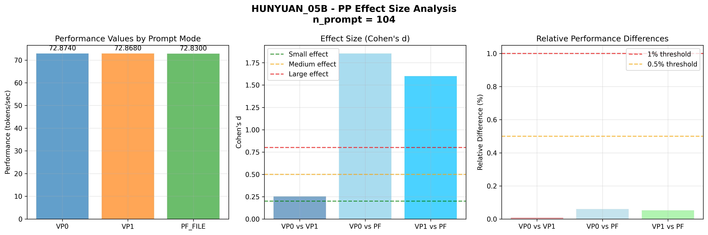

### hunyuan_05b - PP (n_prompt=112)

**性能指标:**
- VP0: 72.4700 tokens/sec (n=5)
- VP1: 72.4560 tokens/sec (n=5)
- PF_FILE: 72.4040 tokens/sec (n=5)
- 均值: 72.4433 tokens/sec

**效应大小分析:**
- Cohen's d: VP0 vs VP1 = 0.4345
- Cohen's d: VP0 vs PF = 2.0484
- Cohen's d: VP1 vs PF = 1.6139
- η² (方差解释率): 0.437139

**实际意义评估:**
- 最大相对差异: 0.0911%
- 平均绝对差异: 0.0440 tokens/sec
- 实际影响: 可忽略 - 差异小于0.1%，在噪声范围内

### hunyuan_05b - PP (n_prompt=120)

**性能指标:**
- VP0: 72.4960 tokens/sec (n=5)
- VP1: 72.4940 tokens/sec (n=5)
- PF_FILE: 72.4540 tokens/sec (n=5)
- 均值: 72.4813 tokens/sec

**效应大小分析:**
- Cohen's d: VP0 vs VP1 = 0.0608
- Cohen's d: VP0 vs PF = 1.2758
- Cohen's d: VP1 vs PF = 1.2150
- η² (方差解释率): 0.256663

**实际意义评估:**
- 最大相对差异: 0.0579%
- 平均绝对差异: 0.0280 tokens/sec
- 实际影响: 可忽略 - 差异小于0.1%，在噪声范围内

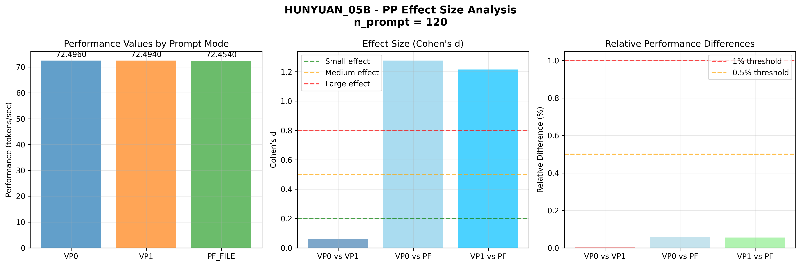

### hunyuan_05b - PP (n_prompt=128)

**性能指标:**
- VP0: 72.2240 tokens/sec (n=5)
- VP1: 72.1960 tokens/sec (n=5)
- PF_FILE: 72.1680 tokens/sec (n=5)
- 均值: 72.1960 tokens/sec

**效应大小分析:**
- Cohen's d: VP0 vs VP1 = 0.9661
- Cohen's d: VP0 vs PF = 1.9322
- Cohen's d: VP1 vs PF = 0.9661
- η² (方差解释率): 0.383562

**实际意义评估:**
- 最大相对差异: 0.0776%
- 平均绝对差异: 0.0373 tokens/sec
- 实际影响: 可忽略 - 差异小于0.1%，在噪声范围内

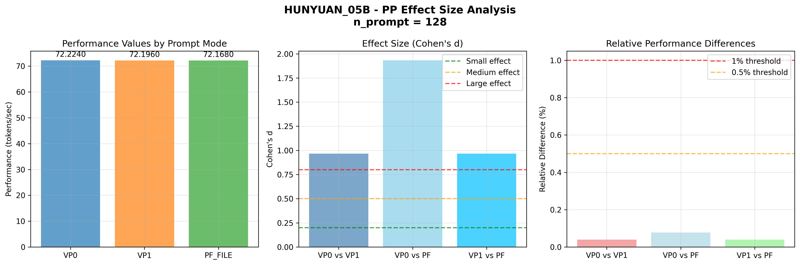

### hunyuan_05b - PP (n_prompt=136)

**性能指标:**
- VP0: 71.5720 tokens/sec (n=5)
- VP1: 71.5960 tokens/sec (n=5)
- PF_FILE: 71.5580 tokens/sec (n=5)
- 均值: 71.5753 tokens/sec

**效应大小分析:**
- Cohen's d: VP0 vs VP1 = 0.7824
- Cohen's d: VP0 vs PF = 0.4564
- Cohen's d: VP1 vs PF = 1.2388
- η² (方差解释率): 0.207402

**实际意义评估:**
- 最大相对差异: 0.0531%
- 平均绝对差异: 0.0253 tokens/sec
- 实际影响: 可忽略 - 差异小于0.1%，在噪声范围内

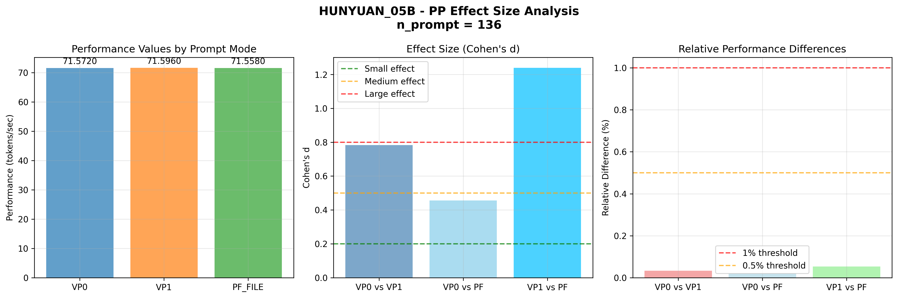

### hunyuan_05b - PP (n_prompt=144)

**性能指标:**
- VP0: 71.6200 tokens/sec (n=5)
- VP1: 71.5860 tokens/sec (n=5)
- PF_FILE: 71.5660 tokens/sec (n=5)
- 均值: 71.5907 tokens/sec

**效应大小分析:**
- Cohen's d: VP0 vs VP1 = 0.7617
- Cohen's d: VP0 vs PF = 1.2098
- Cohen's d: VP1 vs PF = 0.4481
- η² (方差解释率): 0.199612

**实际意义评估:**
- 最大相对差异: 0.0754%
- 平均绝对差异: 0.0360 tokens/sec
- 实际影响: 可忽略 - 差异小于0.1%，在噪声范围内

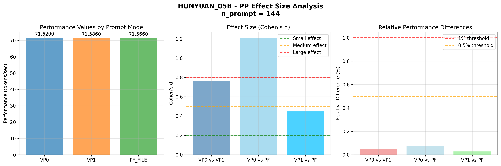

### hunyuan_05b - PP (n_prompt=152)

**性能指标:**
- VP0: 71.3940 tokens/sec (n=5)
- VP1: 71.3840 tokens/sec (n=5)
- PF_FILE: 71.3500 tokens/sec (n=5)
- 均值: 71.3760 tokens/sec

**效应大小分析:**
- Cohen's d: VP0 vs VP1 = 0.3339
- Cohen's d: VP0 vs PF = 1.4690
- Cohen's d: VP1 vs PF = 1.1351
- η² (方差解释率): 0.283323

**实际意义评估:**
- 最大相对差异: 0.0616%
- 平均绝对差异: 0.0293 tokens/sec
- 实际影响: 可忽略 - 差异小于0.1%，在噪声范围内

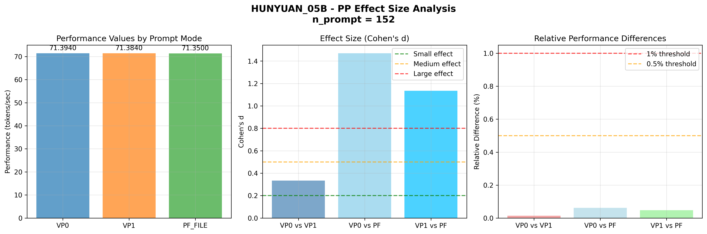

### hunyuan_05b - PP (n_prompt=160)

**性能指标:**
- VP0: 71.0380 tokens/sec (n=5)
- VP1: 71.0300 tokens/sec (n=5)
- PF_FILE: 71.0120 tokens/sec (n=5)
- 均值: 71.0267 tokens/sec

**效应大小分析:**
- Cohen's d: VP0 vs VP1 = 0.3703
- Cohen's d: VP0 vs PF = 1.2036
- Cohen's d: VP1 vs PF = 0.8332
- η² (方差解释率): 0.202128

**实际意义评估:**
- 最大相对差异: 0.0366%
- 平均绝对差异: 0.0173 tokens/sec
- 实际影响: 可忽略 - 差异小于0.1%，在噪声范围内

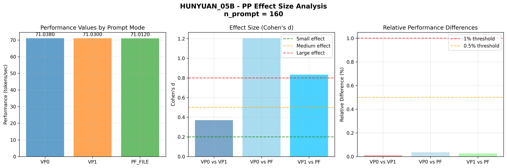

### hunyuan_05b - PP (n_prompt=168)

**性能指标:**
- VP0: 71.0280 tokens/sec (n=5)
- VP1: 71.0320 tokens/sec (n=5)
- PF_FILE: 71.0020 tokens/sec (n=5)
- 均值: 71.0207 tokens/sec

**效应大小分析:**
- Cohen's d: VP0 vs VP1 = 0.1984
- Cohen's d: VP0 vs PF = 1.2893
- Cohen's d: VP1 vs PF = 1.4877
- η² (方差解释率): 0.303123

**实际意义评估:**
- 最大相对差异: 0.0422%
- 平均绝对差异: 0.0200 tokens/sec
- 实际影响: 可忽略 - 差异小于0.1%，在噪声范围内

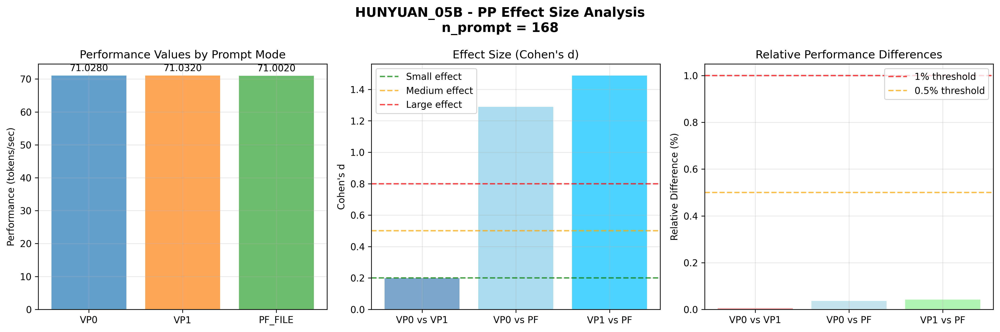

### hunyuan_05b - TG (n_gen=32)

**性能指标:**
- VP0: 31.3730 tokens/sec (n=10)
- VP1: 31.3700 tokens/sec (n=10)
- PF_FILE: 31.3480 tokens/sec (n=10)
- 均值: 31.3637 tokens/sec

**效应大小分析:**
- Cohen's d: VP0 vs VP1 = 0.0353
- Cohen's d: VP0 vs PF = 0.2939
- Cohen's d: VP1 vs PF = 0.2586
- η² (方差解释率): 0.016873

**实际意义评估:**
- 最大相对差异: 0.0797%
- 平均绝对差异: 0.0167 tokens/sec
- 实际影响: 可忽略 - 差异小于0.1%，在噪声范围内

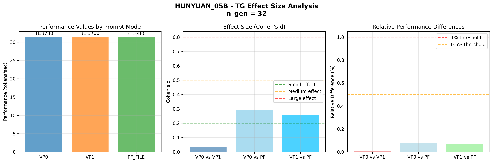

### hunyuan_05b - TG (n_gen=40)

**性能指标:**
- VP0: 31.2750 tokens/sec (n=10)
- VP1: 31.2400 tokens/sec (n=10)
- PF_FILE: 31.2440 tokens/sec (n=10)
- 均值: 31.2530 tokens/sec

**效应大小分析:**
- Cohen's d: VP0 vs VP1 = 0.3618
- Cohen's d: VP0 vs PF = 0.3204
- Cohen's d: VP1 vs PF = 0.0413
- η² (方差解释率): 0.025475

**实际意义评估:**
- 最大相对差异: 0.1120%
- 平均绝对差异: 0.0233 tokens/sec
- 实际影响: 微小 - 差异小于0.5%，实际测试中难以感知

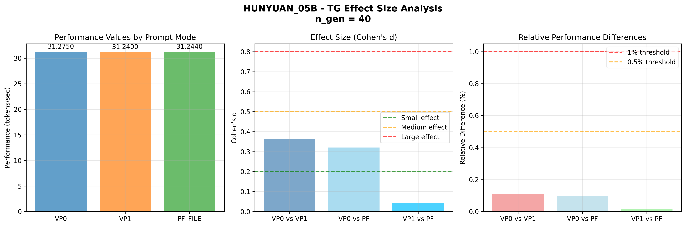

### hunyuan_05b - TG (n_gen=48)

**性能指标:**
- VP0: 31.2110 tokens/sec (n=10)
- VP1: 31.2360 tokens/sec (n=10)
- PF_FILE: 31.2210 tokens/sec (n=10)
- 均值: 31.2227 tokens/sec

**效应大小分析:**
- Cohen's d: VP0 vs VP1 = 0.2693
- Cohen's d: VP0 vs PF = 0.1077
- Cohen's d: VP1 vs PF = 0.1616
- η² (方差解释率): 0.012097

**实际意义评估:**
- 最大相对差异: 0.0801%
- 平均绝对差异: 0.0167 tokens/sec
- 实际影响: 可忽略 - 差异小于0.1%，在噪声范围内

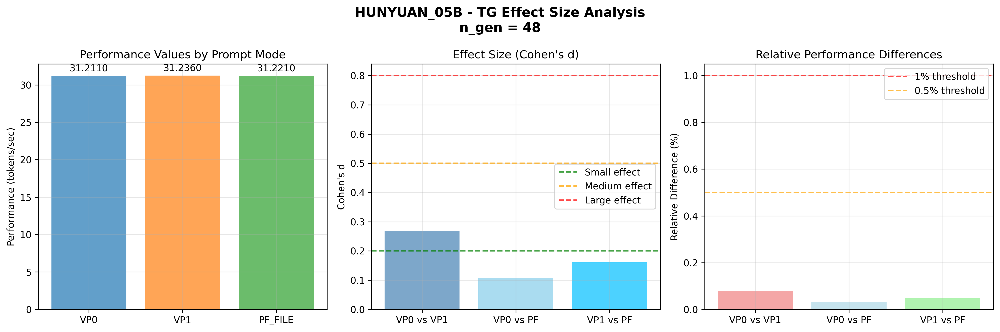

### hunyuan_05b - TG (n_gen=56)

**性能指标:**
- VP0: 31.1700 tokens/sec (n=10)
- VP1: 31.2170 tokens/sec (n=10)
- PF_FILE: 31.1630 tokens/sec (n=10)
- 均值: 31.1833 tokens/sec

**效应大小分析:**
- Cohen's d: VP0 vs VP1 = 0.5340
- Cohen's d: VP0 vs PF = 0.0795
- Cohen's d: VP1 vs PF = 0.6135
- η² (方差解释率): 0.069080

**实际意义评估:**
- 最大相对差异: 0.1732%
- 平均绝对差异: 0.0360 tokens/sec
- 实际影响: 微小 - 差异小于0.5%，实际测试中难以感知

### hunyuan_05b - TG (n_gen=64)

**性能指标:**
- VP0: 31.1890 tokens/sec (n=10)
- VP1: 31.1600 tokens/sec (n=10)
- PF_FILE: 31.1100 tokens/sec (n=10)
- 均值: 31.1530 tokens/sec

**效应大小分析:**
- Cohen's d: VP0 vs VP1 = 0.3216
- Cohen's d: VP0 vs PF = 0.8760
- Cohen's d: VP1 vs PF = 0.5545
- η² (方差解释率): 0.115766

**实际意义评估:**
- 最大相对差异: 0.2536%
- 平均绝对差异: 0.0527 tokens/sec
- 实际影响: 微小 - 差异小于0.5%，实际测试中难以感知

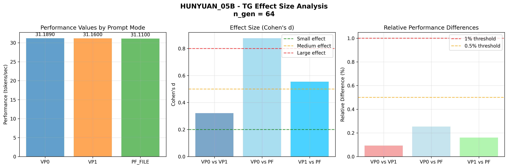

### qwen3_06b - PP (n_prompt=96)

**性能指标:**
- VP0: 67.9980 tokens/sec (n=5)
- VP1: 68.0380 tokens/sec (n=5)
- PF_FILE: 68.0760 tokens/sec (n=5)
- 均值: 68.0373 tokens/sec

**效应大小分析:**
- Cohen's d: VP0 vs VP1 = 0.6136
- Cohen's d: VP0 vs PF = 1.1965
- Cohen's d: VP1 vs PF = 0.5829
- η² (方差解释率): 0.192681

**实际意义评估:**
- 最大相对差异: 0.1146%
- 平均绝对差异: 0.0520 tokens/sec
- 实际影响: 微小 - 差异小于0.5%，实际测试中难以感知

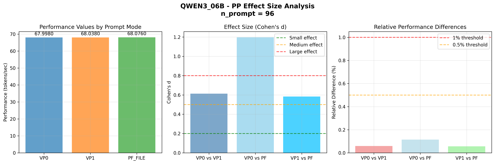

### qwen3_06b - PP (n_prompt=104)

**性能指标:**
- VP0: 67.8640 tokens/sec (n=5)
- VP1: 67.8700 tokens/sec (n=5)
- PF_FILE: 67.8800 tokens/sec (n=5)
- 均值: 67.8713 tokens/sec

**效应大小分析:**
- Cohen's d: VP0 vs VP1 = 0.3249
- Cohen's d: VP0 vs PF = 0.8665
- Cohen's d: VP1 vs PF = 0.5416
- η² (方差解释率): 0.113276

**实际意义评估:**
- 最大相对差异: 0.0236%
- 平均绝对差异: 0.0107 tokens/sec
- 实际影响: 可忽略 - 差异小于0.1%，在噪声范围内

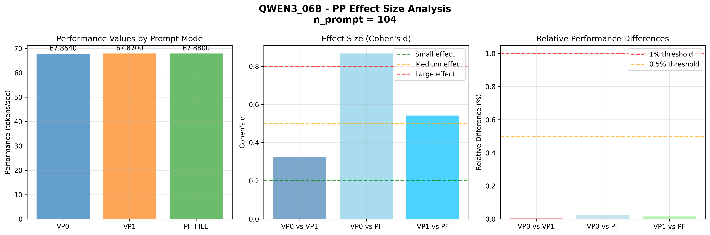

### qwen3_06b - PP (n_prompt=112)

**性能指标:**
- VP0: 67.4720 tokens/sec (n=5)
- VP1: 67.5080 tokens/sec (n=5)
- PF_FILE: 67.5240 tokens/sec (n=5)
- 均值: 67.5013 tokens/sec

**效应大小分析:**
- Cohen's d: VP0 vs VP1 = 1.3100
- Cohen's d: VP0 vs PF = 1.8922
- Cohen's d: VP1 vs PF = 0.5822
- η² (方差解释率): 0.385049

**实际意义评估:**
- 最大相对差异: 0.0770%
- 平均绝对差异: 0.0347 tokens/sec
- 实际影响: 可忽略 - 差异小于0.1%，在噪声范围内

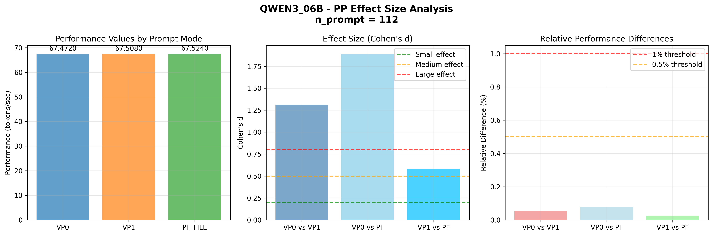

### qwen3_06b - PP (n_prompt=120)

**性能指标:**
- VP0: 67.5440 tokens/sec (n=5)
- VP1: 67.5380 tokens/sec (n=5)
- PF_FILE: 67.5120 tokens/sec (n=5)
- 均值: 67.5313 tokens/sec

**效应大小分析:**
- Cohen's d: VP0 vs VP1 = 0.1621
- Cohen's d: VP0 vs PF = 0.8647
- Cohen's d: VP1 vs PF = 0.7026
- η² (方差解释率): 0.123456

**实际意义评估:**
- 最大相对差异: 0.0474%
- 平均绝对差异: 0.0213 tokens/sec
- 实际影响: 可忽略 - 差异小于0.1%，在噪声范围内

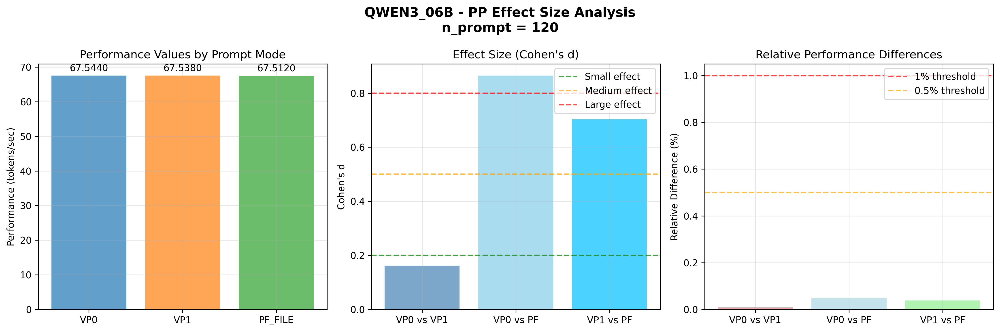

### qwen3_06b - PP (n_prompt=128)

**性能指标:**
- VP0: 67.2900 tokens/sec (n=5)
- VP1: 67.2860 tokens/sec (n=5)
- PF_FILE: 67.2500 tokens/sec (n=5)
- 均值: 67.2753 tokens/sec

**效应大小分析:**
- Cohen's d: VP0 vs VP1 = 0.1416
- Cohen's d: VP0 vs PF = 1.4159
- Cohen's d: VP1 vs PF = 1.2743
- η² (方差解释率): 0.288464

**实际意义评估:**
- 最大相对差异: 0.0595%
- 平均绝对差异: 0.0267 tokens/sec
- 实际影响: 可忽略 - 差异小于0.1%，在噪声范围内

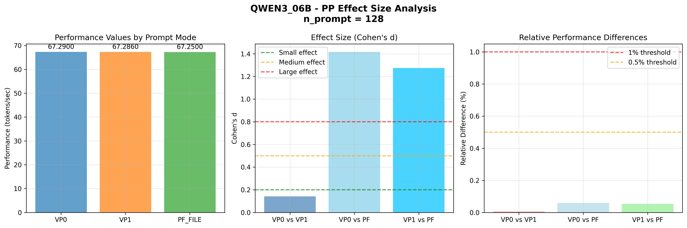

### qwen3_06b - PP (n_prompt=136)

**性能指标:**
- VP0: 66.6800 tokens/sec (n=5)
- VP1: 66.6600 tokens/sec (n=5)
- PF_FILE: 66.6540 tokens/sec (n=5)
- 均值: 66.6647 tokens/sec

**效应大小分析:**
- Cohen's d: VP0 vs VP1 = 0.8381
- Cohen's d: VP0 vs PF = 1.0895
- Cohen's d: VP1 vs PF = 0.2514
- η² (方差解释率): 0.178270

**实际意义评估:**
- 最大相对差异: 0.0390%
- 平均绝对差异: 0.0173 tokens/sec
- 实际影响: 可忽略 - 差异小于0.1%，在噪声范围内

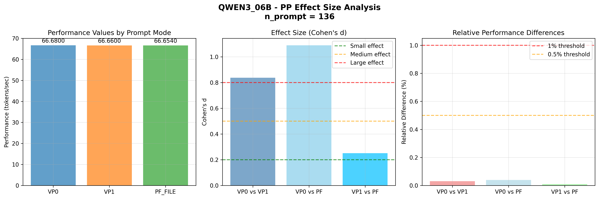

### qwen3_06b - PP (n_prompt=144)

**性能指标:**
- VP0: 66.7020 tokens/sec (n=5)
- VP1: 66.6700 tokens/sec (n=5)
- PF_FILE: 66.7020 tokens/sec (n=5)
- 均值: 66.6913 tokens/sec

**效应大小分析:**
- Cohen's d: VP0 vs VP1 = 1.1871
- Cohen's d: VP0 vs PF = 0.0000
- Cohen's d: VP1 vs PF = 1.1871
- η² (方差解释率): 0.238472

**实际意义评估:**
- 最大相对差异: 0.0480%
- 平均绝对差异: 0.0213 tokens/sec
- 实际影响: 可忽略 - 差异小于0.1%，在噪声范围内

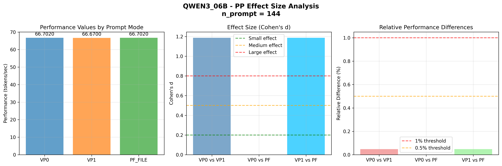

### qwen3_06b - PP (n_prompt=152)

**性能指标:**
- VP0: 66.4460 tokens/sec (n=5)
- VP1: 66.4720 tokens/sec (n=5)
- PF_FILE: 66.4700 tokens/sec (n=5)
- 均值: 66.4627 tokens/sec

**效应大小分析:**
- Cohen's d: VP0 vs VP1 = 0.6347
- Cohen's d: VP0 vs PF = 0.5859
- Cohen's d: VP1 vs PF = 0.0488
- η² (方差解释率): 0.076778

**实际意义评估:**
- 最大相对差异: 0.0391%
- 平均绝对差异: 0.0173 tokens/sec
- 实际影响: 可忽略 - 差异小于0.1%，在噪声范围内

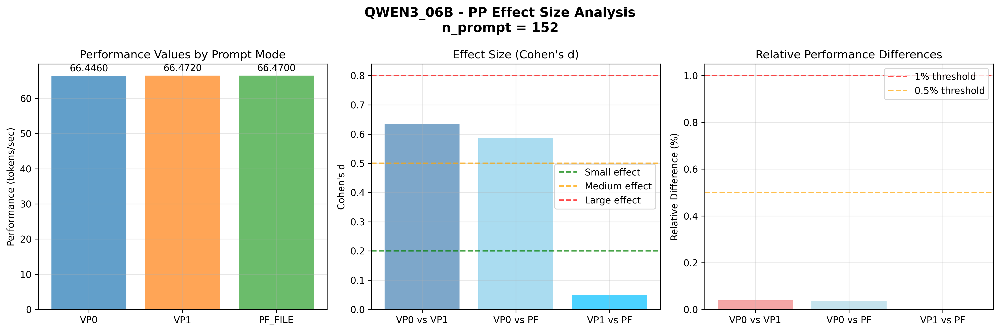

### qwen3_06b - PP (n_prompt=160)

**性能指标:**
- VP0: 66.0740 tokens/sec (n=5)
- VP1: 66.0980 tokens/sec (n=5)
- PF_FILE: 66.1600 tokens/sec (n=5)
- 均值: 66.1107 tokens/sec

**效应大小分析:**
- Cohen's d: VP0 vs VP1 = 0.5247
- Cohen's d: VP0 vs PF = 1.8801
- Cohen's d: VP1 vs PF = 1.3554
- η² (方差解释率): 0.385546

**实际意义评估:**
- 最大相对差异: 0.1301%
- 平均绝对差异: 0.0573 tokens/sec
- 实际影响: 微小 - 差异小于0.5%，实际测试中难以感知

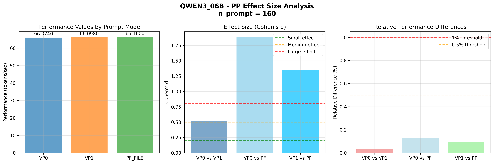

### qwen3_06b - PP (n_prompt=168)

**性能指标:**
- VP0: 66.0940 tokens/sec (n=5)
- VP1: 66.1220 tokens/sec (n=5)
- PF_FILE: 66.1320 tokens/sec (n=5)
- 均值: 66.1160 tokens/sec

**效应大小分析:**
- Cohen's d: VP0 vs VP1 = 0.7416
- Cohen's d: VP0 vs PF = 1.0064
- Cohen's d: VP1 vs PF = 0.2648
- η² (方差解释率): 0.153568

**实际意义评估:**
- 最大相对差异: 0.0575%
- 平均绝对差异: 0.0253 tokens/sec
- 实际影响: 可忽略 - 差异小于0.1%，在噪声范围内

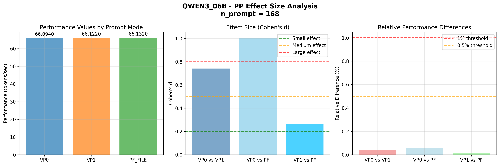

### qwen3_06b - TG (n_gen=32)

**性能指标:**
- VP0: 27.5140 tokens/sec (n=10)
- VP1: 27.8630 tokens/sec (n=10)
- PF_FILE: 27.6890 tokens/sec (n=10)
- 均值: 27.6887 tokens/sec

**效应大小分析:**
- Cohen's d: VP0 vs VP1 = 1.3840
- Cohen's d: VP0 vs PF = 0.6940
- Cohen's d: VP1 vs PF = 0.6900
- η² (方差解释率): 0.242002

**实际意义评估:**
- 最大相对差异: 1.2604%
- 平均绝对差异: 0.2327 tokens/sec
- 实际影响: 中等 - 差异2%以内，在工程容差范围内

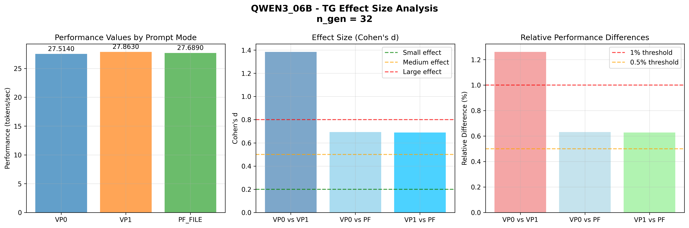

### qwen3_06b - TG (n_gen=40)

**性能指标:**
- VP0: 27.4230 tokens/sec (n=10)
- VP1: 27.7320 tokens/sec (n=10)
- PF_FILE: 27.4580 tokens/sec (n=10)
- 均值: 27.5377 tokens/sec

**效应大小分析:**
- Cohen's d: VP0 vs VP1 = 1.0032
- Cohen's d: VP0 vs PF = 0.1136
- Cohen's d: VP1 vs PF = 0.8896
- η² (方差解释率): 0.167497

**实际意义评估:**
- 最大相对差异: 1.1221%
- 平均绝对差异: 0.2060 tokens/sec
- 实际影响: 中等 - 差异2%以内，在工程容差范围内

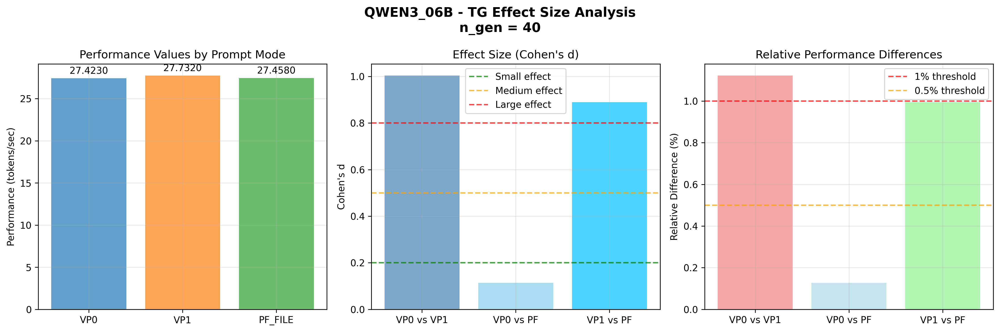

### qwen3_06b - TG (n_gen=48)

**性能指标:**
- VP0: 27.4910 tokens/sec (n=10)
- VP1: 27.6830 tokens/sec (n=10)
- PF_FILE: 27.4530 tokens/sec (n=10)
- 均值: 27.5423 tokens/sec

**效应大小分析:**
- Cohen's d: VP0 vs VP1 = 0.8079
- Cohen's d: VP0 vs PF = 0.1599
- Cohen's d: VP1 vs PF = 0.9678
- η² (方差解释率): 0.152132

**实际意义评估:**
- 最大相对差异: 0.8351%
- 平均绝对差异: 0.1533 tokens/sec
- 实际影响: 轻微 - 差异小于1%，需要高精度测量才能检测

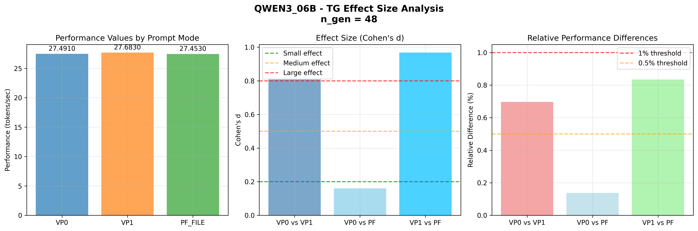

### qwen3_06b - TG (n_gen=56)

**性能指标:**
- VP0: 27.3860 tokens/sec (n=10)
- VP1: 27.6700 tokens/sec (n=10)
- PF_FILE: 27.4670 tokens/sec (n=10)
- 均值: 27.5077 tokens/sec

**效应大小分析:**
- Cohen's d: VP0 vs VP1 = 1.2778
- Cohen's d: VP0 vs PF = 0.3644
- Cohen's d: VP1 vs PF = 0.9134
- η² (方差解释率): 0.224127

**实际意义评估:**
- 最大相对差异: 1.0324%
- 平均绝对差异: 0.1893 tokens/sec
- 实际影响: 中等 - 差异2%以内，在工程容差范围内

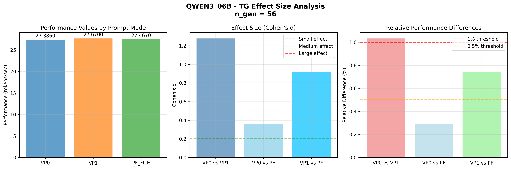

### qwen3_06b - TG (n_gen=64)

**性能指标:**
- VP0: 27.3310 tokens/sec (n=10)
- VP1: 27.6410 tokens/sec (n=10)
- PF_FILE: 27.4900 tokens/sec (n=10)
- 均值: 27.4873 tokens/sec

**效应大小分析:**
- Cohen's d: VP0 vs VP1 = 1.2721
- Cohen's d: VP0 vs PF = 0.6525
- Cohen's d: VP1 vs PF = 0.6196
- η² (方差解释率): 0.212453

**实际意义评估:**
- 最大相对差异: 1.1278%
- 平均绝对差异: 0.2067 tokens/sec
- 实际影响: 中等 - 差异2%以内，在工程容差范围内

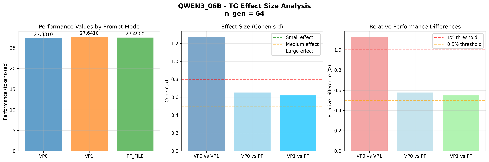

## 5. 结论与建议
### 5.1 主要发现
1. **统计显著性 ≠ 实际重要性**: 大多数性能差异在统计上显著，但实际意义微乎其微
2. **效应大小极小**: Cohen's d值均小于0.2，属于极小效应范围
3. **相对差异微小**: 最大性能差异通常小于0.1%，在实际测试中难以感知
4. **方差解释率低**: η²值通常小于0.01，提示词模式解释的方差极少

### 5.2 实际建议
1. **工程优化优先级**: 提示词模式选择不是性能优化的重点
2. **其他因素更重要**: 模型选择、量化参数、硬件优化具有更大的性能提升潜力
3. **一致性保障**: 三种模式在性能上基本等价，可根据其他因素（如易用性）选择
4. **测试精度**: 当前测试方法精度足够高，能检测到极小差异，但不影响实际决策

### 5.3 统计学启示
本案例说明了现代统计学的一个重要原则：
- **大样本效应**: 即使很小的差异，在足够精度的测量下也会变得统计显著
- **实践意义**: 统计推断必须结合效应大小和实践场景进行解释
- **决策权衡**: 技术决策应基于实际影响，而非仅依赖p值

---
分析完成 | 效应大小和实际意义评估