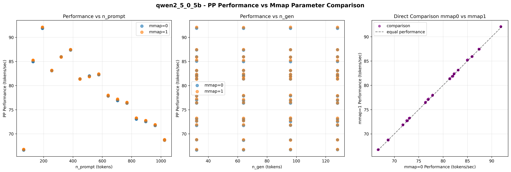
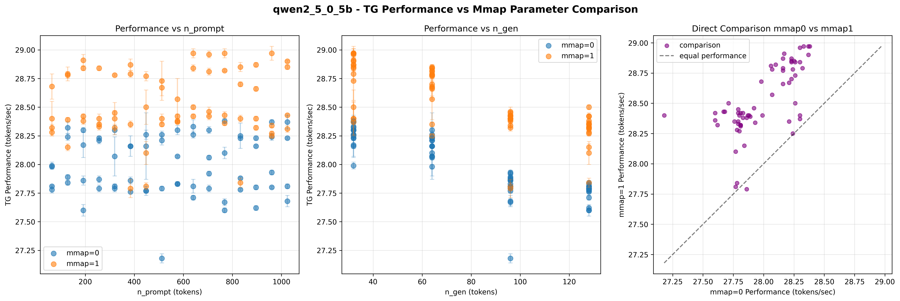
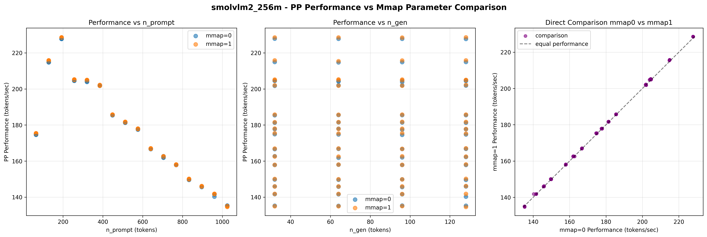
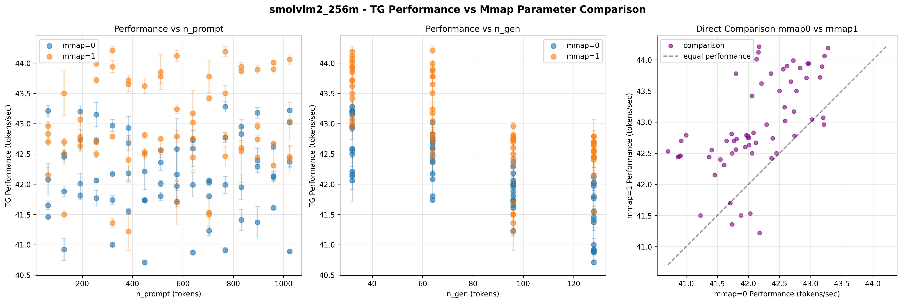
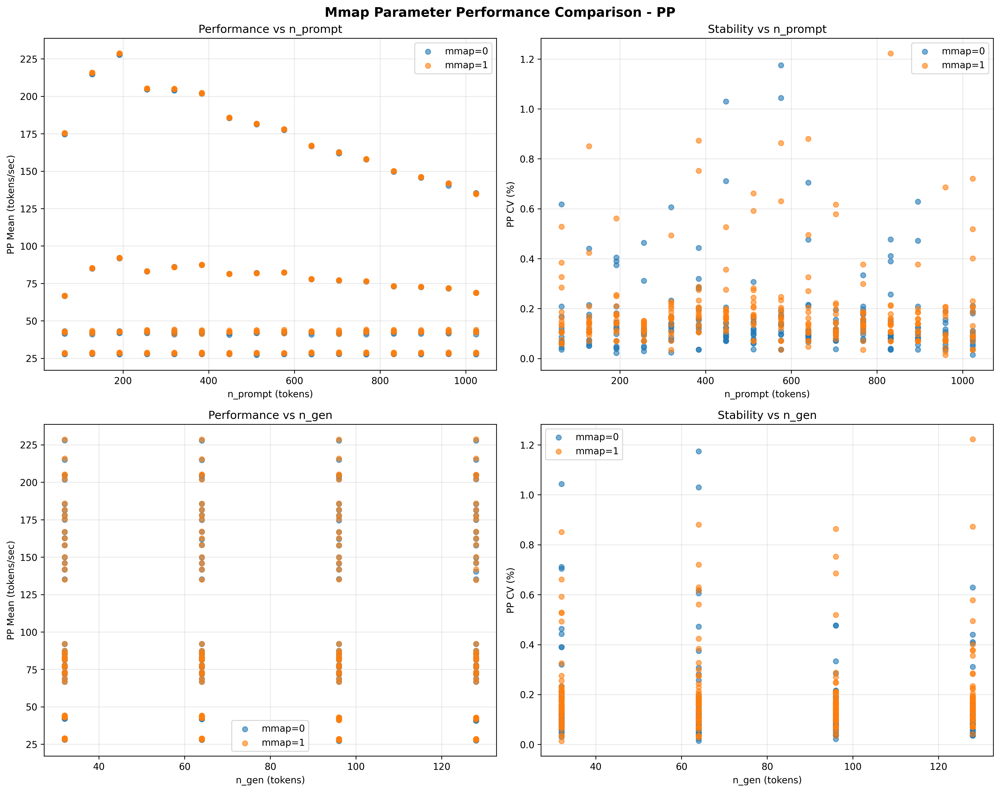

# mmap参数深度扫描分析数据报告
生成时间: 2025年11月28日 16:29:31
数据来源: benchmark_results.db

## 数据概览
- 总测试记录数: 512
- 涉及模型: qwen2_5_0_5b, smolvlm2_256m
- 性能指标: pp, tg
- mmap值: [0, 1]
- n_prompt范围: 64 - 1024
- n_gen范围: 32 - 128

## 测试记录统计
| mmap值 | 模型 | 性能指标 | 测试记录数 |
|--------|------|----------|------------|
| 0 | qwen2_5_0_5b | pp | 128 |
| 0 | qwen2_5_5_5b | tg | 128 |
| 0 | smolvlm2_256m | pp | 128 |
| 0 | smolvlm2_256m | tg | 128 |
| 1 | qwen2_5_0_5b | pp | 128 |
| 1 | qwen2_5_5_5b | tg | 128 |
| 1 | smolvlm2_256m | pp | 128 |
| 1 | smolvlm2_256m | tg | 128 |

## 性能数据表格

### PP (Prefill阶段) 性能数据
| 模型 | mmap值 | 数据点数 | 平均性能(tokens/sec) | 性能标准差 | 最小性能 | 最大性能 | 平均CV(%) | 最大CV(%) | n_prompt范围 | n_gen范围 |
|------|--------|----------|-------------------|------------|----------|----------|-----------|----------|-------------|-----------|
| qwen2_5_0_5b | 0 | 128 | 78.9308 | 6.9513 | 66.6300 | 91.8800 | 0.1035 | 0.1964 | 0.0146 | 64-1024 | 32-128 |
| qwen2_5_0_5b | 1 | 128 | 79.0177 | 6.9487 | 66.7600 | 92.1000 | 0.1281 | 0.2095 | 0.0139 | 64-1024 | 32-128 |
| smolvlm2_256m | 0 | 128 | 177.000 | 27.2199 | 135.180 | 227.9100 | 0.0972 | 0.2049 | 0.0219 | 64-1024 | 32-128 |
| smolvlm2_256m | 1 | 128 | 177.337 | 27.3983 | 134.620 | 228.6300 | 0.1722 | 0.2698 | 0.0775 | 64-1024 | 32-128 |

### TG (Decode阶段) 性能数据
| 模型 | mmap值 | 数据点数 | 平均性能(tokens/sec) | 性能标准差 | 最小性能 | 最大性能 | 平均CV(%) | 最大CV(%) | n_prompt范围 | n_gen_range |
|------|--------|----------|-------------------|------------|----------|----------|-----------|----------|-------------|-----------|
| qwen2_5_0_5b | 0 | 128 | 28.00 | 0.2549 | 27.1800 | 28.3800 | 0.1321 | 1.0298 | 0.0354 | 64-1024 | 32-128 |
| qwen2_5_5_5b | 1 | 128 | 28.52 | 0.2849 | 27.7900 | 28.9700 | 0.1463 | 0.6300 | 0.0346 | 64-1024 | 32-128 |
| smolvlm2_256m | 0 | 128 | 42.14 | 0.6572 | 40.7100 | 43.2800 | 0.2543 | 1.1743 | 0.0237 | 64-1024 | 32-128 |
| smolvlm2_256m | 1 | 128 | 42.95 | 0.7523 | 41.2200 | 44.2100 | 0.3117 | 1.2221 | 0.0468 | 64-1024 | 32-128 |

## mmap参数差异分析
| 模型 | 性能指标 | 性能差异(tokens/sec) | 差异百分比(%) | CV差异(%) | 数据点数差 |
|------|----------|-------------------|----------------|-----------|-------------|--------------|
| qwen2_5_5_5b | pp | 0.0869 | 0.1101 | 0.0246 | 0 |
| smolvlm2_256m | pp | 0.3389 | 0.1915 | 0.0749 | 0 |
| qwen2_5_5_5b | tg | 0.5292 | 1.8906 | 0.0143 | 0 |
| smolvlm2_256m | tg | 0.8111 | 1.9248 | 0.0574 | 0 |

## 分析图表
### 单模型对比图

*图表说明: 每个图表显示mmap=0和mmap=1条件下的性能散点图，包含误差棒表示标准差。最后一个子图显示直接对比。*

### 聚合对比图

*聚合图表说明: 左上-性能vs n_prompt，右上-稳定性vs n_prompt，左下-性能vs n_gen，右下-稳定性vs n_gen*

## 数据文件
- [原始数据](mmap_sweep_raw_data.csv): 所有测试记录的详细数据
- [汇总数据](mmap_sweep_summary.csv): 按模型和mmap值汇总的统计数据
- [差异数据](mmap_sweep_difference.csv): mmap=0与mmap=1的差异对比数据

---

数据整理完成