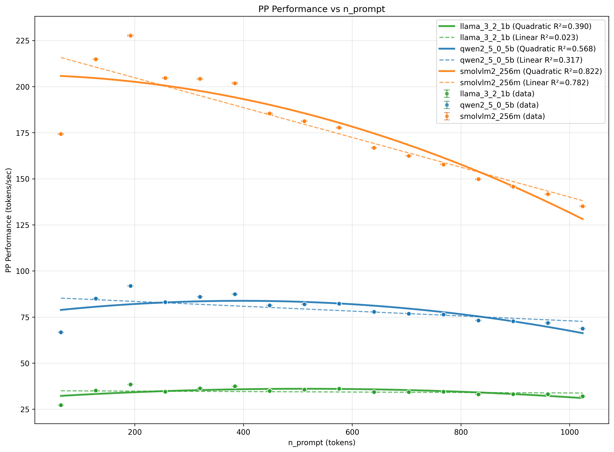
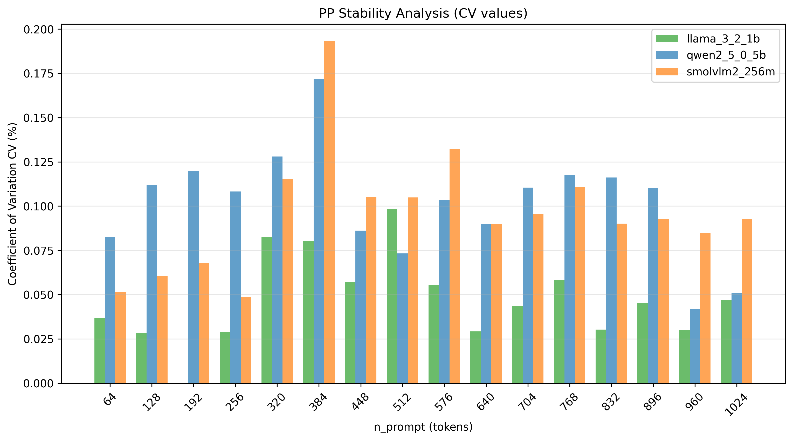
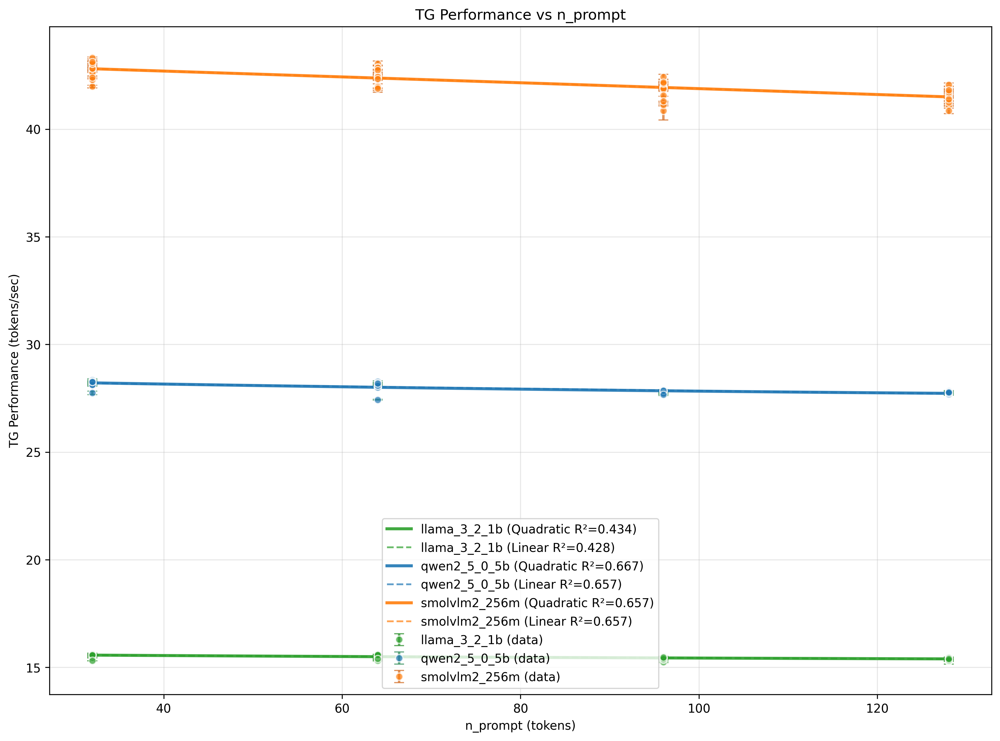

# 多模型对比回归分析数据报告

## 基本信息
生成时间: 2025年11月28日 17:20:22
数据来源: benchmark_results.db
分析模型: qwen2_5_0_5b, smolvlm2_256m, llama_3_2_1b
测试类型: 三模型n/p组合扫描基准测试

---

## PP(Prefill阶段)数据结果

### llama_3_2_1b

#### 基础统计数据
- 数据点: 64
- n_prompt范围: 64 - 1024 tokens
- 性能值范围: 27.22 - 38.47 tokens/sec
- CV值:
  - 平均: 0.049%
  - 最小: 0.000%
  - 最大: 0.112%

#### 回归分析结果
- 线性回归: y = -0.0013x + 35.0672 (R²=0.0230)
- 二次回归: y = -0.000019x² + 0.0196x + 31.0541 (R²=0.3899)
- 最佳模型: quadratic (R²=0.3899)
- 线性回归斜率: -0.0013

### qwen2_5_0_5b

#### 基础统计数据
- 数据点: 64
- n_prompt范围: 64 - 1024 tokens
- 性能值范围: 66.69 - 91.90 tokens/sec
- CV值:
  - 平均: 0.099%
  - 最小: 0.028%
  - 最大: 0.184%

#### 回归分析结果
- 线性回归: y = -0.0131x + 86.0871 (R²=0.3174)
- 二次回归: y = -0.000045x² + 0.0353x + 76.7819 (R²=0.5684)
- 最佳模型: quadratic (R²=0.5684)
- 线性回归斜率: -0.0131

### smolvlm2_256m

#### 基础统计数据
- 数据点: 64
- n_prompt范围: 64 - 1024 tokens
- 性能值范围: 134.92 - 227.97 tokens/sec
- CV值:
  - 平均: 0.099%
  - 最小: 0.026%
  - 最大: 0.235%

#### 回归分析结果
- 线性回归: y = -0.0809x + 220.9312 (R²=0.7825)
- 二次回归: y = -0.000070x² + -0.0050x + 206.3651 (R²=0.8225)
- 最佳模型: quadratic (R²=0.8225)
- 线性回归斜率: -0.0809

\n\n\n\n---\n\n## TG(Decode阶段)数据结果\n\n### llama_3_2_1b

#### 基础统计数据
- 数据点: 64
- n_prompt范围: 32 - 128 tokens
- 性能值范围: 15.24 - 15.63 tokens/sec
- CV值:
  - 平均: 0.107%
  - 最小: 0.000%
  - 最大: 0.916%

#### 回归分析结果
- 线性回归: y = -0.0018x + 15.6200 (R²=0.4284)
- 二次回归: y = 0.000007x² + -0.0029x + 15.6559 (R²=0.4337)
- 最佳模型: quadratic (R²=0.4337)
- 线性回归斜率: -0.0018

### qwen2_5_0_5b

#### 基础统计数据
- 数据点: 64
- n_prompt范围: 32 - 128 tokens
- 性能值范围: 27.43 - 28.35 tokens/sec
- CV值:
  - 平均: 0.118%
  - 最小: 0.035%
  - 最大: 0.396%

#### 回归分析结果
- 线性回归: y = -0.0051x + 28.3553 (R²=0.6574)
- 二次回归: y = 0.000021x² + -0.0085x + 28.4647 (R²=0.6670)
- 最佳模型: quadratic (R²=0.6670)
- 线性回归斜率: -0.0051

### smolvlm2_256m

#### 基础统计数据
- 数据点: 64
- n_prompt范围: 32 - 128 tokens
- 性能值范围: 40.85 - 43.31 tokens/sec
- CV值:
  - 平均: 0.249%
  - 最小: 0.024%
  - 最大: 1.077%

#### 回归分析结果
- 线性回归: y = -0.0136x + 43.2419 (R²=0.6572)
- 二次回归: y = -0.000001x² + -0.0134x + 43.2364 (R²=0.6573)
- 最佳模型: quadratic (R²=0.6573)
- 线性回归斜率: -0.0136

\n\n\n\n---\n\n## 数据汇总表\n\n| 指标 | PP | TG |\n|------|----|----|\n| 平均CV | 0.049% | 0.107% |\n\n\n数据处理完成