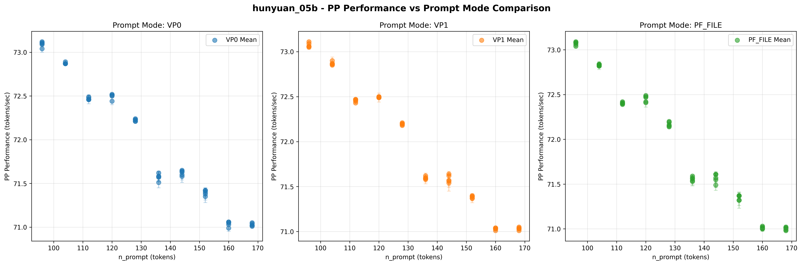
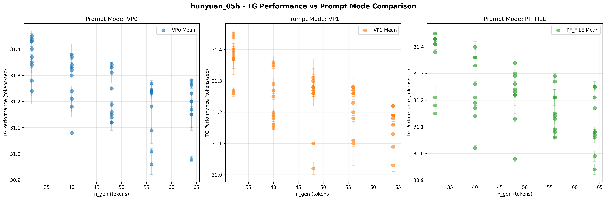
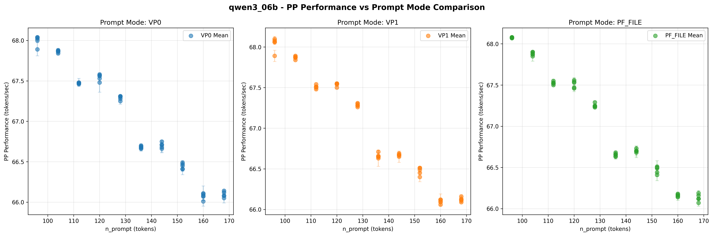
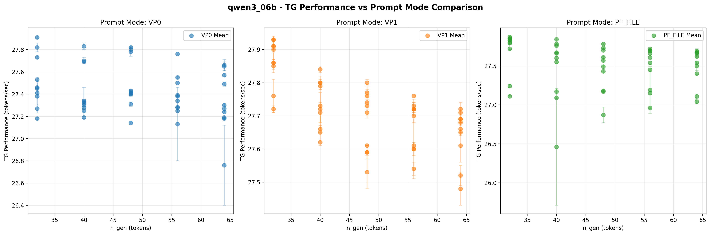
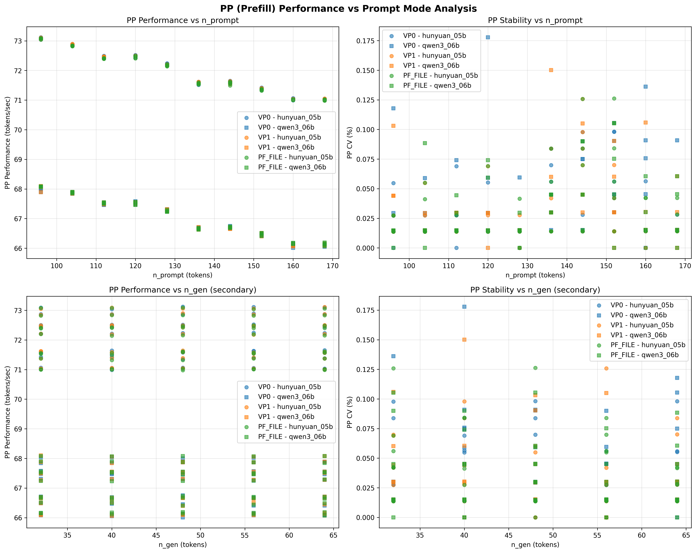
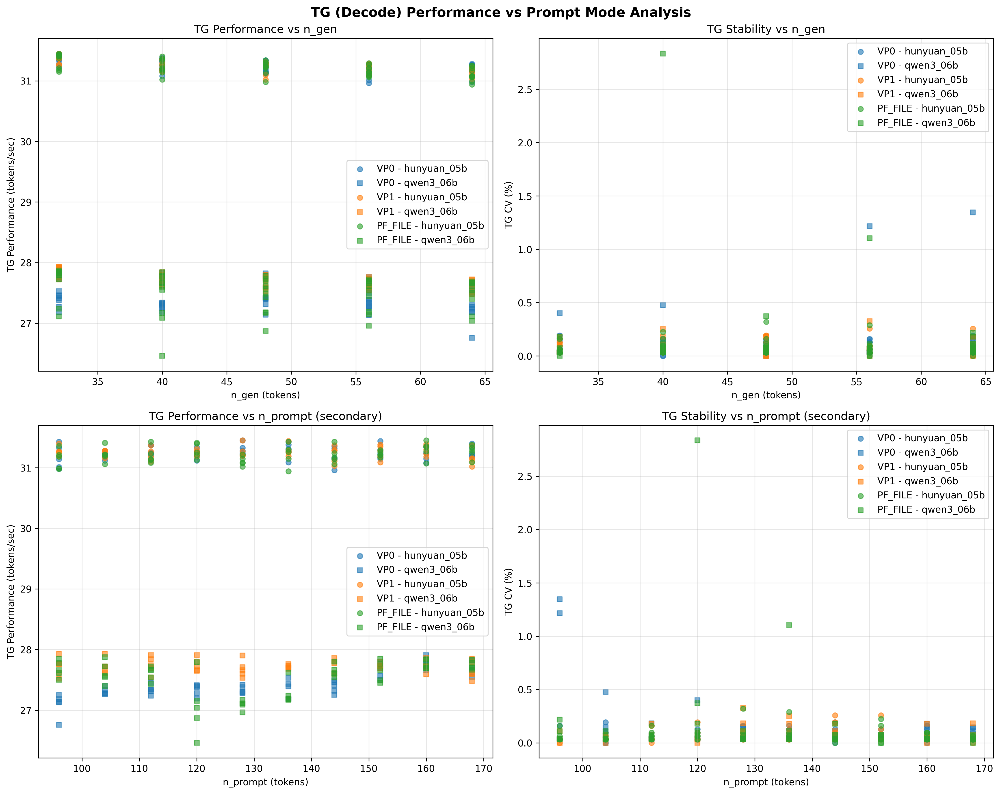

# 提示词模式对比分析数据报告
生成时间: 2025年11月30日 02:35:49
数据来源: benchmark_results.db

## 数据概览
- 总测试记录数: 600
- 涉及模型: hunyuan_05b, qwen3_06b
- 性能指标: pp, tg
- 提示词模式: pf_file, vp0, vp1
- n_prompt范围: 96 - 168
- n_gen范围: 32 - 64

## 测试记录统计
| 提示词模式 | 模型 | 性能指标 | 测试记录数 |
|------------|------|----------|------------|
| pf_file | hunyuan_05b | pp | 50 |
| pf_file | hunyuan_05b | tg | 50 |
| pf_file | qwen3_06b | pp | 50 |
| pf_file | qwen3_06b | tg | 50 |
| vp0 | hunyuan_05b | pp | 50 |
| vp0 | hunyuan_05b | tg | 50 |
| vp0 | qwen3_06b | pp | 50 |
| vp0 | qwen3_06b | tg | 50 |
| vp1 | hunyuan_05b | pp | 50 |
| vp1 | hunyuan_05b | tg | 50 |
| vp1 | qwen3_06b | pp | 50 |
| vp1 | qwen3_06b | tg | 50 |

## 性能数据表格
### PP (Prefill阶段) 性能数据
| 模型 | 提示词模式 | 数据点数 | 平均性能(tokens/sec) | 性能标准差 | 最小性能 | 最大性能 | 平均CV(%) | 最大CV(%) |
|------|------------|----------|-------------------|------------|----------|----------|-----------|----------|
| hunyuan_05b | pf_file | 50 | 71.9414 | 0.7129 | 70.9800 | 73.0900 | 0.0312 | 0.1262 |
| hunyuan_05b | vp0 | 50 | 71.9808 | 0.7172 | 70.9900 | 73.1200 | 0.0315 | 0.0981 |
| hunyuan_05b | vp1 | 50 | 71.9716 | 0.7132 | 71.0100 | 73.1100 | 0.0259 | 0.1258 |
| qwen3_06b | pf_file | 50 | 67.0360 | 0.6756 | 66.0700 | 68.0800 | 0.0329 | 0.1054 |
| qwen3_06b | vp0 | 50 | 67.0164 | 0.6798 | 66.0100 | 68.0400 | 0.0434 | 0.1778 |
| qwen3_06b | vp1 | 50 | 67.0262 | 0.6818 | 66.0600 | 68.1000 | 0.0338 | 0.1501 |

### TG (Decode阶段) 性能数据
| 模型 | 提示词模式 | 数据点数 | 平均性能(tokens/sec) | 性能标准差 | 最小性能 | 最大性能 | 平均CV(%) | 最大CV(%) |
|------|------------|----------|-------------------|------------|----------|----------|-----------|----------|
| hunyuan_05b | pf_file | 50 | 31.2172 | 0.1301 | 30.9400 | 31.4500 | 0.0660 | 0.3203 |
| hunyuan_05b | vp0 | 50 | 31.2436 | 0.1151 | 30.9600 | 31.4500 | 0.0666 | 0.1926 |
| hunyuan_05b | vp1 | 50 | 31.2446 | 0.0991 | 31.0200 | 31.4500 | 0.0627 | 0.2573 |
| qwen3_06b | pf_file | 50 | 27.5114 | 0.3100 | 26.4600 | 27.8700 | 0.1443 | 2.8345 |
| qwen3_06b | vp0 | 50 | 27.4290 | 0.2315 | 26.7600 | 27.9100 | 0.1292 | 1.3453 |
| qwen3_06b | vp1 | 50 | 27.7178 | 0.1098 | 27.4800 | 27.9300 | 0.0744 | 0.3261 |

## 分析图表
### 单模型对比图

*图表说明: 每个图表显示不同提示词模式(vp0/vp1/pf_file)下的性能散点图，包含误差棒表示标准差。*

### 聚合对比图

*聚合图表说明:
- PP聚合图: 左上-性能vs n_prompt(主要)，右上-稳定性vs n_prompt(主要)，左下-性能vs n_gen(次要)，右下-稳定性vs n_gen(次要)*
- TG聚合图: 左上-性能vs n_gen(主要)，右上-稳定性vs n_gen(主要)，左下-性能vs n_prompt(次要)，右下-稳定性vs n_prompt(次要)*
- 图例说明：hunyuan_05b模型使用圆形(○)，qwen3_06b模型使用方形(□)
- 注意：PP和TG已分两个独立图表展示，便于清晰分析

## 数据文件
- [原始数据](prompt_mode_raw_data.csv): 所有测试记录的详细数据
- [汇总数据](prompt_mode_summary.csv): 按模型和模式汇总的统计数据

---
数据整理完成