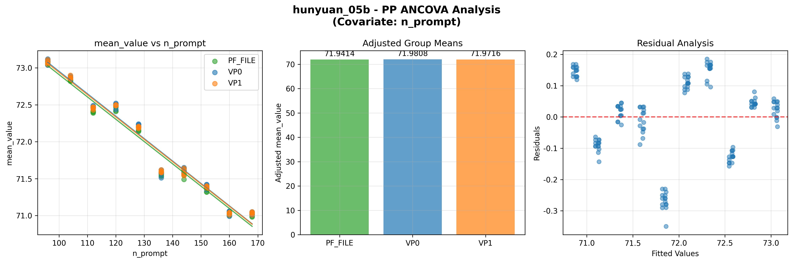
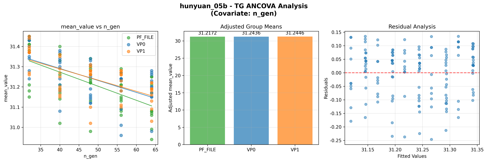
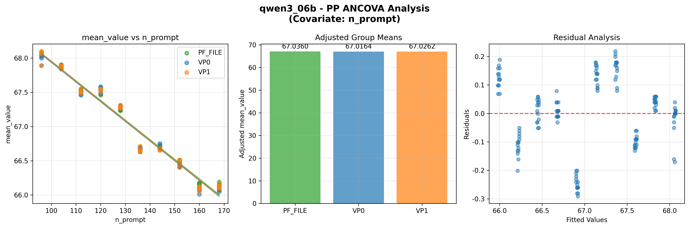
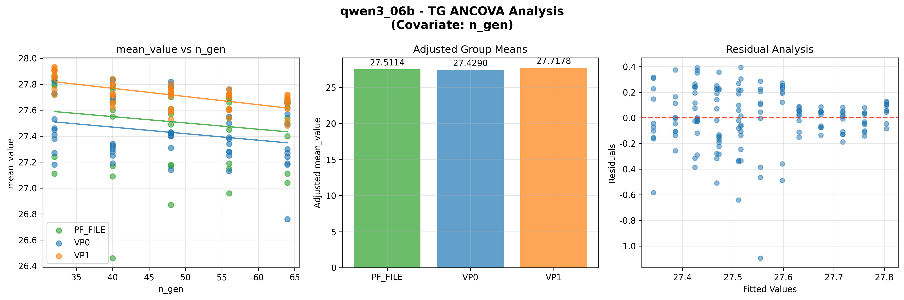

# 提示词模式协方差分析报告

## 1. 分析概览

### 1.1 分析目标
分析提示词模式（VP0、VP1、PF_FILE）对大模型性能的影响
同时控制token长度作为协变量。

### 1.2 统计假设
零假设（H₀）：控制token长度后，提示词模式对性能无显著影响
备择假设（H₁）：控制token长度后，至少一种提示词模式与其他模式有差异

### 1.3 分析设计
- **PP性能**：协方差分析，以n_prompt为协变量
- **TG性能**：协方差分析，以n_gen为协变量
- **分析因子**：提示词模式（VP0、VP1、PF_FILE）
- **因变量**：性能均值

### 1.4 统计假设检验

| 假设项目 | 描述 | 检验方法 |
|---------|-----|---------|
| 线性关系 | 各组内协变量与因变量呈线性关系 | Pearson相关系数 |
| 斜率齐性 | 协变量与因子无显著交互作用 | 交互项检验 |
| 残差正态性 | 残差服从正态分布 | Shapiro-Wilk检验 |
| 方差齐性 | 各组残差方差相等 | Levene检验 |

## 2. HUNYUAN_05B 分析结果

### 2.1 PP性能分析（协变量：n_prompt）

#### 模型摘要

- **R²**: 0.967706
- **调整R²**: 0.967042
- **F统计量**: 1458.305350
- **p值**: 0.000000
- **AIC**: -185.08
- **BIC**: -173.04

#### 方差分析关键统计

- **总体F统计量**: 1458.305350
- **总体p值**: 0.000000
- **显著性**: 显著

#### 调整组均值

| 提示词模式 | 调整均值 |
|-----------|---------|
| PF_FILE | 71.941400 |
| VP0 | 71.980800 |
| VP1 | 71.971600 |

#### 效应大小

- **η²**: 0.000566
- **偏η²**: 0.017222
- **效应解释**: 极小效应 (η² = 0.000566)

#### 假设验证

##### 线性关系评估
- PF_FILE: r = -0.984, p = 0.000000, 符合线性: True
- VP0: r = -0.983, p = 0.000000, 符合线性: True
- VP1: r = -0.984, p = 0.000000, 符合线性: True

##### 统计检验
- **正态性检验(Shapiro-Wilk)**: p = N/A - 未通过
- **方差齐性(Levene)**: p = 0.996844 - 通过
- **斜率齐性**: p = 0.890279 - 通过

### 2.2 TG性能分析（协变量：n_gen）

#### 模型摘要

- **R²**: 0.376604
- **调整R²**: 0.363794
- **F统计量**: 29.400343
- **p值**: 0.000000
- **AIC**: -285.99
- **BIC**: -273.95

#### 方差分析关键统计

- **总体F统计量**: 29.400343
- **总体p值**: 0.000000
- **显著性**: 显著

#### 调整组均值

| 提示词模式 | 调整均值 |
|-----------|---------|
| PF_FILE | 31.217200 |
| VP0 | 31.243600 |
| VP1 | 31.244600 |

#### 效应大小

- **η²**: 0.012167
- **偏η²**: 0.019143
- **效应解释**: 小效应 (η² = 0.012167)

#### 假设验证

##### 线性关系评估
- PF_FILE: r = -0.611, p = 0.000002, 符合线性: True
- VP0: r = -0.587, p = 0.000007, 符合线性: True
- VP1: r = -0.638, p = 0.000001, 符合线性: True

##### 统计检验
- **正态性检验(Shapiro-Wilk)**: p = N/A - 未通过
- **方差齐性(Levene)**: p = 0.041325 - 未通过
- **斜率齐性**: p = 0.521485 - 通过

## 2. QWEN3_06B 分析结果

### 2.1 PP性能分析（协变量：n_prompt）

#### 模型摘要

- **R²**: 0.965258
- **调整R²**: 0.964544
- **F统计量**: 1352.142064
- **p值**: 0.000000
- **AIC**: -189.41
- **BIC**: -177.37

#### 方差分析关键统计

- **总体F统计量**: 1352.142064
- **总体p值**: 0.000000
- **显著性**: 显著

#### 调整组均值

| 提示词模式 | 调整均值 |
|-----------|---------|
| PF_FILE | 67.036000 |
| VP0 | 67.016400 |
| VP1 | 67.026200 |

#### 效应大小

- **η²**: 0.000142
- **偏η²**: 0.004061
- **效应解释**: 极小效应 (η² = 0.000142)

#### 假设验证

##### 线性关系评估
- PF_FILE: r = -0.985, p = 0.000000, 符合线性: True
- VP0: r = -0.981, p = 0.000000, 符合线性: True
- VP1: r = -0.982, p = 0.000000, 符合线性: True

##### 统计检验
- **正态性检验(Shapiro-Wilk)**: p = N/A - 未通过
- **方差齐性(Levene)**: p = 0.309365 - 通过
- **斜率齐性**: p = 0.945831 - 通过

### 2.2 TG性能分析（协变量：n_gen）

#### 模型摘要

- **R²**: 0.273619
- **调整R²**: 0.258693
- **F统计量**: 18.332118
- **p值**: 0.000000
- **AIC**: -18.37
- **BIC**: -6.33

#### 方差分析关键统计

- **总体F统计量**: 18.332118
- **总体p值**: 0.000000
- **显著性**: 显著

#### 调整组均值

| 提示词模式 | 调整均值 |
|-----------|---------|
| PF_FILE | 27.511400 |
| VP0 | 27.429000 |
| VP1 | 27.717800 |

#### 效应大小

- **η²**: 0.218241
- **偏η²**: 0.231036
- **效应解释**: 大效应 (η² = 0.218241)

#### 假设验证

##### 线性关系评估
- PF_FILE: r = -0.179, p = 0.212942, 符合线性: True
- VP0: r = -0.249, p = 0.081659, 符合线性: True
- VP1: r = -0.658, p = 0.000000, 符合线性: True

##### 统计检验
- **正态性检验(Shapiro-Wilk)**: p = N/A - 未通过
- **方差齐性(Levene)**: p = 0.000030 - 未通过
- **斜率齐性**: p = 0.965130 - 通过

## 3. 跨模型比较

### 3.1 PP性能汇总

| 模型 | R² | F统计量 | p值 | η² | 效应解释 |
|-----|----|---------|----|----|--------|
| hunyuan_05b | 0.9677 | 1458.3053 | 0.000000 | 0.000566 | 极小效应 (η² = 0.000566) |
| qwen3_06b | 0.9653 | 1352.1421 | 0.000000 | 0.000142 | 极小效应 (η² = 0.000142) |

### 3.2 TG性能汇总

| 模型 | R² | F统计量 | p值 | η² | 效应解释 |
|-----|----|---------|----|----|--------|
| hunyuan_05b | 0.3766 | 29.4003 | 0.000000 | 0.012167 | 小效应 (η² = 0.012167) |
| qwen3_06b | 0.2736 | 18.3321 | 0.000000 | 0.218241 | 大效应 (η² = 0.218241) |

## 4. 技术说明

### 4.1 分析方法
- **分析类型**: 协方差分析（ANCOVA）
- **统计软件**: Python (statsmodels, scipy)
- **协变量控制**: Token长度（PP用n_prompt，TG用n_gen）
- **置信水平**: 95% (α = 0.05)
- **效应大小指标**: η²和偏η²

### 4.2 数据处理
- **数据源**: SQLite数据库 benchmark_results.db
- **分析模型**: hunyuan_05b, qwen3_06b
- **提示词模式**: VP0, VP1, PF_FILE
- **性能指标**: PP和TG的均值
- **缺失数据**: 完全病例删除

### 4.3 输出文件
- **CSV结果**: ancova_analysis_results.csv
- **可视化图表**: (详见下方图表引用)
- **分析报告**: ancova_analysis_report.md

### 4.4 分析图表

#### Hunyuan_05b 模型 - PP性能分析（协变量：n_prompt）

*图1：左图展示PP性能与提示词长度的线性关系及回归线，中图为控制n_prompt后的各组调整均值，右图为残差分析*

#### Hunyuan_05b 模型 - TG性能分析（协变量：n_gen）

*图2：左图展示TG性能与生成长度的线性关系及回归线，中图为控制n_gen后的各组调整均值，右图为残差分析*

#### Qwen3_06b 模型 - PP性能分析（协变量：n_prompt）

*图3：左图展示PP性能与提示词长度的线性关系及回归线，中图为控制n_prompt后的各组调整均值，右图为残差分析*

#### Qwen3_06b 模型 - TG性能分析（协变量：n_gen）

*图4：左图展示TG性能与生成长度的线性关系及回归线，中图为控制n_gen后的各组调整均值，右图为残差分析*

**图表说明**：所有图表采用英文标签，使用安全字体(DejaVu Sans)渲染，采用1×3横向布局展示散点图、调整均值和残差分析。

---

*报告生成时间: 2025-11-30 05:06:35*
*生成工具: 协方差分析脚本*
