# 提示词模式性能方差分析报告
生成时间: 2025年11月30日 03:20:27
数据来源: benchmark_results.db
分析方法: 单因素方差分析(One-Way ANOVA)

## 1. 数据概览
- 总测试记录数: 600
- 涉及模型: hunyuan_05b, qwen3_06b
- 性能指标: pp, tg
- 提示词模式: pf_file, vp0, vp1
- n_prompt范围: 96 - 168
- n_gen范围: 32 - 64

## 2. 分析方法
### 2.1 单因素方差分析(One-Way ANOVA)
- 原假设H0: 三种提示词模式(VP0, VP1, PF_FILE)的性能均值相等
- 备择假设H1: 至少有一种模式的性能均值与其他模式不同
- 显著性水平α=0.05

### 2.2 方差齐性检验
- Levene检验: 检验各组方差是否相等
- Bartlett检验: 另一种方差齐性检验方法

### 2.3 事后检验
- Tukey HSD: 当ANOVA显著时，进行两两比较
- 控制多重比较中的第一类错误率

## 3. 详细分析结果
### 3.1 HUNYUAN_05B_PP 性能分析

**分析方法**: 按n_prompt参数值分组进行ANOVA，每组内包含相同n_prompt长度下的5次重复测试

**分析范围**: n_prompt ∈ [96, 104, 112, 120, 128, 136, 144, 152, 160, 168]

#### n_prompt = 96

##### 基础统计信息
| 模式 | 样本量 | 均值 | 标准差 | 中位数 |
|------|--------|------|--------|--------|
| VP0 | 5 | 73.0920 | 0.0311 | 73.1000 |
| VP1 | 5 | 73.0740 | 0.0251 | 73.0600 |
| PF_FILE | 5 | 73.0700 | 0.0200 | 73.0800 |

##### 方差齐性检验
| 检验方法 | 统计量 | p值 | 结论(α=0.05) |
|----------|--------|-----|--------------|
| Levene检验 | 0.107692 | 0.898762 | 满足方差齐性 |
| Bartlett检验 | 0.692604 | 0.707299 | 满足方差齐性 |

##### 单因素方差分析(ANOVA)结果
- F统计量: 1.030000
- p值: 0.38652319
- 显著性水平: 不显著 (p >= 0.05)
- **结果**: 不能拒绝原假设，三种模式的性能差异不具有统计显著性

##### 数据分布图
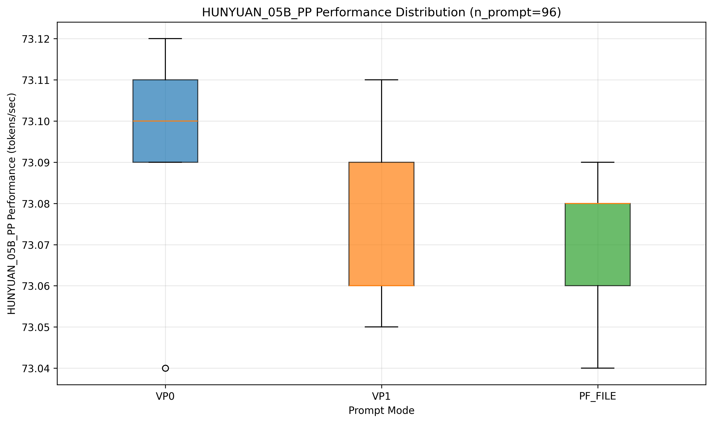

#### n_prompt = 104

##### 基础统计信息
| 模式 | 样本量 | 均值 | 标准差 | 中位数 |
|------|--------|------|--------|--------|
| VP0 | 5 | 72.8740 | 0.0089 | 72.8700 |
| VP1 | 5 | 72.8680 | 0.0192 | 72.8600 |
| PF_FILE | 5 | 72.8300 | 0.0100 | 72.8300 |

##### 方差齐性检验
| 检验方法 | 统计量 | p值 | 结论(α=0.05) |
|----------|--------|-----|--------------|
| Levene检验 | 0.648649 | 0.540141 | 满足方差齐性 |
| Bartlett检验 | 2.639585 | 0.267191 | 满足方差齐性 |

##### 单因素方差分析(ANOVA)结果
- F统计量: 15.527273
- p值: 0.00046878
- 显著性水平: 极显著 (p < 0.001)
- **结果**: 拒绝原假设，至少有一种模式的性能与其他模式存在显著差异

##### 数据分布图
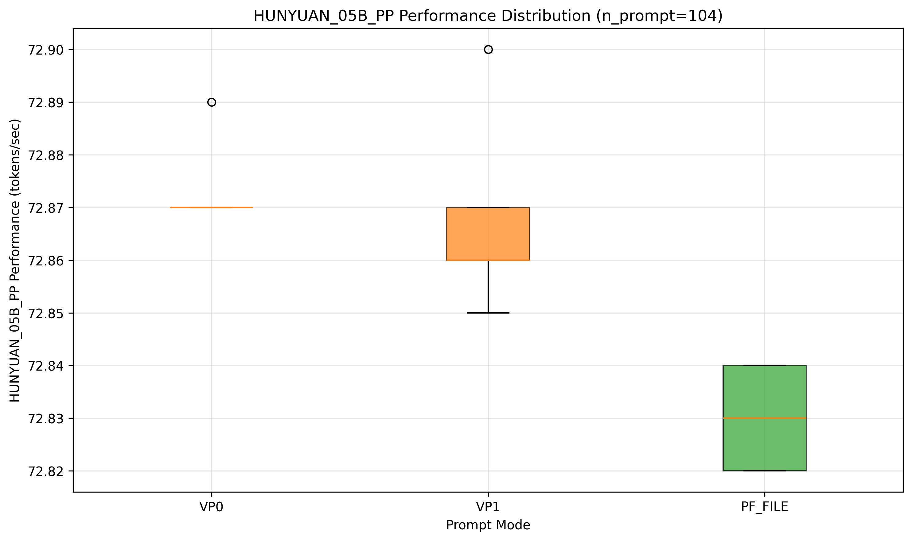

#### n_prompt = 112

##### 基础统计信息
| 模式 | 样本量 | 均值 | 标准差 | 中位数 |
|------|--------|------|--------|--------|
| VP0 | 5 | 72.4700 | 0.0141 | 72.4600 |
| VP1 | 5 | 72.4560 | 0.0167 | 72.4600 |
| PF_FILE | 5 | 72.4040 | 0.0114 | 72.4000 |

##### 方差齐性检验
| 检验方法 | 统计量 | p值 | 结论(α=0.05) |
|----------|--------|-----|--------------|
| Levene检验 | 0.153846 | 0.859068 | 满足方差齐性 |
| Bartlett检验 | 0.518035 | 0.771810 | 满足方差齐性 |

##### 单因素方差分析(ANOVA)结果
- F统计量: 29.737705
- p值: 0.00002239
- 显著性水平: 极显著 (p < 0.001)
- **结果**: 拒绝原假设，至少有一种模式的性能与其他模式存在显著差异

##### 数据分布图
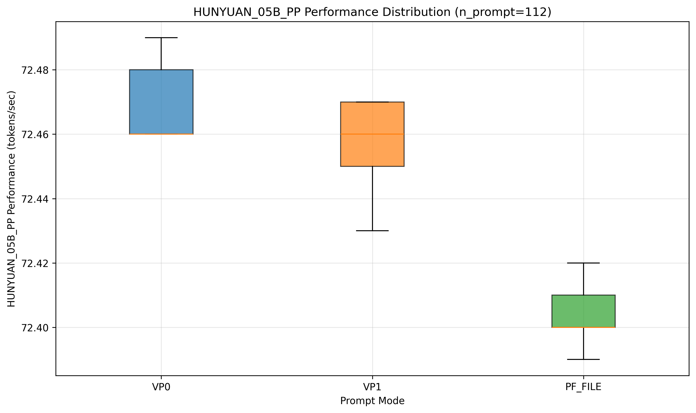

#### n_prompt = 120

##### 基础统计信息
| 模式 | 样本量 | 均值 | 标准差 | 中位数 |
|------|--------|------|--------|--------|
| VP0 | 5 | 72.4960 | 0.0321 | 72.5100 |
| VP1 | 5 | 72.4940 | 0.0055 | 72.4900 |
| PF_FILE | 5 | 72.4540 | 0.0365 | 72.4700 |

##### 方差齐性检验
| 检验方法 | 统计量 | p值 | 结论(α=0.05) |
|----------|--------|-----|--------------|
| Levene检验 | 1.388535 | 0.286786 | 满足方差齐性 |
| Bartlett检验 | 9.035508 | 0.010914 | 不满足方差齐性 |

##### 单因素方差分析(ANOVA)结果
- F统计量: 3.523013
- p值: 0.06255490
- 显著性水平: 边缘显著 (p < 0.10)
- **结果**: 不能拒绝原假设，三种模式的性能差异不具有统计显著性

##### 数据分布图
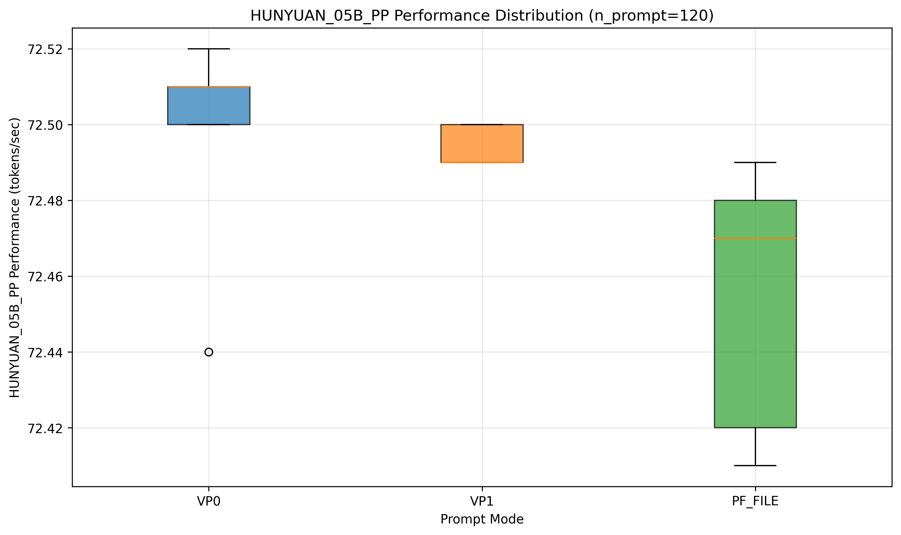

#### n_prompt = 128

##### 基础统计信息
| 模式 | 样本量 | 均值 | 标准差 | 中位数 |
|------|--------|------|--------|--------|
| VP0 | 5 | 72.2240 | 0.0134 | 72.2300 |
| VP1 | 5 | 72.1960 | 0.0114 | 72.2000 |
| PF_FILE | 5 | 72.1680 | 0.0259 | 72.1600 |

##### 方差齐性检验
| 检验方法 | 统计量 | p值 | 结论(α=0.05) |
|----------|--------|-----|--------------|
| Levene检验 | 1.476190 | 0.267193 | 满足方差齐性 |
| Bartlett检验 | 2.876587 | 0.237332 | 满足方差齐性 |

##### 单因素方差分析(ANOVA)结果
- F统计量: 12.000000
- p值: 0.00137174
- 显著性水平: 高度显著 (p < 0.01)
- **结果**: 拒绝原假设，至少有一种模式的性能与其他模式存在显著差异

##### 数据分布图
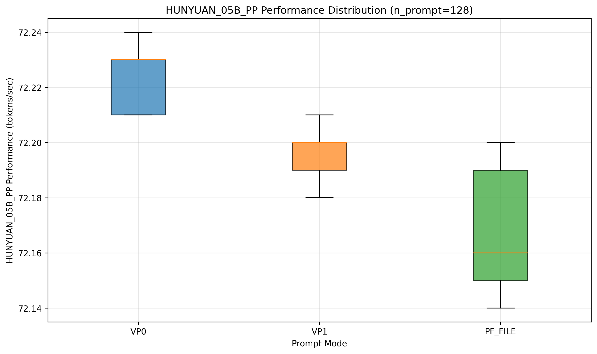

#### n_prompt = 136

##### 基础统计信息
| 模式 | 样本量 | 均值 | 标准差 | 中位数 |
|------|--------|------|--------|--------|
| VP0 | 5 | 71.5720 | 0.0396 | 71.5800 |
| VP1 | 5 | 71.5960 | 0.0152 | 71.5900 |
| PF_FILE | 5 | 71.5580 | 0.0239 | 71.5600 |

##### 方差齐性检验
| 检验方法 | 统计量 | p值 | 结论(α=0.05) |
|----------|--------|-----|--------------|
| Levene检验 | 0.592000 | 0.568597 | 满足方差齐性 |
| Bartlett检验 | 3.144788 | 0.207548 | 满足方差齐性 |

##### 单因素方差分析(ANOVA)结果
- F统计量: 2.337553
- p值: 0.13889159
- 显著性水平: 不显著 (p >= 0.05)
- **结果**: 不能拒绝原假设，三种模式的性能差异不具有统计显著性

##### 数据分布图
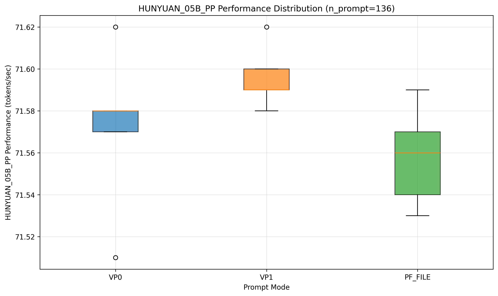

#### n_prompt = 144

##### 基础统计信息
| 模式 | 样本量 | 均值 | 标准差 | 中位数 |
|------|--------|------|--------|--------|
| VP0 | 5 | 71.6200 | 0.0292 | 71.6300 |
| VP1 | 5 | 71.5860 | 0.0422 | 71.5700 |
| PF_FILE | 5 | 71.5660 | 0.0498 | 71.5700 |

##### 方差齐性检验
| 检验方法 | 统计量 | p值 | 结论(α=0.05) |
|----------|--------|-----|--------------|
| Levene检验 | 0.376812 | 0.693883 | 满足方差齐性 |
| Bartlett检验 | 0.991470 | 0.609123 | 满足方差齐性 |

##### 单因素方差分析(ANOVA)结果
- F统计量: 2.187867
- p值: 0.15483989
- 显著性水平: 不显著 (p >= 0.05)
- **结果**: 不能拒绝原假设，三种模式的性能差异不具有统计显著性

##### 数据分布图
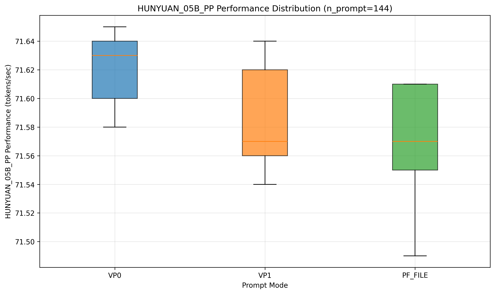

#### n_prompt = 152

##### 基础统计信息
| 模式 | 样本量 | 均值 | 标准差 | 中位数 |
|------|--------|------|--------|--------|
| VP0 | 5 | 71.3940 | 0.0297 | 71.4000 |
| VP1 | 5 | 71.3840 | 0.0134 | 71.3900 |
| PF_FILE | 5 | 71.3500 | 0.0274 | 71.3700 |

##### 方差齐性检验
| 检验方法 | 统计量 | p值 | 结论(α=0.05) |
|----------|--------|-----|--------------|
| Levene检验 | 0.529915 | 0.601814 | 满足方差齐性 |
| Bartlett检验 | 2.212047 | 0.330872 | 满足方差齐性 |

##### 单因素方差分析(ANOVA)结果
- F统计量: 4.408840
- p值: 0.03668543
- 显著性水平: 显著 (p < 0.05)
- **结果**: 拒绝原假设，至少有一种模式的性能与其他模式存在显著差异

##### 数据分布图
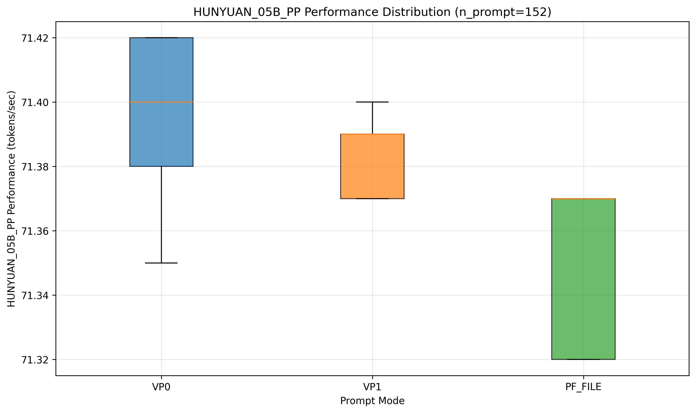

#### n_prompt = 160

##### 基础统计信息
| 模式 | 样本量 | 均值 | 标准差 | 中位数 |
|------|--------|------|--------|--------|
| VP0 | 5 | 71.0380 | 0.0295 | 71.0500 |
| VP1 | 5 | 71.0300 | 0.0122 | 71.0300 |
| PF_FILE | 5 | 71.0120 | 0.0130 | 71.0100 |

##### 方差齐性检验
| 检验方法 | 统计量 | p值 | 结论(α=0.05) |
|----------|--------|-----|--------------|
| Levene检验 | 0.925373 | 0.422910 | 满足方差齐性 |
| Bartlett检验 | 3.723703 | 0.155385 | 满足方差齐性 |

##### 单因素方差分析(ANOVA)结果
- F统计量: 2.235294
- p值: 0.14956598
- 显著性水平: 不显著 (p >= 0.05)
- **结果**: 不能拒绝原假设，三种模式的性能差异不具有统计显著性

##### 数据分布图
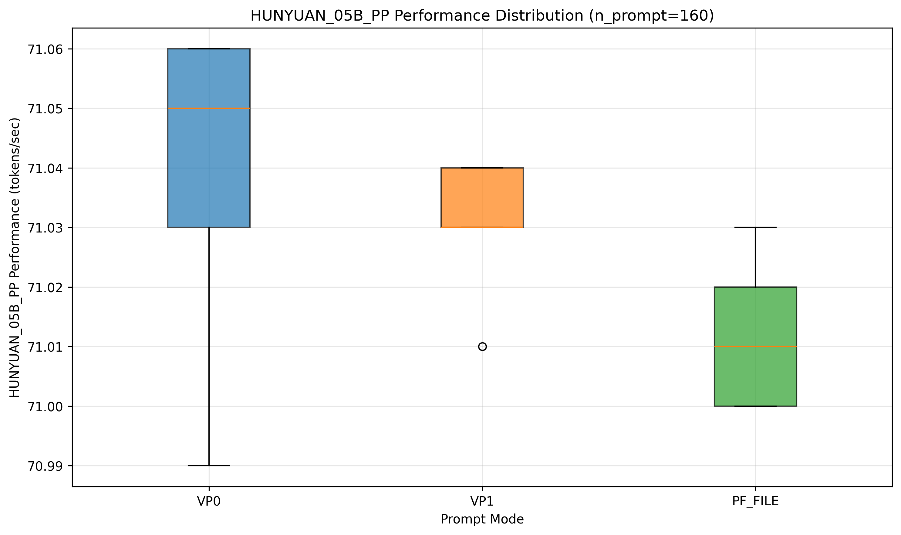

#### n_prompt = 168

##### 基础统计信息
| 模式 | 样本量 | 均值 | 标准差 | 中位数 |
|------|--------|------|--------|--------|
| VP0 | 5 | 71.0280 | 0.0164 | 71.0200 |
| VP1 | 5 | 71.0320 | 0.0148 | 71.0300 |
| PF_FILE | 5 | 71.0020 | 0.0164 | 71.0100 |

##### 方差齐性检验
| 检验方法 | 统计量 | p值 | 结论(α=0.05) |
|----------|--------|-----|--------------|
| Levene检验 | 0.045455 | 0.955727 | 满足方差齐性 |
| Bartlett检验 | 0.049129 | 0.975735 | 满足方差齐性 |

##### 单因素方差分析(ANOVA)结果
- F统计量: 5.236842
- p值: 0.02317618
- 显著性水平: 显著 (p < 0.05)
- **结果**: 拒绝原假设，至少有一种模式的性能与其他模式存在显著差异

##### 数据分布图
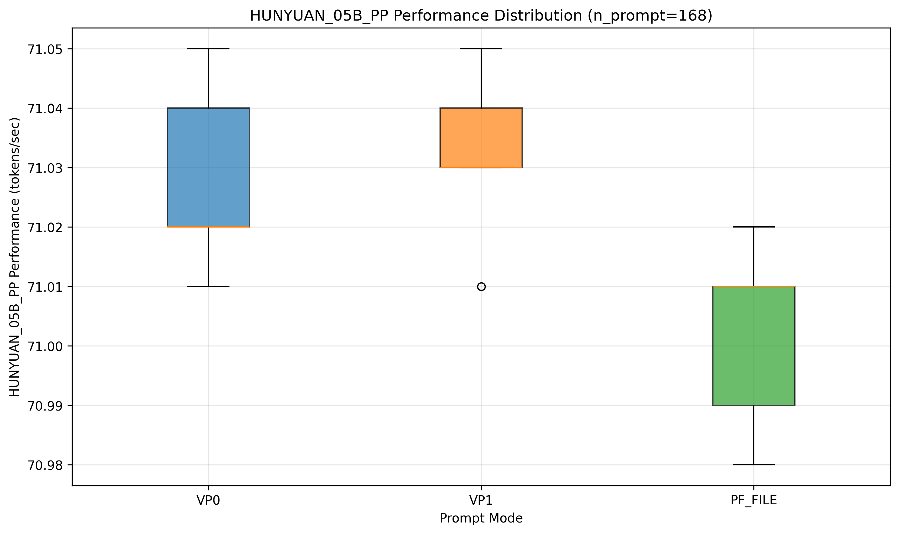

### 3.2 HUNYUAN_05B_TG 性能分析

**分析方法**: 按n_gen参数值分组进行ANOVA，每组内包含相同n_gen长度下的5次重复测试

**分析范围**: n_gen ∈ [32, 40, 48, 56, 64]

#### n_gen = 32

##### 基础统计信息
| 模式 | 样本量 | 均值 | 标准差 | 中位数 |
|------|--------|------|--------|--------|
| VP0 | 10 | 31.3730 | 0.0712 | 31.3850 |
| VP1 | 10 | 31.3700 | 0.0622 | 31.3750 |
| PF_FILE | 10 | 31.3480 | 0.1182 | 31.4100 |

##### 方差齐性检验
| 检验方法 | 统计量 | p值 | 结论(α=0.05) |
|----------|--------|-----|--------------|
| Levene检验 | 0.855115 | 0.436431 | 满足方差齐性 |
| Bartlett检验 | 4.169422 | 0.124343 | 满足方差齐性 |

##### 单因素方差分析(ANOVA)结果
- F统计量: 0.244022
- p值: 0.78517967
- 显著性水平: 不显著 (p >= 0.05)
- **结果**: 不能拒绝原假设，三种模式的性能差异不具有统计显著性

##### 数据分布图
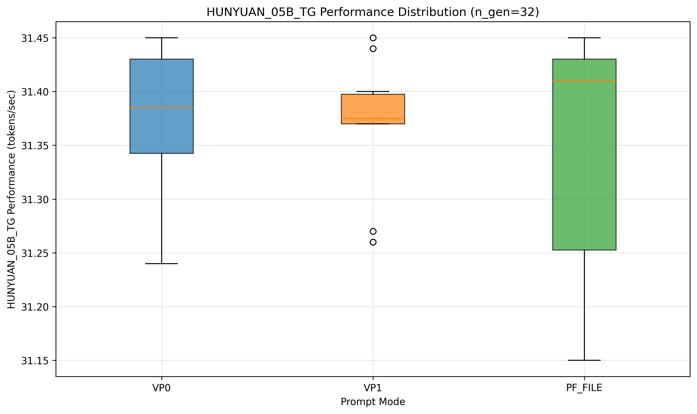

#### n_gen = 40

##### 基础统计信息
| 模式 | 样本量 | 均值 | 标准差 | 中位数 |
|------|--------|------|--------|--------|
| VP0 | 10 | 31.2750 | 0.0957 | 31.3100 |
| VP1 | 10 | 31.2400 | 0.0762 | 31.2250 |
| PF_FILE | 10 | 31.2440 | 0.1199 | 31.2350 |

##### 方差齐性检验
| 检验方法 | 统计量 | p值 | 结论(α=0.05) |
|----------|--------|-----|--------------|
| Levene检验 | 0.940299 | 0.402928 | 满足方差齐性 |
| Bartlett检验 | 1.737087 | 0.419562 | 满足方差齐性 |

##### 单因素方差分析(ANOVA)结果
- F统计量: 0.375213
- p值: 0.69066983
- 显著性水平: 不显著 (p >= 0.05)
- **结果**: 不能拒绝原假设，三种模式的性能差异不具有统计显著性

##### 数据分布图
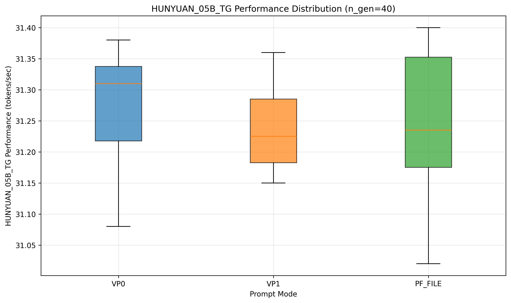

#### n_gen = 48

##### 基础统计信息
| 模式 | 样本量 | 均值 | 标准差 | 中位数 |
|------|--------|------|--------|--------|
| VP0 | 10 | 31.2110 | 0.0885 | 31.1750 |
| VP1 | 10 | 31.2360 | 0.0959 | 31.2750 |
| PF_FILE | 10 | 31.2210 | 0.1019 | 31.2350 |

##### 方差齐性检验
| 检验方法 | 统计量 | p值 | 结论(α=0.05) |
|----------|--------|-----|--------------|
| Levene检验 | 0.161379 | 0.851784 | 满足方差齐性 |
| Bartlett检验 | 0.170712 | 0.918185 | 满足方差齐性 |

##### 单因素方差分析(ANOVA)结果
- F统计量: 0.173203
- p值: 0.84189374
- 显著性水平: 不显著 (p >= 0.05)
- **结果**: 不能拒绝原假设，三种模式的性能差异不具有统计显著性

##### 数据分布图
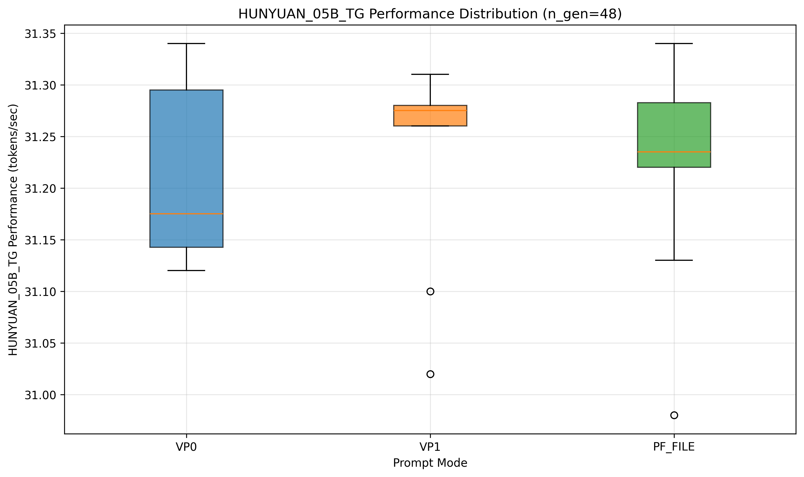

#### n_gen = 56

##### 基础统计信息
| 模式 | 样本量 | 均值 | 标准差 | 中位数 |
|------|--------|------|--------|--------|
| VP0 | 10 | 31.1700 | 0.1103 | 31.2350 |
| VP1 | 10 | 31.2170 | 0.0678 | 31.2450 |
| PF_FILE | 10 | 31.1630 | 0.0793 | 31.1450 |

##### 方差齐性检验
| 检验方法 | 统计量 | p值 | 结论(α=0.05) |
|----------|--------|-----|--------------|
| Levene检验 | 0.265587 | 0.768736 | 满足方差齐性 |
| Bartlett检验 | 2.175691 | 0.336942 | 满足方差齐性 |

##### 单因素方差分析(ANOVA)结果
- F统计量: 1.122505
- p值: 0.34018240
- 显著性水平: 不显著 (p >= 0.05)
- **结果**: 不能拒绝原假设，三种模式的性能差异不具有统计显著性

##### 数据分布图
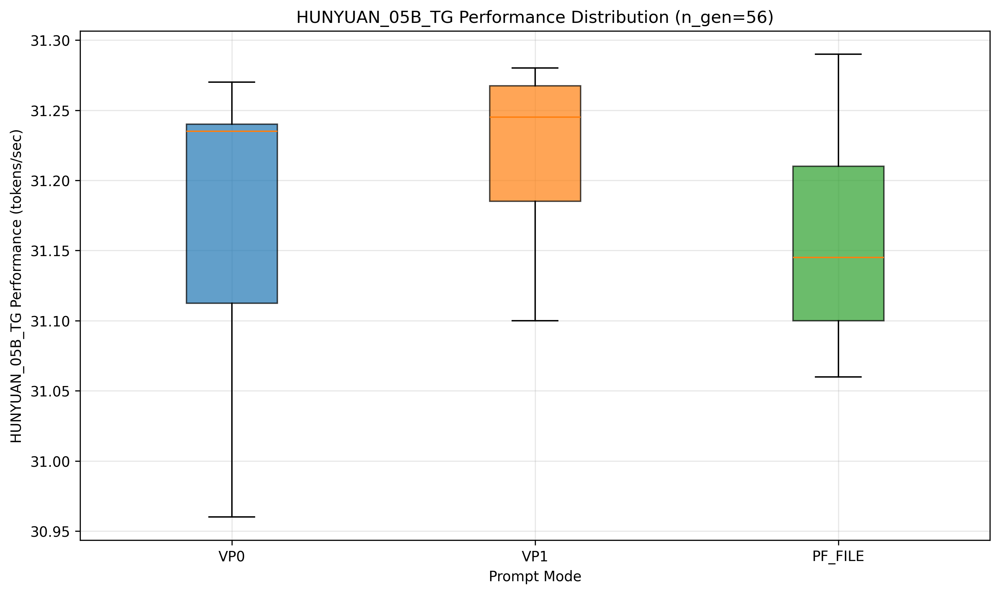

#### n_gen = 64

##### 基础统计信息
| 模式 | 样本量 | 均值 | 标准差 | 中位数 |
|------|--------|------|--------|--------|
| VP0 | 10 | 31.1890 | 0.0875 | 31.2000 |
| VP1 | 10 | 31.1600 | 0.0606 | 31.1850 |
| PF_FILE | 10 | 31.1100 | 0.1065 | 31.0800 |

##### 方差齐性检验
| 检验方法 | 统计量 | p值 | 结论(α=0.05) |
|----------|--------|-----|--------------|
| Levene检验 | 1.080966 | 0.353501 | 满足方差齐性 |
| Bartlett检验 | 2.597930 | 0.272814 | 满足方差齐性 |

##### 单因素方差分析(ANOVA)结果
- F统计量: 2.114817
- p值: 0.14020316
- 显著性水平: 不显著 (p >= 0.05)
- **结果**: 不能拒绝原假设，三种模式的性能差异不具有统计显著性

##### 数据分布图
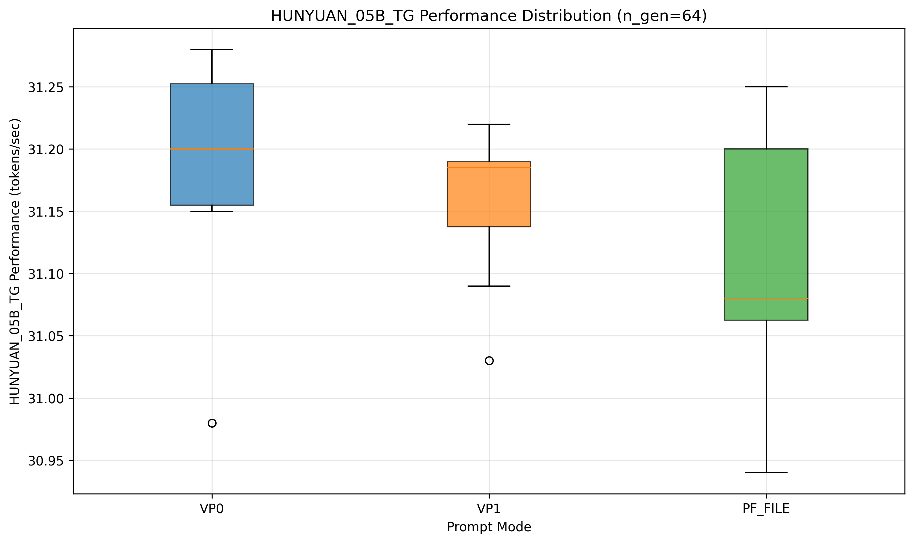

### 3.3 QWEN3_06B_PP 性能分析

**分析方法**: 按n_prompt参数值分组进行ANOVA，每组内包含相同n_prompt长度下的5次重复测试

**分析范围**: n_prompt ∈ [96, 104, 112, 120, 128, 136, 144, 152, 160, 168]

#### n_prompt = 96

##### 基础统计信息
| 模式 | 样本量 | 均值 | 标准差 | 中位数 |
|------|--------|------|--------|--------|
| VP0 | 5 | 67.9980 | 0.0626 | 68.0200 |
| VP1 | 5 | 68.0380 | 0.0844 | 68.0600 |
| PF_FILE | 5 | 68.0760 | 0.0055 | 68.0800 |

##### 方差齐性检验
| 检验方法 | 统计量 | p值 | 结论(α=0.05) |
|----------|--------|-----|--------------|
| Levene检验 | 0.952746 | 0.413018 | 满足方差齐性 |
| Bartlett检验 | 14.739976 | 0.000630 | 不满足方差齐性 |

##### 单因素方差分析(ANOVA)结果
- F统计量: 2.061427
- p值: 0.16999489
- 显著性水平: 不显著 (p >= 0.05)
- **结果**: 不能拒绝原假设，三种模式的性能差异不具有统计显著性

##### 数据分布图
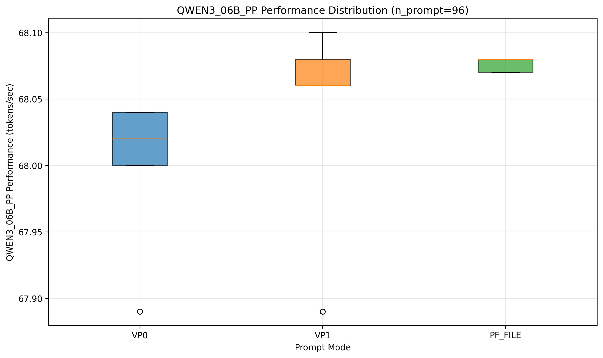

#### n_prompt = 104

##### 基础统计信息
| 模式 | 样本量 | 均值 | 标准差 | 中位数 |
|------|--------|------|--------|--------|
| VP0 | 5 | 67.8640 | 0.0152 | 67.8700 |
| VP1 | 5 | 67.8700 | 0.0187 | 67.8700 |
| PF_FILE | 5 | 67.8800 | 0.0212 | 67.8800 |

##### 方差齐性检验
| 检验方法 | 统计量 | p值 | 结论(α=0.05) |
|----------|--------|-----|--------------|
| Levene检验 | 0.311111 | 0.738367 | 满足方差齐性 |
| Bartlett检验 | 0.399043 | 0.819123 | 满足方差齐性 |

##### 单因素方差分析(ANOVA)结果
- F统计量: 0.951456
- p值: 0.41347829
- 显著性水平: 不显著 (p >= 0.05)
- **结果**: 不能拒绝原假设，三种模式的性能差异不具有统计显著性

##### 数据分布图
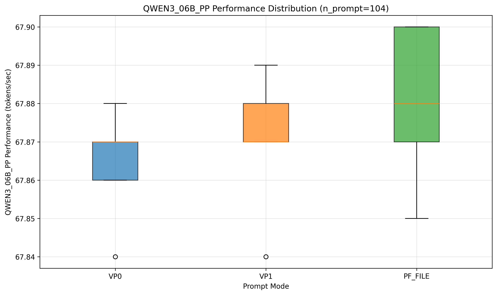

#### n_prompt = 112

##### 基础统计信息
| 模式 | 样本量 | 均值 | 标准差 | 中位数 |
|------|--------|------|--------|--------|
| VP0 | 5 | 67.4720 | 0.0084 | 67.4700 |
| VP1 | 5 | 67.5080 | 0.0217 | 67.5100 |
| PF_FILE | 5 | 67.5240 | 0.0182 | 67.5200 |

##### 方差齐性检验
| 检验方法 | 统计量 | p值 | 结论(α=0.05) |
|----------|--------|-----|--------------|
| Levene检验 | 0.604651 | 0.562093 | 满足方差齐性 |
| Bartlett检验 | 2.913560 | 0.232985 | 满足方差齐性 |

##### 单因素方差分析(ANOVA)结果
- F统计量: 12.229885
- p值: 0.00127117
- 显著性水平: 高度显著 (p < 0.01)
- **结果**: 拒绝原假设，至少有一种模式的性能与其他模式存在显著差异

##### 数据分布图
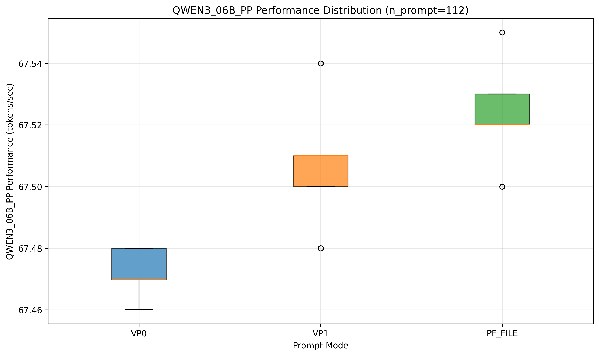

#### n_prompt = 120

##### 基础统计信息
| 模式 | 样本量 | 均值 | 标准差 | 中位数 |
|------|--------|------|--------|--------|
| VP0 | 5 | 67.5440 | 0.0404 | 67.5600 |
| VP1 | 5 | 67.5380 | 0.0217 | 67.5500 |
| PF_FILE | 5 | 67.5120 | 0.0444 | 67.5300 |

##### 方差齐性检验
| 检验方法 | 统计量 | p值 | 结论(α=0.05) |
|----------|--------|-----|--------------|
| Levene检验 | 0.818565 | 0.464247 | 满足方差齐性 |
| Bartlett检验 | 1.812604 | 0.404015 | 满足方差齐性 |

##### 单因素方差分析(ANOVA)结果
- F统计量: 1.066339
- p值: 0.37474916
- 显著性水平: 不显著 (p >= 0.05)
- **结果**: 不能拒绝原假设，三种模式的性能差异不具有统计显著性

##### 数据分布图
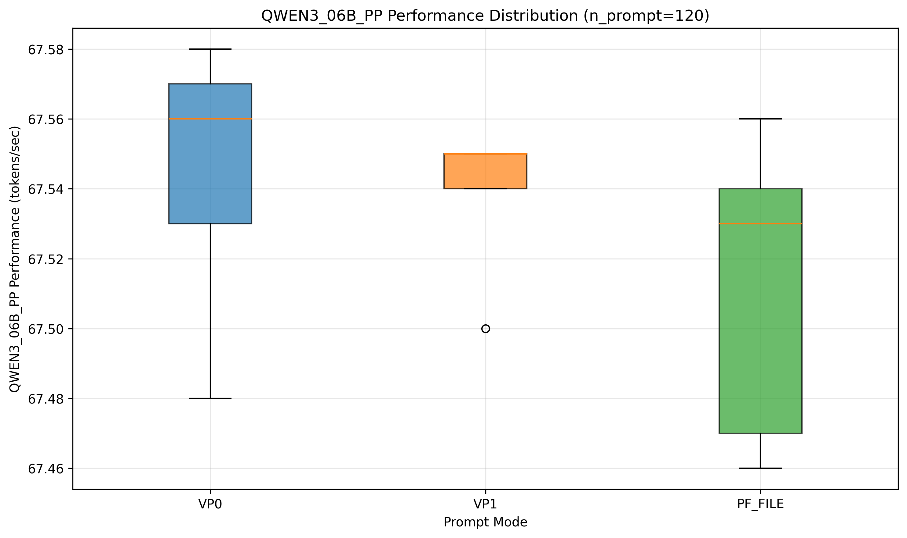

#### n_prompt = 128

##### 基础统计信息
| 模式 | 样本量 | 均值 | 标准差 | 中位数 |
|------|--------|------|--------|--------|
| VP0 | 5 | 67.2900 | 0.0255 | 67.3000 |
| VP1 | 5 | 67.2860 | 0.0195 | 67.2800 |
| PF_FILE | 5 | 67.2500 | 0.0235 | 67.2400 |

##### 方差齐性检验
| 检验方法 | 统计量 | p值 | 结论(α=0.05) |
|----------|--------|-----|--------------|
| Levene检验 | 0.081633 | 0.922118 | 满足方差齐性 |
| Bartlett检验 | 0.261510 | 0.877433 | 满足方差齐性 |

##### 单因素方差分析(ANOVA)结果
- F统计量: 4.607595
- p值: 0.03274960
- 显著性水平: 显著 (p < 0.05)
- **结果**: 拒绝原假设，至少有一种模式的性能与其他模式存在显著差异

##### 数据分布图
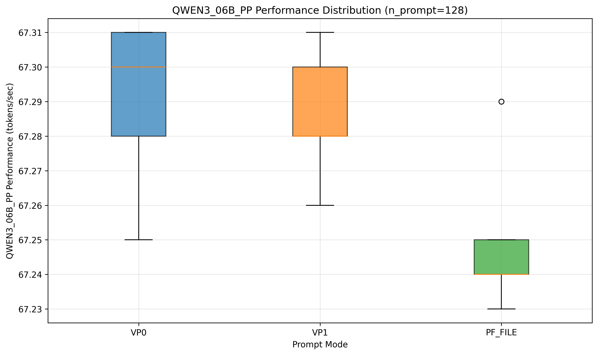

#### n_prompt = 136

##### 基础统计信息
| 模式 | 样本量 | 均值 | 标准差 | 中位数 |
|------|--------|------|--------|--------|
| VP0 | 5 | 66.6800 | 0.0158 | 66.6800 |
| VP1 | 5 | 66.6600 | 0.0300 | 66.6500 |
| PF_FILE | 5 | 66.6540 | 0.0195 | 66.6600 |

##### 方差齐性检验
| 检验方法 | 统计量 | p值 | 结论(α=0.05) |
|----------|--------|-----|--------------|
| Levene检验 | 0.160920 | 0.853167 | 满足方差齐性 |
| Bartlett检验 | 1.581139 | 0.453586 | 满足方差齐性 |

##### 单因素方差分析(ANOVA)结果
- F统计量: 1.816993
- p值: 0.20448856
- 显著性水平: 不显著 (p >= 0.05)
- **结果**: 不能拒绝原假设，三种模式的性能差异不具有统计显著性

##### 数据分布图
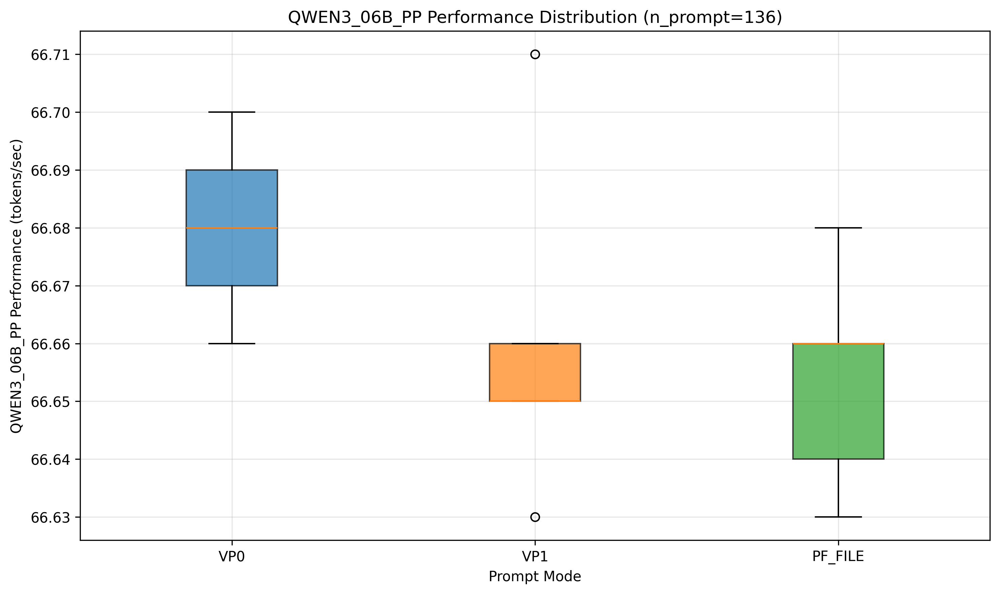

#### n_prompt = 144

##### 基础统计信息
| 模式 | 样本量 | 均值 | 标准差 | 中位数 |
|------|--------|------|--------|--------|
| VP0 | 5 | 66.7020 | 0.0342 | 66.7100 |
| VP1 | 5 | 66.6700 | 0.0141 | 66.6700 |
| PF_FILE | 5 | 66.7020 | 0.0179 | 66.7000 |

##### 方差齐性检验
| 检验方法 | 统计量 | p值 | 结论(α=0.05) |
|----------|--------|-----|--------------|
| Levene检验 | 1.341176 | 0.298067 | 满足方差齐性 |
| Bartlett检验 | 3.132782 | 0.208797 | 满足方差齐性 |

##### 单因素方差分析(ANOVA)结果
- F统计量: 3.029586
- p值: 0.08607966
- 显著性水平: 边缘显著 (p < 0.10)
- **结果**: 不能拒绝原假设，三种模式的性能差异不具有统计显著性

##### 数据分布图
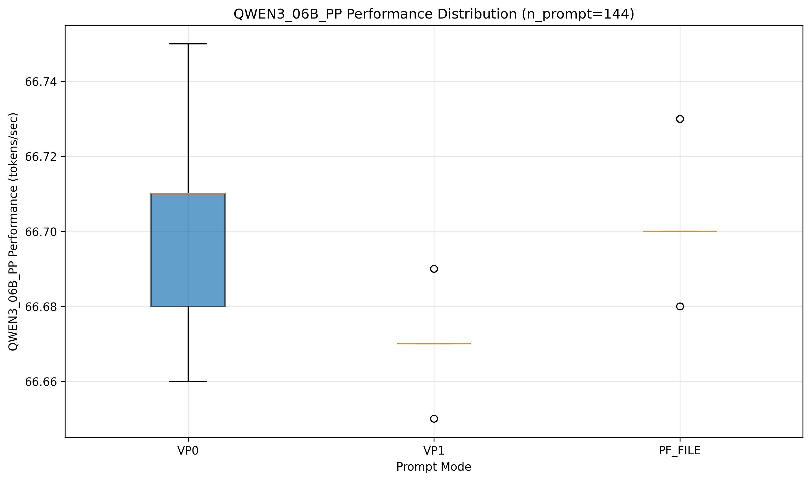

#### n_prompt = 152

##### 基础统计信息
| 模式 | 样本量 | 均值 | 标准差 | 中位数 |
|------|--------|------|--------|--------|
| VP0 | 5 | 66.4460 | 0.0358 | 66.4500 |
| VP1 | 5 | 66.4720 | 0.0471 | 66.4900 |
| PF_FILE | 5 | 66.4700 | 0.0430 | 66.4900 |

##### 方差齐性检验
| 检验方法 | 统计量 | p值 | 结论(α=0.05) |
|----------|--------|-----|--------------|
| Levene检验 | 0.054475 | 0.947215 | 满足方差齐性 |
| Bartlett检验 | 0.273240 | 0.872302 | 满足方差齐性 |

##### 单因素方差分析(ANOVA)结果
- F统计量: 0.586916
- p值: 0.57123498
- 显著性水平: 不显著 (p >= 0.05)
- **结果**: 不能拒绝原假设，三种模式的性能差异不具有统计显著性

##### 数据分布图
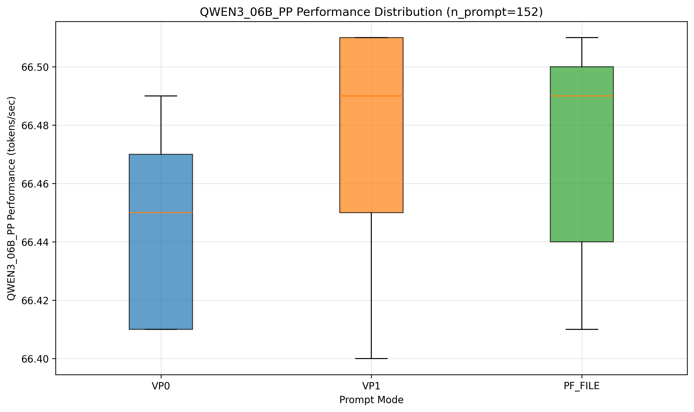

#### n_prompt = 160

##### 基础统计信息
| 模式 | 样本量 | 均值 | 标准差 | 中位数 |
|------|--------|------|--------|--------|
| VP0 | 5 | 66.0740 | 0.0391 | 66.0800 |
| VP1 | 5 | 66.0980 | 0.0249 | 66.1000 |
| PF_FILE | 5 | 66.1600 | 0.0158 | 66.1600 |

##### 方差齐性检验
| 检验方法 | 统计量 | p值 | 结论(α=0.05) |
|----------|--------|-----|--------------|
| Levene检验 | 0.725490 | 0.504155 | 满足方差齐性 |
| Bartlett检验 | 2.770674 | 0.250239 | 满足方差齐性 |

##### 单因素方差分析(ANOVA)结果
- F统计量: 12.308333
- p值: 0.00123884
- 显著性水平: 高度显著 (p < 0.01)
- **结果**: 拒绝原假设，至少有一种模式的性能与其他模式存在显著差异

##### 数据分布图
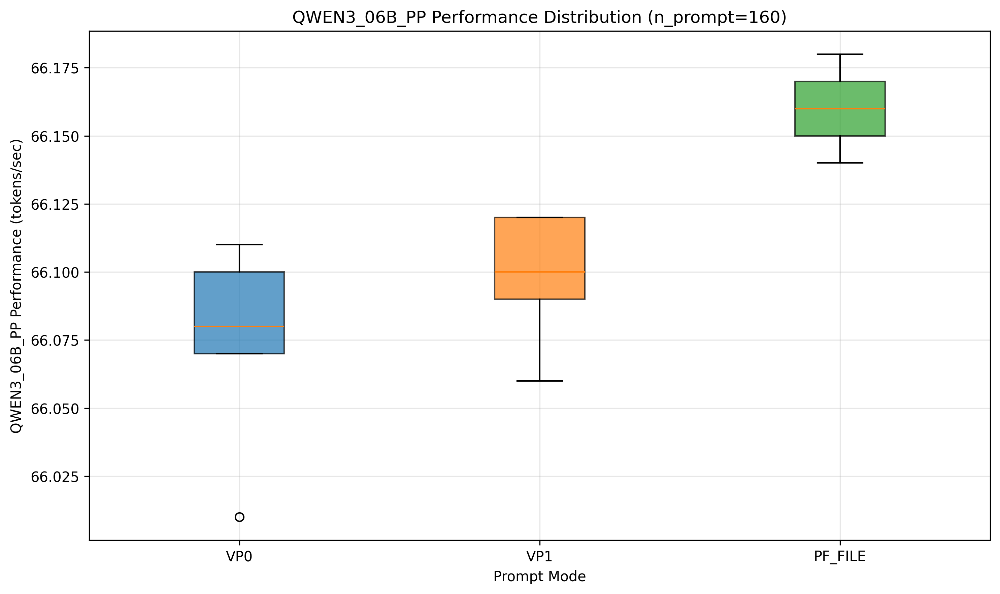

#### n_prompt = 168

##### 基础统计信息
| 模式 | 样本量 | 均值 | 标准差 | 中位数 |
|------|--------|------|--------|--------|
| VP0 | 5 | 66.0940 | 0.0358 | 66.0800 |
| VP1 | 5 | 66.1220 | 0.0259 | 66.1200 |
| PF_FILE | 5 | 66.1320 | 0.0455 | 66.1200 |

##### 方差齐性检验
| 检验方法 | 统计量 | p值 | 结论(α=0.05) |
|----------|--------|-----|--------------|
| Levene检验 | 0.385417 | 0.688291 | 满足方差齐性 |
| Bartlett检验 | 1.094680 | 0.578487 | 满足方差齐性 |

##### 单因素方差分析(ANOVA)结果
- F统计量: 1.447761
- p值: 0.27337138
- 显著性水平: 不显著 (p >= 0.05)
- **结果**: 不能拒绝原假设，三种模式的性能差异不具有统计显著性

##### 数据分布图
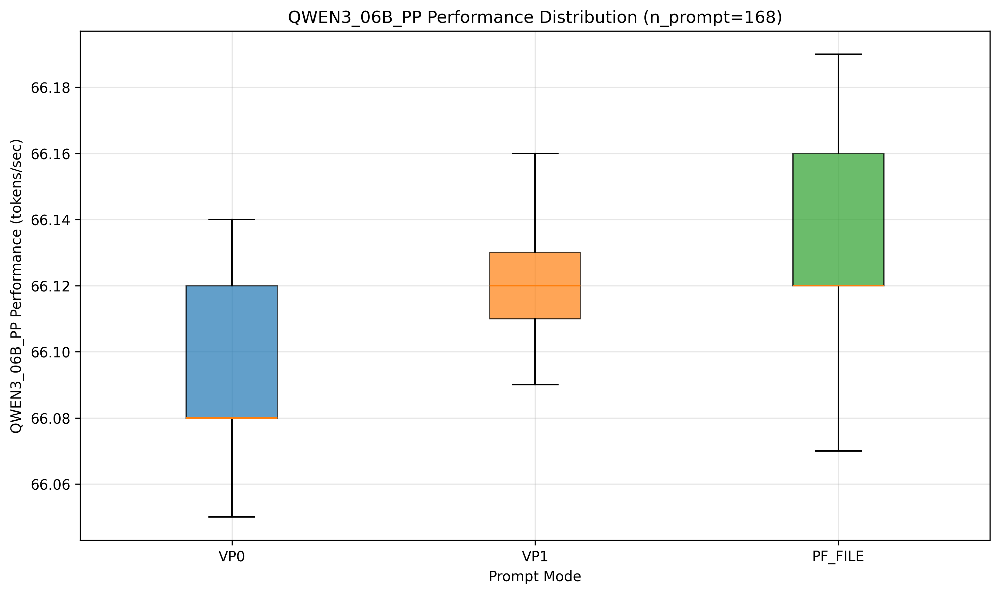

### 3.4 QWEN3_06B_TG 性能分析

**分析方法**: 按n_gen参数值分组进行ANOVA，每组内包含相同n_gen长度下的5次重复测试

**分析范围**: n_gen ∈ [32, 40, 48, 56, 64]

#### n_gen = 32

##### 基础统计信息
| 模式 | 样本量 | 均值 | 标准差 | 中位数 |
|------|--------|------|--------|--------|
| VP0 | 10 | 27.5140 | 0.2367 | 27.4550 |
| VP1 | 10 | 27.8630 | 0.0715 | 27.8800 |
| PF_FILE | 10 | 27.6890 | 0.2758 | 27.8150 |

##### 方差齐性检验
| 检验方法 | 统计量 | p值 | 结论(α=0.05) |
|----------|--------|-----|--------------|
| Levene检验 | 1.397504 | 0.264529 | 满足方差齐性 |
| Bartlett检验 | 12.689907 | 0.001756 | 不满足方差齐性 |

##### 单因素方差分析(ANOVA)结果
- F统计量: 6.657481
- p值: 0.00446289
- 显著性水平: 高度显著 (p < 0.01)
- **结果**: 拒绝原假设，至少有一种模式的性能与其他模式存在显著差异

##### 数据分布图
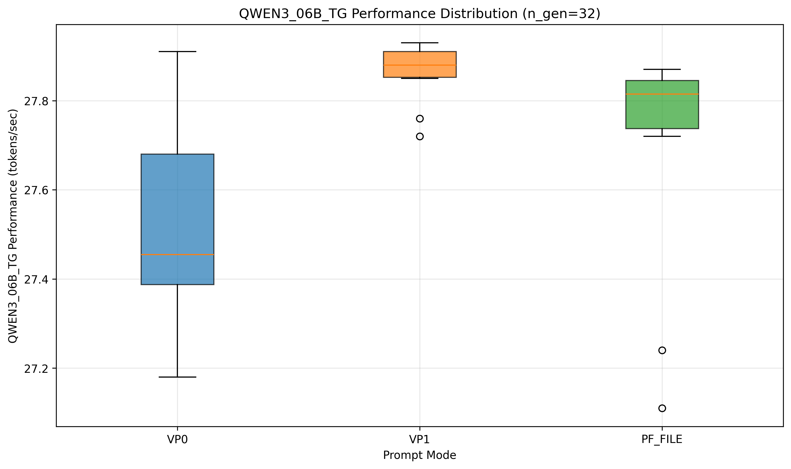

#### n_gen = 40

##### 基础统计信息
| 模式 | 样本量 | 均值 | 标准差 | 中位数 |
|------|--------|------|--------|--------|
| VP0 | 10 | 27.4230 | 0.2260 | 27.3250 |
| VP1 | 10 | 27.7320 | 0.0741 | 27.7250 |
| PF_FILE | 10 | 27.4580 | 0.4307 | 27.6300 |

##### 方差齐性检验
| 检验方法 | 统计量 | p值 | 结论(α=0.05) |
|----------|--------|-----|--------------|
| Levene检验 | 2.293470 | 0.120243 | 满足方差齐性 |
| Bartlett检验 | 19.842058 | 0.000049 | 不满足方差齐性 |

##### 单因素方差分析(ANOVA)结果
- F统计量: 3.548351
- p值: 0.04283449
- 显著性水平: 显著 (p < 0.05)
- **结果**: 拒绝原假设，至少有一种模式的性能与其他模式存在显著差异

##### 数据分布图
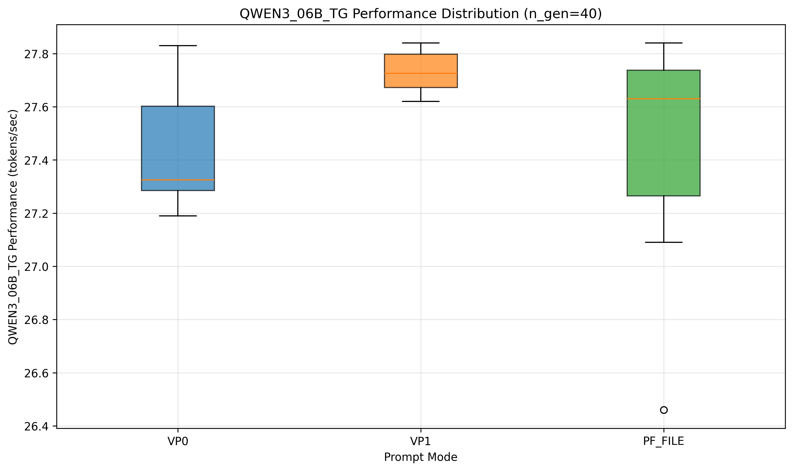

#### n_gen = 48

##### 基础统计信息
| 模式 | 样本量 | 均值 | 标准差 | 中位数 |
|------|--------|------|--------|--------|
| VP0 | 10 | 27.4910 | 0.2298 | 27.4150 |
| VP1 | 10 | 27.6830 | 0.0939 | 27.7200 |
| PF_FILE | 10 | 27.4530 | 0.2943 | 27.5300 |

##### 方差齐性检验
| 检验方法 | 统计量 | p值 | 结论(α=0.05) |
|----------|--------|-----|--------------|
| Levene检验 | 2.296581 | 0.119923 | 满足方差齐性 |
| Bartlett检验 | 9.392150 | 0.009131 | 不满足方差齐性 |

##### 单因素方差分析(ANOVA)结果
- F统计量: 3.076939
- p值: 0.06254566
- 显著性水平: 边缘显著 (p < 0.10)
- **结果**: 不能拒绝原假设，三种模式的性能差异不具有统计显著性

##### 数据分布图
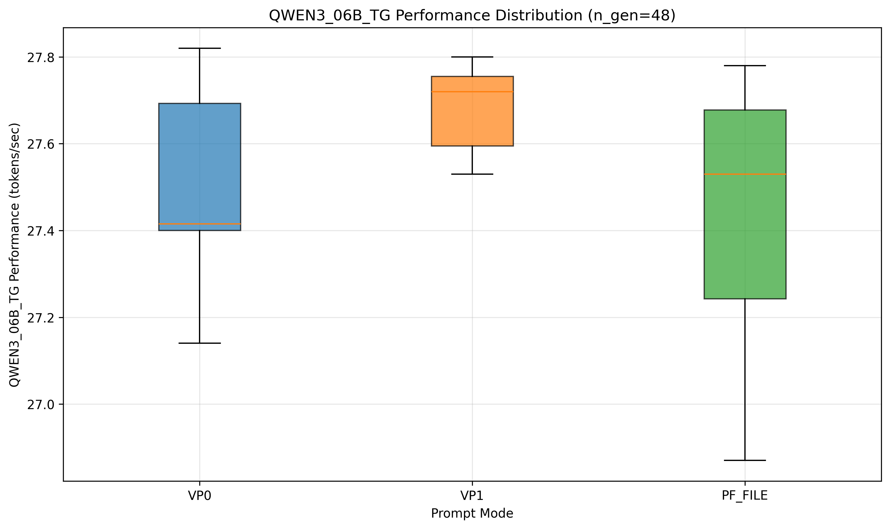

#### n_gen = 56

##### 基础统计信息
| 模式 | 样本量 | 均值 | 标准差 | 中位数 |
|------|--------|------|--------|--------|
| VP0 | 10 | 27.3860 | 0.1790 | 27.3600 |
| VP1 | 10 | 27.6700 | 0.0748 | 27.7100 |
| PF_FILE | 10 | 27.4670 | 0.2719 | 27.5750 |

##### 方差齐性检验
| 检验方法 | 统计量 | p值 | 结论(α=0.05) |
|----------|--------|-----|--------------|
| Levene检验 | 2.988587 | 0.067225 | 满足方差齐性 |
| Bartlett检验 | 11.625982 | 0.002988 | 不满足方差齐性 |

##### 单因素方差分析(ANOVA)结果
- F统计量: 5.753567
- p值: 0.00829096
- 显著性水平: 高度显著 (p < 0.01)
- **结果**: 拒绝原假设，至少有一种模式的性能与其他模式存在显著差异

##### 数据分布图
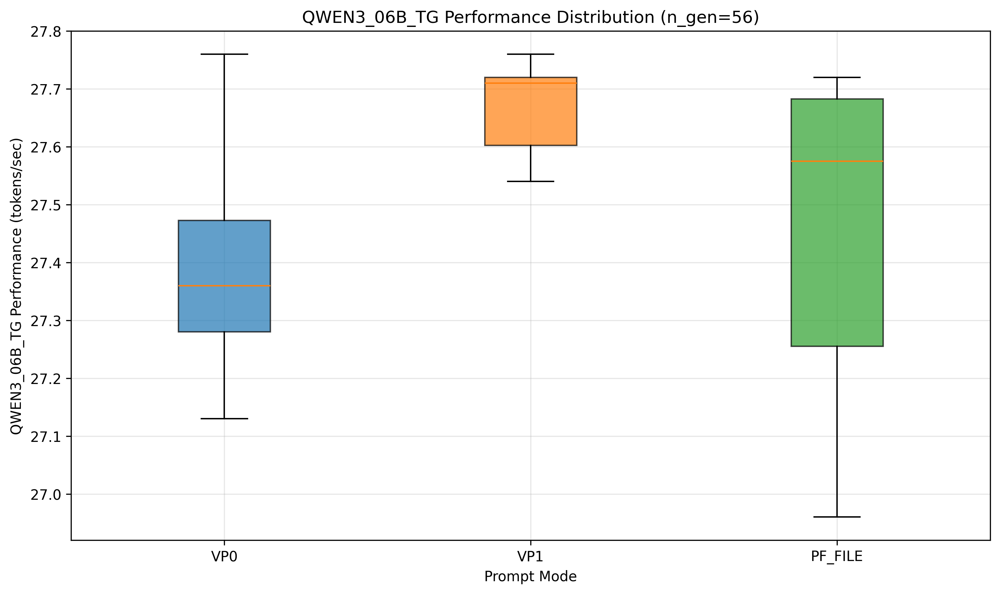

#### n_gen = 64

##### 基础统计信息
| 模式 | 样本量 | 均值 | 标准差 | 中位数 |
|------|--------|------|--------|--------|
| VP0 | 10 | 27.3310 | 0.2737 | 27.2850 |
| VP1 | 10 | 27.6410 | 0.0812 | 27.6700 |
| PF_FILE | 10 | 27.4900 | 0.2376 | 27.5800 |

##### 方差齐性检验
| 检验方法 | 统计量 | p值 | 结论(α=0.05) |
|----------|--------|-----|--------------|
| Levene检验 | 2.611593 | 0.091862 | 满足方差齐性 |
| Bartlett检验 | 10.719764 | 0.004701 | 不满足方差齐性 |

##### 单因素方差分析(ANOVA)结果
- F统计量: 5.225753
- p值: 0.01206634
- 显著性水平: 显著 (p < 0.05)
- **结果**: 拒绝原假设，至少有一种模式的性能与其他模式存在显著差异

##### 数据分布图
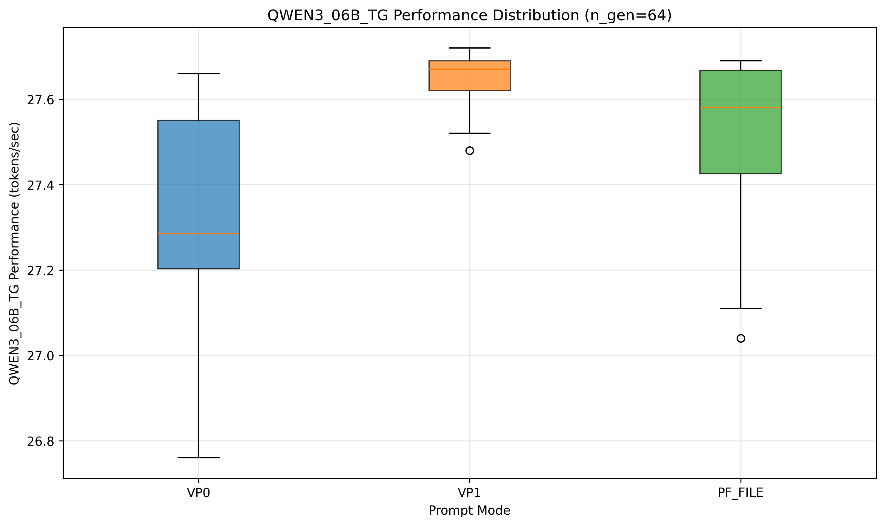

## 4. 数据文件
- [详细分析结果](anova_results.csv): 所有统计分析的完整数据
- [箱线图文件]: 各模型和性能指标的分布可视化

---
分析完成 | 请注意：本报告仅提供统计检验结果，不包含技术和业务结论