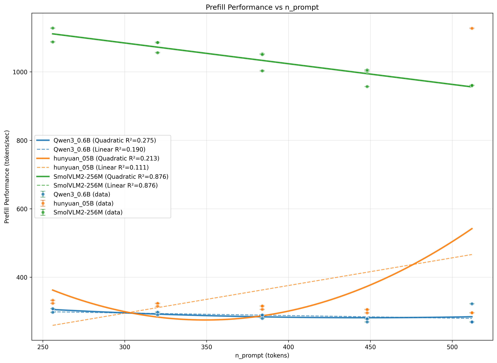
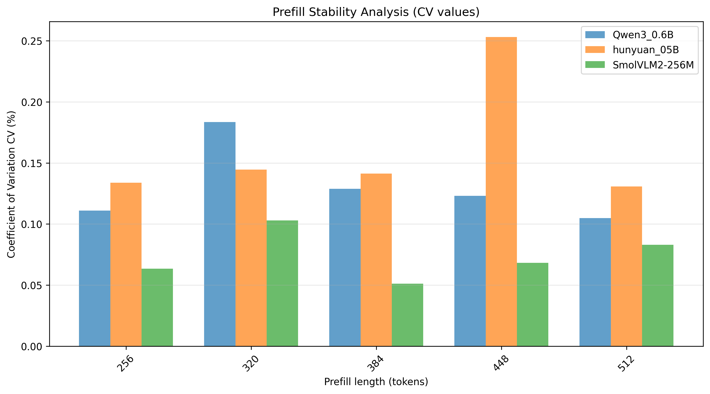
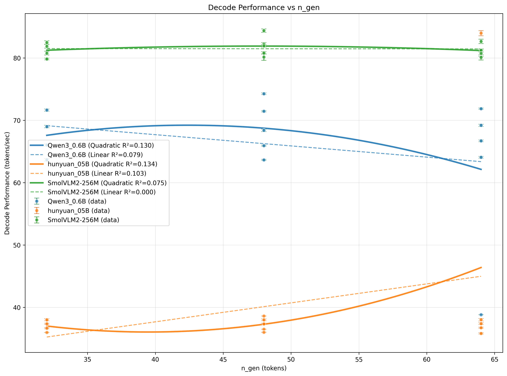
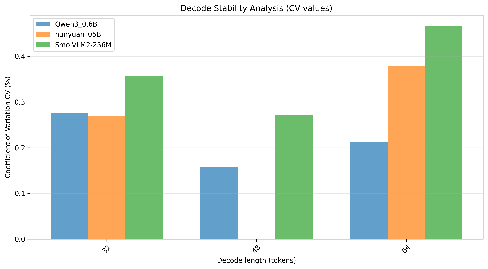

# 多模型CSV数据回归分析报告

## 基本信息
生成时间: 2025年12月11日 09:59:21
数据来源: D3000Mstep-p64n16.csv
分析模型: Qwen3_0.6B, hunyuan_05B, SmolVLM2-256M
测试环境: D3000M CPU 6小核(0,1,2,4,5,6)

## 测试配置信息
- 线程数: 6
- 精度: Low (precision=2)
- KV缓存: true
- 内存映射: true
- 动态优化: dynamicOption=7
- Prompt模式: vp=1

---

## Prefill阶段数据结果

### Qwen3_0.6B

#### 基础统计数据
- 数据点: 14
- n_prompt范围: 256 - 512 tokens
- 性能值范围: 269.44 - 322.58 tokens/sec
- CV值:
  - 平均: 0.128%
  - 最小: 0.052%
  - 最大: 0.210%

#### 回归分析结果
- 线性回归: y = -0.0756x + 318.3302 (R²=0.1901)
- 二次回归: y = 0.000657x² + -0.5872x + 412.9618 (R²=0.2746)
- 最佳模型: quadratic (R²=0.2746)
- 线性回归斜率: -0.0756

### hunyuan_05B

#### 基础统计数据
- 数据点: 14
- n_prompt范围: 256 - 512 tokens
- 性能值范围: 295.89 - 1127.26 tokens/sec
- CV值:
  - 平均: 0.151%
  - 最小: 0.071%
  - 最大: 0.268%

#### 回归分析结果
- 线性回归: y = 0.8083x + 52.5108 (R²=0.1112)
- 二次回归: y = 0.010063x² + -7.0271x + 1501.9620 (R²=0.2128)
- 最佳模型: quadratic (R²=0.2128)
- 线性回归斜率: 0.8083

### SmolVLM2-256M

#### 基础统计数据
- 数据点: 13
- n_prompt范围: 256 - 512 tokens
- 性能值范围: 957.10 - 1127.85 tokens/sec
- CV值:
  - 平均: 0.083%
  - 最小: 0.033%
  - 最大: 0.137%

#### 回归分析结果
- 线性回归: y = -0.6054x + 1265.9606 (R²=0.8756)
- 二次回归: y = 0.000010x² + -0.6131x + 1267.3715 (R²=0.8756)
- 最佳模型: quadratic (R²=0.8756)
- 线性回归斜率: -0.6054

---

## Decode阶段数据结果

### Qwen3_0.6B

#### 基础统计数据
- 数据点: 14
- n_gen范围: 32 - 64 tokens
- 性能值范围: 38.84 - 74.25 tokens/sec
- CV值:
  - 平均: 0.204%
  - 最小: 0.000%
  - 最大: 0.314%

#### 回归分析结果
- 线性回归: y = -0.1801x + 74.9011 (R²=0.0787)
- 二次回归: y = -0.015138x² + 1.2828x + 42.0390 (R²=0.1298)
- 最佳模型: quadratic (R²=0.1298)
- 线性回归斜率: -0.1801

### hunyuan_05B

#### 基础统计数据
- 数据点: 14
- n_gen范围: 32 - 64 tokens
- 性能值范围: 35.83 - 83.97 tokens/sec
- CV值:
  - 平均: 0.250%
  - 最小: 0.000%
  - 最大: 0.526%

#### 回归分析结果
- 线性回归: y = 0.3042x + 25.5184 (R²=0.1033)
- 二次回归: y = 0.017192x² + -1.3573x + 62.8410 (R²=0.1335)
- 最佳模型: quadratic (R²=0.1335)
- 线性回归斜率: 0.3042

### SmolVLM2-256M

#### 基础统计数据
- 数据点: 13
- n_gen范围: 32 - 64 tokens
- 性能值范围: 79.83 - 84.37 tokens/sec
- CV值:
  - 平均: 0.374%
  - 最小: 0.177%
  - 最大: 0.636%

#### 回归分析结果
- 线性回归: y = -0.0016x + 81.5534 (R²=0.0003)
- 二次回归: y = -0.002700x² + 0.2576x + 75.7575 (R²=0.0750)
- 最佳模型: quadratic (R²=0.0750)
- 线性回归斜率: -0.0016

---

## 数据汇总表

| 指标 | Prefill | Decode |
|------|---------|--------|
| Qwen3_0.6B R² | PP:0.2746 | TG:0.1298 |
| Qwen3_0.6B CV | PP:0.128% | TG:0.204% |
| hunyuan_05B R² | PP:0.2128 | TG:0.1335 |
| hunyuan_05B CV | PP:0.151% | TG:0.250% |
| SmolVLM2-256M R² | PP:0.8756 | TG:0.0750 |
| SmolVLM2-256M CV | PP:0.083% | TG:0.374% |

数据处理完成
