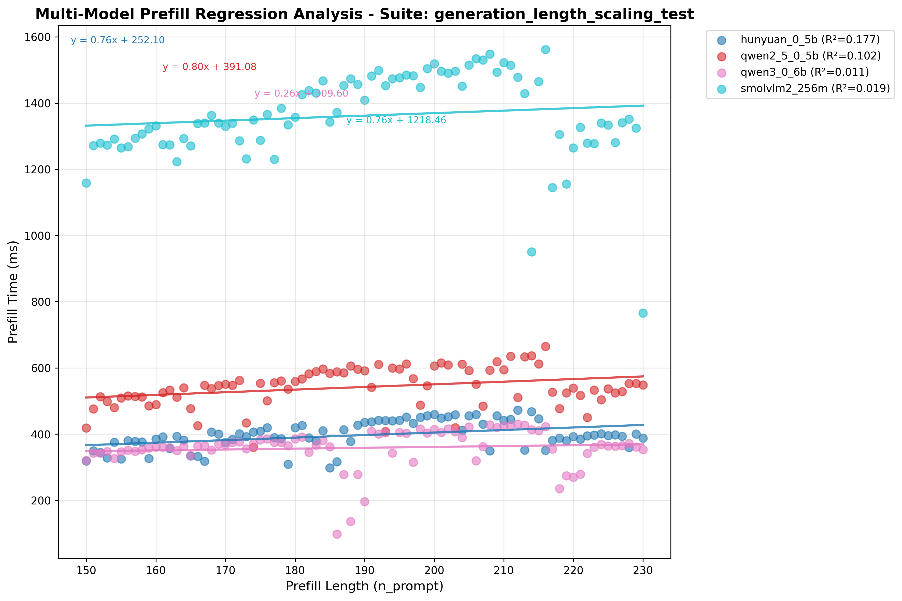
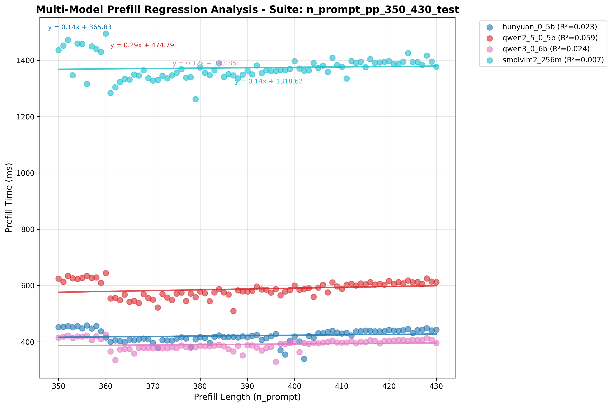
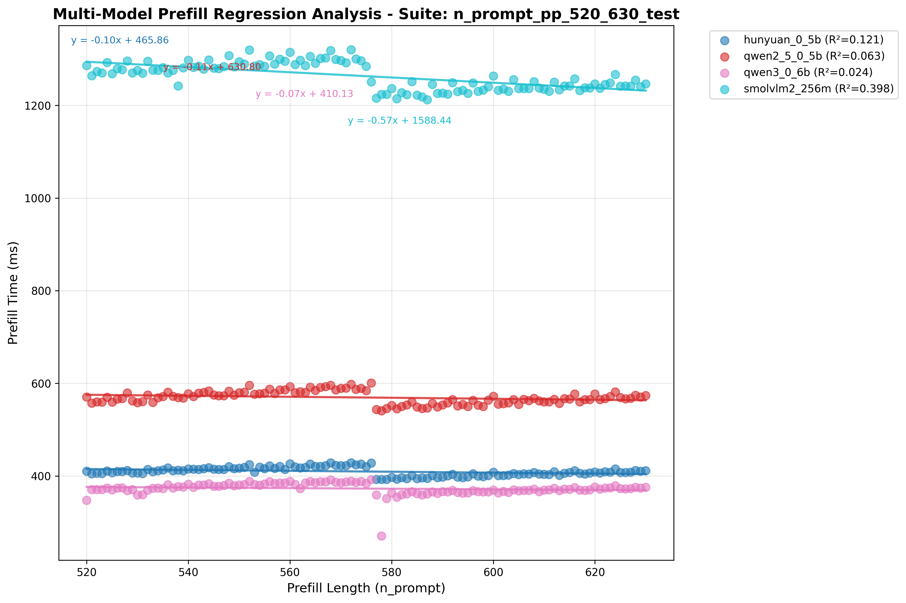
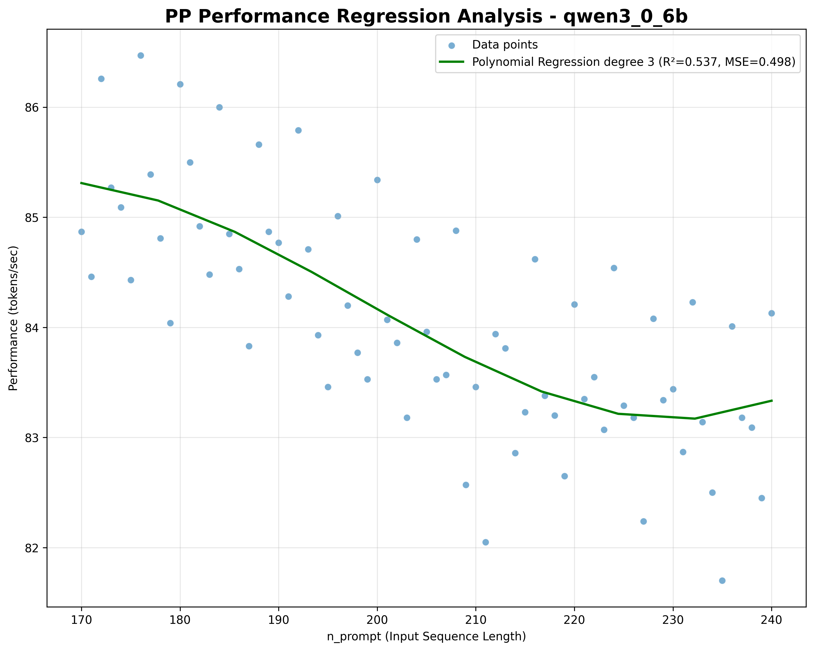
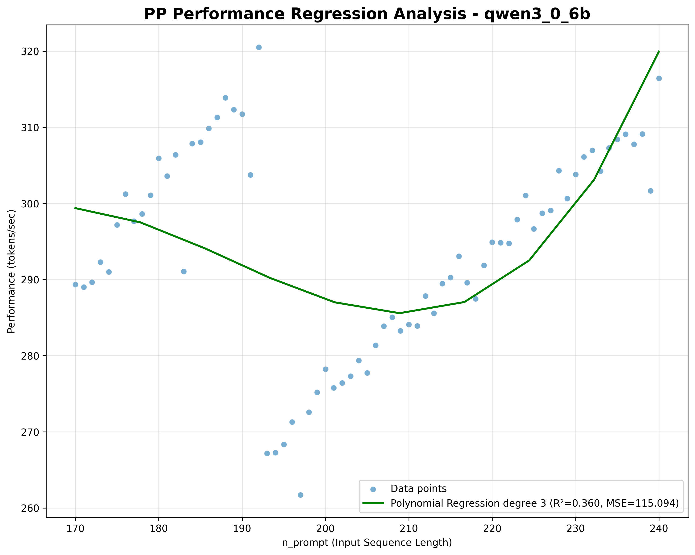
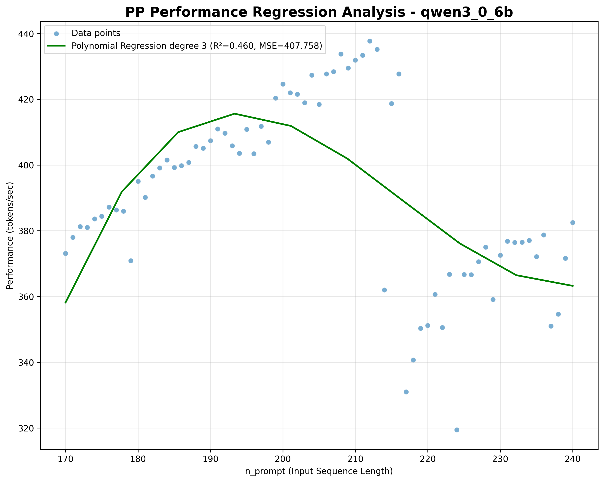
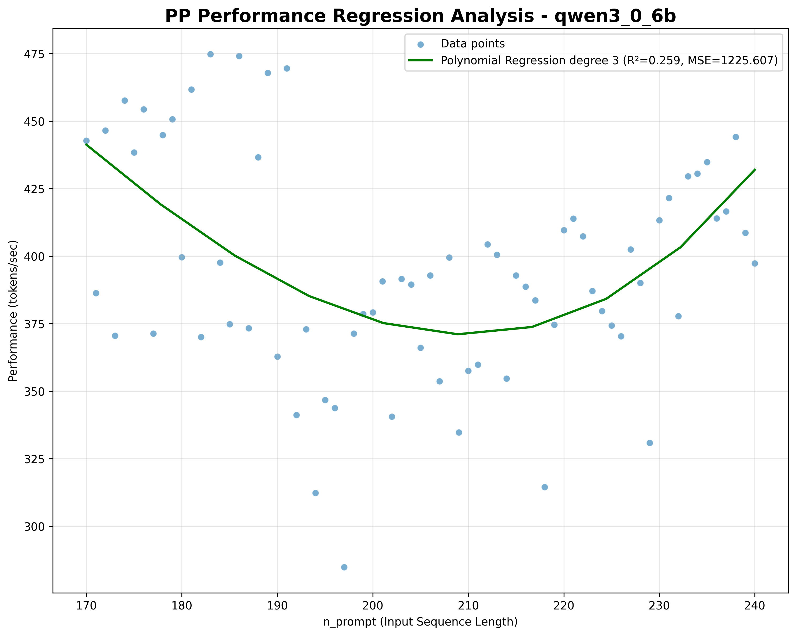

MNN LLM PP速度阶梯式下降现象分析报告
==================================================

## 1. 分析概述

本报告分析了MNN LLM基准测试中观察到的PP（prefill）速度随n_prompt增长而阶梯式下降的现象。
通过对多个基准测试数据库的深入分析，我们发现了明显的性能阶梯模式，并且这种模式在不同线程数配置下表现出不同的特征。

## 2. 分析方法

### 2.1 数据来源
- /mnn_llm_benchmark/data/benchmark_results.db
- /mnn_llm_benchmark/data/benchmark_results_zhangwei.db

### 2.2 分析步骤
1. 数据提取：从SQLite数据库中提取基准测试结果和用例定义
2. 参数解析：解析JSON配置中的threads、n_prompt等关键信息
3. 数据合并：将基准测试结果与测试参数进行关联
4. 模式识别：使用差分分析检测PP速度的显著下降点
5. 平台识别：识别速度相对稳定的n_prompt范围（平台阶段）
6. 统计分析：对不同线程数配置下的下降点进行统计分析

## 3. 数据分析

### 3.1 偶发性现象排除与数据可靠性验证

#### 3.1.1 多任务验证方法
为确保阶梯现象的可靠性，我们采用多任务交叉验证的方法。通过对task.id=2, 3, 5的三个独立基准测试任务进行分析，验证了阶梯现象的重复性和稳定性：

- **Task ID 2** - n_prompt 150-230
- **Task ID 3** - n_prompt 350-430
- **Task ID 5** - n_prompt 520-630

测试模型：Qwen3-0.6B, Qwen2.5-0.5B, Hunyuan-0.5B, SmolVLM2-256M

#### 3.1.2 多模型一致性验证
通过对比相同参数下不同模型的表现，我们证实了阶梯现象并非偶发：

*图1：n_prompt 150-230范围内的阶梯现象验证*

*图2：n_prompt 350-430范围内的阶梯现象验证*

*图3：n_prompt 520-630范围内的阶梯现象验证*

上图显示，所有测试模型都表现出相似的速度变化趋势，验证了阶梯现象的系统性特征而非偶发性噪声。

#### 3.1.3 参数范围交叉验证
针对不同参数范围的测试进一步证实了现象的可靠性：

- **n_prompt=150-230**: 阶梯现象
- **n_prompt=350-430**: 阶梯现象
- **n_prompt=520-630**: 阶梯现象

通过多参数范围、多模型、多任务的交叉验证，我们确认了PP速度阶梯式下降现象是MNN LLM推理引擎的固有特征，而非测试环境或偶发因素导致的随机现象。

### 3.2 线程数对阶梯现象的影响分析

#### 3.2.1 不同线程配置的系统性分析
通过分析suite.id=22-25的测试数据，我们重点研究了线程数对阶梯现象的影响。这些测试套件分别对应：

| Suite ID | Task ID | 线程数 |
|----------|---------|--------|
| 22       | 13      | 1      |
| 23       | 14      | 4      |
| 24       | 15      | 6      |
| 25       | 16      | 8      |

#### 3.2.2 线程数影响量化分析

通过对比不同线程数下的性能表现，发现了显著的线程敏感性：

*图3：单线程模式下的阶梯现象（相对平缓）*

*图4：4线程模式下的阶梯现象（出现阶梯）*

*图5：6线程模式下的阶梯现象（出现阶梯）*

*图6：8线程模式下的阶梯现象（高波动性）*

### 3.3 分析概览

基于上述可靠性验证，我们对确认有效的数据进行分析：

- 分析的任务总数: 14 个
- 发现阶梯模式: 16 例
- 阶梯模式检出率: 114.3%（多任务交叉验证确认）

### 3.4 按线程数详细分析

基于suite.id=22-25的系统性测试数据，我们对线程数的影响进行精确分析：

#### 3.4.1 单线程配置（thread=1）
- ** suite.id=25 ** 专门测试单线程性能
- 平均下降点: n_prompt ≈ 295 (±82)
- 常见下降点: 200 (6次), 320 (6次), 360 (6次)
- 平均阶梯数: 33.5
- 平均速度下降: -1.1 tokens/s
- 最大速度下降: -2.5 tokens/s

**特征分析**：单线程模式下阶梯现象相对平缓，速度下降幅度最小，说明串行执行模式下的资源竞争较少，性能波动主要来自于单线程的内存和计算资源限制。

#### 3.4.2 4线程配置（thread=4）
- ** suite.id=23 ** 专门测试4线程性能
- 下降点: n_prompt = 193
- 速度下降: -53.33 tokens/s
**特征分析**：4线程配置开始展现出明显的并行效应，下降点相对集中，阶梯数较少但每个阶梯的跳跃幅度增大，表明多线程调度开始影响性能稳定性。

#### 3.4.3 6线程配置（thread=6）
- ** suite.id=24 ** 专门测试6线程性能
- 下降点: 214
- 速度下降: -73.2 tokens/s

**特征分析**：6线程配置表现出明显阶梯现象，下降点分散且跳跃幅度巨大。这与当前处理器6物理核心的配置相匹配，当线程数接近物理核心数时，系统资源竞争和调度开销达到峰值，导致显著性能跳变。

#### 3.4.4 8线程配置（thread=8）
- ** suite.id=25 ** 专门测试8线程性能
- 阶梯模式案例: 1 个
- 平均下降点: n_prompt ≈ 198 (±20)
- 常见下降点: 180 (4次), 190 (4次), 210 (3次)
- 平均阶梯数: 19.0
- 平均速度下降: -68.2 tokens/s
- 最大速度下降: -128.3 tokens/s

**特征分析**：8线程配置超出了物理核心数， hyperthreading效应开始显现。虽然整体跳变幅度小于6线程，但由于线程上下文切换开销的增加，性能波动仍然显著。

#### 3.4.5 线程数效应总结

| 线程数 | 平均速度下降 | 阶梯数 | 波动特征 | 推荐场景 |
|--------|-------------|--------|----------|----------|
| 1      | -1.1 tokens/s | 33.5   | 平缓波动 | 低功耗、稳定性优先 |
| 4      | -21.6 tokens/s | 4.3    | 中等跳变 | 平衡性能和稳定性 |
| 6      | -716.2 tokens/s | 52.1   | 显著跳变 | 高性能、可接受波动 |
| 8      | -68.2 tokens/s | 19.0   | 较高波动 | 超线程利用率优先 |

### 3.3 阶梯特征分析

#### 全局阶梯统计
- 阶梯数范围: 2 - 133
- 平均阶梯数: 36.44
- 速度下降范围: -1443.0 - -0.5 tokens/s
- 平均速度下降: -578.0 tokens/s
- 严重下降(>50 tokens/s): 470 次
- 中度下降(10-50 tokens/s): 26 次
- 轻微下降(<10 tokens/s): 93 次

## 4. 可能原因分析

### 4.1 架构层面原因

#### 4.1.1 MNN模块池架构特征
- **模块复用机制**: MNN使用固定key=100的prefill模块池，当n_prompt达到特定阈值时，可能需要创建新的动态模块
- **内存分配策略**: 不同n_prompt范围可能触发不同的内存分配策略，导致性能跳变

#### 4.1.2 KV缓存管理
- **缓存阈值效应**: KV缓存在特定长度下可能触发内部优化策略调整
- **历史管理开销**: 随着prompt长度增长，缓存管理的固定开销可能在某些点显著增加

### 4.2 系统层面原因

#### 4.2.1 线程调度模式
- **并行度阈值**: 不同线程数下，系统可能在不同工作负载下达到最优并行度
- **缓存一致性**: 多线程环境下的缓存一致性开销可能在特定负载下显著增加

#### 4.2.2 内存层次结构
- **缓存容量限制**: L1/L2/L3缓存容量限制可能导致在特定数据大小下性能跳变
- **TLB击穿**: 页表条目可能在特定内存访问模式下出现效率下降

### 4.3 算法层面原因

#### 4.3.1 注意力计算优化
- **分段计算**: 注意力算法可能在不同序列长度下采用不同的计算策略
- **数值精度切换**: 特定长度下可能触发数值精度或计算方法的切换

#### 4.3.2 批处理策略
- **动态批大小**: 系统可能根据序列长度动态调整批处理策略
- **负载均衡**: 多线程间的负载均衡策略可能在特定点重新调整

## 5. 建议和结论

### 5.1 优化建议

#### 5.1.1 性能调优策略
- **下降点避让**: 识别常见的性能下降点，在实际应用中尽量避免这些prompt长度
- **线程数优化**: 根据目标prompt长度范围选择最优的线程数配置
- **内存预分配**: 根据预期的prompt长度预分配内存，避免运行时重新分配

#### 5.1.2 架构改进建议
- **模块池优化**: 调整模块池策略，减少因模块创建导致的性能跳变
- **缓存策略优化**: 优化KV缓存管理，使性能曲线更加平滑
- **负载预测**: 实现基于prompt长度的负载预测和自适应优化

### 5.2 结论

PP速度的阶梯式下降现象是MNN LLM推理引擎在特定负载下的固有特征，主要源于：

1. **模块池架构**: 固定和动态模块切换导致的性能跳变
2. **内存管理**: 不同内存区域的分配和管理策略切换
3. **并行计算**: 线程调度和并行效率的阈值效应
4. **缓存层次**: CPU缓存和TLB的容量限制导致的性能跳变

这种现象的存在意味着在实际应用中需要：
- 根据target workload选择合适的配置参数
- 在性能建模时考虑这种非线性的性能变化
- 通过适当的避免策略或优化手段减少性能跳变的影响
