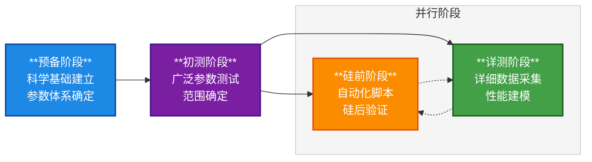

# 端侧AI推理优化基准测试项目文档库

## 一、项目概述

端侧AI推理优化 (Edge AI Optimization, EAO) 基准测试项目专注于建立大模型在端侧设备上的性能数学模型，为端侧设备设计和AI框架开发提供科学依据和技术支撑。

### 技术要点
- **推理引擎**：主要使用MNN推理引擎进行验证测试
- **测试模式**：支持llama.cpp固定提示词模式、Prefill/Decode分离测试模式
- **目标平台**：具有AI推理能力的端侧设备（移动、嵌入式、IoT）
- **验证体系**：硅后硬件验证和硅前平台预测相结合

## 二、项目目标

- **建立性能基准**：为大模型推理建立标准化的性能基准测试体系
- **参数优化**：通过科学测试确定最优的推理参数配置
- **性能建模**：建立数学模型预测不同配置下的性能表现
- **自动化测试**：开发标准化的自动化测试脚本和工具
- **硅前验证**：为处理器设计提供性能预测和验证支持

## 三、项目阶段



项目采用阶段性并行推进方法：
1. **预备阶段**：建立科学基础和参数体系
2. **初测阶段**：广泛参数测试和范围确定
3. **详测阶段**：详细数据采集和性能建模（与硅前阶段并行）
4. **硅前阶段**：自动化脚本开发和硅后验证支持（与详测阶段并行）

## 四、文件使用指南

### 项目文档结构
```
EAO_Bench_Docs/
├── 01-预备阶段/     # 5步科学论证基础
│   ├── 1.基准测试大模型集选用合理性分析/
│   ├── 2.基准测试性能指标合理性分析/              # 2号报告（四维合理性分析）
│   ├── 3.基准测试提示词长度选定合理性分析/
│   ├── 4.llama.cpp固定提示词模式可行性论证/
│   └── 5.基准测试变量参数集选定合理性分析/
├── 02-初测阶段/     # 广泛参数测试
├── 03-详测阶段/     # 详细建模
├── 04-硅前阶段/     # 自动化测试
├── 模板/          # 文档标准化模板
├── 共享资源/       # 参考资料和配置
└── 测试结果/       # 数据和分析结果
```

### 如何使用本文档库

#### 阶段导航
- 每个阶段都有独立的README说明工作内容和关系
- 查阅各阶段README了解具体工作流程和依赖关系

#### 模板使用
- `模板/README.md` - 模板使用说明
- 4个标准化模板确保文档质量和一致性

#### 参考资料
- `共享资源/README.md` - 技术标准和参考资料目录
- 国家标准解读、评估要求等背景材料

#### AI助手指导
- `CLAUDE.md` 和 `GEMINI.md` - AI助手项目工作指导
- 包含项目背景、技术要求和协作规范

## 五、文档规范

### 标准化模板
- **可行性论证报告模板**：论证对象、论证方法、论证过程、论证结论
- **基准测试报告模板**：测试对象、测试方案、测试过程、测试结论
- **数据分析报告模板**：分析对象、分析方法、分析过程、分析结论
- **研究报告模板**：研究背景、研究方法、研究过程、研究结论

### 版本控制
- 使用Git进行文档版本管理和协作
- 模板确保文档格式和内容的一致性

## 六、技术栈

- **推理框架**：MNN移动端推理框架
- **分析工具**：Python（NumPy/Pandas/SciPy）
- **文档管理**：Markdown + Git
- **自动化**：Shell脚本
