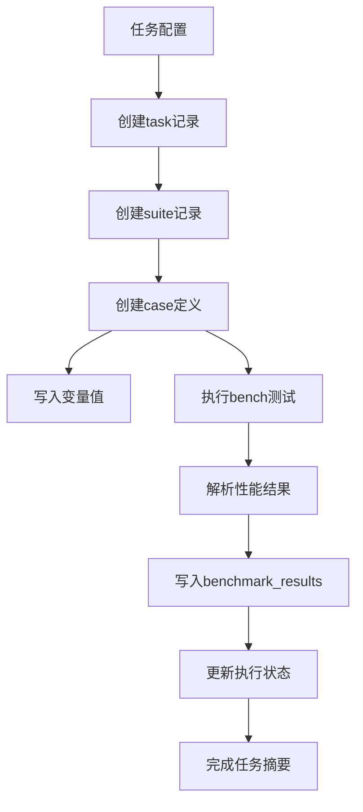

# MNN LLM Benchmark 数据库结构解读

## 概述

MNN LLM Benchmark框架使用SQLite数据库存储基准测试的完整执行结果和中间数据。数据库设计遵循规范化原则，采用分层结构存储任务、套件、用例和性能结果数据。

本文档详细解读数据库结构、表设计、数据含义以及数据流向，为后续数据分析、可视化和建模工作提供基础。

## 整体架构

数据库采用5层关联结构：

```
tasks (任务)
└── suites (测试套件) ────┐
    └── case_definitions (用例定义) ────┐
        └── case_variable_values (用例变量)
        └── benchmark_results (性能结果)
```

## 表结构详解

### 1. tasks 表 - 任务层

**作用**: 存储基准测试任务的顶层信息和执行状态。

**重要字段**:
- `id`: 任务唯一标识符（主键）
- `name`: 完整任务名称（包含时间戳）
- `original_name`: 原始任务名称（不含时间戳）
- `run_number`: 运行次序（相同任务的重复执行计数）
- `description`: 任务描述
- `original_yaml`: 完整的YAML配置（JSON格式）
- `summary_json`: 执行摘要统计信息
- `execution_time_seconds`: 总执行时间
- `status`: 任务状态（pending/completed/partial_failure/failed）

**数据样例**:
```
id: 1
name: mnn_llm_t1_c2_pn_sweep_20251120_090711
original_name: mnn_llm_t1_c2_pn_sweep
run_number: 1
status: completed
```

### 2. suites 表 - 测试套件层

**作用**: 存储任务中不同模型/配置的测试套件。

**重要字段**:
- `id`: 套件唯一标识符
- `task_id`: 关联的任务ID
- `name`: 套件名称（描述测试配置）
- `model_name`: 模型名称
- `model_path`: 模型文件路径
- `suite_yaml`: 套件配置详情

**数据样例**:
```
id: 1
task_id: 1
name: pn_grid_t1_c2_kvfalse_mmap0_dyo0
model_name: qwen3_06b
model_path: /models/qwen3_06b
```

### 3. case_definitions 表 - 用例定义层

**作用**: 存储具体测试用例的配置参数和执行信息。

**重要字段**:
- `id`: 用例唯一标识符
- `suite_id`: 关联的套件ID
- `name`: 用例名称（格式：case_N）
- `base_parameters`: 基础测试参数（JSON格式）
- `model_size`: 模型大小（MB）
- `backend`: 推理后端
- `threads`: 线程数
- `precision`: 精度模式（0:Normal,1:High,2:Low）
- `execution_time_seconds`: 用例执行时间
- `status`: 执行状态（success/failed/pending）

**数据样例**:
```
id: 1
suite_id: 1
name: case_1
threads: 1
precision: 2
status: success
```

### 4. case_variable_values 表 - 变量值层

**作用**: 存储测试用例的所有变量参数，提供灵活的参数化支持。

**重要字段**:
- `id`: 记录唯一标识符
- `case_id`: 关联的用例ID
- `variable_name`: 变量名称
- `variable_value`: 变量值

**核心变量定义**:
| 变量名 | 含义 | 典型值 | 说明 |
|--------|------|--------|------|
| threads | 线程数 | 1,2,4 | 推理使用的线程数 |
| precision | 精度 | 0,1,2 | 0:Normal,1:High,2:Low |
| kv_cache | KV缓存 | true/false | 是否启用KV缓存 |
| mmap | 内存映射 | 0,1 | 是否启用内存映射 |
| dynamicOption | 动态选项 | 0-8 | 动态优化选项编号 |
| n_prompt | 提示词长度 | 64,128,256 | Prefill阶段输入长度 |
| n_gen | 生成长度 | 32,64,128 | Decode阶段生成长度 |

**数据样例**:
```
case_id: 1
variable_name: n_gen
variable_value: 32

case_id: 1
variable_name: n_prompt
variable_value: 64
```

### 5. benchmark_results 表 - 性能结果层

**作用**: 存储基准测试的核心性能数据。

**重要字段**:
- `id`: 结果记录唯一标识符
- `case_id`: 关联的用例ID
- `result_type`: 测试类型（pp/tg/pp+tg）
- `result_parameter`: 测试参数（长度值）
- `mean_value`: 平均性能值（tokens/sec）
- `std_value`: 标准差
- `value_type`: 值类型（single等）
- `unit`: 单位（tokens/sec）
- `ptypes`: 性能测试模式（fix等）

**性能类型详解**:
- `pp`: Prefill阶段性能
- `tg`: Token Generation阶段性能
- `pp+tg`: 组合测试性能

**数据样例**:
```
case_id: 1
result_type: pp
result_parameter: 64
mean_value: 68.07
std_value: 0.15

case_id: 1
result_type: tg
result_parameter: 32
mean_value: 26.88
std_value: 0.99
```

## 数据流向分析

### 1. 数据写入流程



### 2. 核心数据库操作

**文件位置**: `~/MNN_LLM_Benchmark/framework/utils/db_manager.py`

**关键方法**:
- `create_or_update_task()`: 创建任务记录
- `create_or_update_suite()`: 创建测试套件
- `create_or_update_case_with_results()`: 创建用例并写入结果
- `complete_task_with_summary()`: 完成任务并更新摘要

### 3. 性能数据解析

从`llm_bench`原始JSON解析关键信息：

**Prefill (PP) 数据**:
- 从`test_name`解析提示词长度（如"pp64" → 64）
- 提取`tokens_per_sec.mean/std`性能值

**Token Generation (TG) 数据**:
- 从`test_name`解析生成长度（如"tg32" → 32）
- 提取`tokens_per_sec.mean/std`性能值

**组合 (PP+TG) 数据**:
- 解析复合参数（如"pp32+tg64" → pp=32, tg=64）

## 数据查询模式

### 1. 基础性能查询

```sql
-- 查询指定模型的性能数据
SELECT s.model_name,
       br.result_type,
       br.result_parameter,
       br.mean_value,
       br.std_value
FROM benchmark_results br
JOIN case_definitions cd ON br.case_id = cd.id
JOIN suites s ON cd.suite_id = s.id
WHERE s.model_name = 'qwen3_06b'
AND br.result_type = 'tg';
```

### 2. 变量关联查询

```sql
-- 查询n_gen变量与TG性能的关系
SELECT cv.variable_value as n_gen,
       br.mean_value as tg_performance,
       br.std_value
FROM benchmark_results br
JOIN case_definitions cd ON br.case_id = cd.id
JOIN case_variable_values cv ON cd.id = cv.case_id
WHERE br.result_type = 'tg'
AND cv.variable_name = 'n_gen';
```

### 3. 多维度分析查询

```sql
-- 分析不同配置下的性能表现
SELECT
    cv.variable_value as threads,
    s.model_name,
    AVG(br.mean_value) as avg_performance,
    MIN(br.mean_value) as min_performance,
    MAX(br.mean_value) as max_performance
FROM benchmark_results br
JOIN case_definitions cd ON br.case_id = cd.id
JOIN suites s ON cd.suite_id = s.id
JOIN case_variable_values cv ON cd.id = cv.case_id
WHERE br.result_type = 'tg'
AND cv.variable_name = 'threads'
GROUP BY cv.variable_value, s.model_name;
```

## 数据质量特性

### 1. 数据一致性

- **外键约束**: 确保层级关联完整性
- **唯一约束**: 防止重复数据记录
- **事务处理**: 保证数据写入原子性

### 2. 性能优化

- **索引设计**:
  - `idx_suites_task_id`: 加速任务-套件查询
  - `idx_cases_suite_id`: 加速套件-用例查询
  - `idx_results_case_id`: 加速结果查询
  - `idx_case_variables_case_id`: 加速变量查询

### 3. 数据完整性

- **状态管理**: 通过status字段跟踪执行状态
- **错误处理**: 失败记录保留用于问题诊断
- **版本控制**: run_number字段支持任务版本管理

## 数据分析应用场景

### 1. 性能建模

从benchmark_results表提取核心指标：
- **PP性能**: result_type='pp'的mean_value
- **TG性能**: result_type='tg'的mean_value
- **变异性**: std_value用于计算置信区间

### 2. 参数优化分析

结合case_variable_values和benchmark_results：
- 分析特定参数对性能的影响
- 确定最优配置组合
- 评估参数敏感度

### 3. 模型比较分析

跨suites记录比较不同模型：
- 相同配置下的模型性能对比
- 可扩展性分析（模型大小vs性能）
- 精度-性能权衡分析

## 附录：数据库初始化脚本

### 表创建SQL

详细建表语句见文件：
`/home/xphi/MNN_LLM_Benchmark/framework/utils/db_manager.py` 中的 `_init_database()` 方法

### 数据库迁移

支持字段追加和结构升级：
- 自动检查现有字段
- 兼容历史数据
- 平滑迁移机制

## 总结

MNN LLM Benchmark数据库设计具有以下特点：

1. **结构清晰**: 5层层级关系明确，便于理解和使用
2. **扩展性强**: 变量值表支持灵活的参数化配置
3. **数据完整**: 完整记录从配置到结果的全流程数据
4. **性能优化**: 合理的索引设计支持高效查询
5. **质量保证**: 约束机制确保数据一致性

该数据库为后续的端侧AI推理性能分析、建模和优化提供了坚实的数据基础，是EAO基准测试框架的核心数据组件。

---

**文档版本**: v1.0
**创建时间**: 2025-11-21
**维护者**: EAO团队