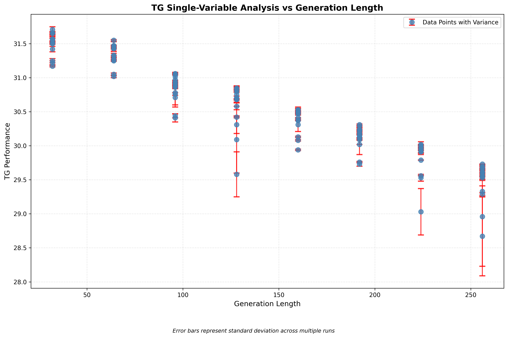

# pn_grid_t1_c2_kvfalse_mmap0_dyo0 单变量分析报告 - 生成长度

## 基本信息

- **模型**: hunyuan_05b
- **分析时间**: 
- **说明**: 本报告对**pn_grid_t1_c2_kvfalse_mmap0_dyo0**套件中变量**生成长度**的性能影响进行了详细分析。

## 分析元数据

| 属性 | 值 |
|------|-----|
| Suite名称 | pn_grid_t1_c2_kvfalse_mmap0_dyo0 |
| 模型名称 | hunyuan_05b |
| 分析模式 | 单变量分析 |
| 目标变量 | 生成长度 |
| 固定参数 | 无固定参数 |
| 筛选案例数 | 128 |
| 总案例数 | 128 |
| 结果类型 | pp, tg |

## 方差分析

### 方差意义说明

方差说明：
        - 每个数据点的误差条表示多次运行结果的标准差
        - 误差条长度反映了结果的一致性：较短表示结果更稳定
        - 在理想情况下，相同参数配置下的多次运行结果应该有较小的方差
        - 较大的方差可能表明系统存在不稳定的因素

### 方差统计表

| 结果类型 | 数据点数 | 平均标准差 | 最大标准差 | 最小标准差 |
|--------|--------|----------|----------|----------|
| pp | 128 | 0.0320 | 0.1800 | 0.0100 |
| tg | 128 | 0.0453 | 0.7300 | 0.0000 |

## 分析结果
### 数据汇总

| 结果类型 | 案例数 | 平均性能 | 标准差 | 单位 |
|----------|--------|----------|--------|------|
| PP | 128 | 61.9689 | 0.0320 | tokens/sec |
| TG | 128 | 30.5159 | 0.0453 | tokens/sec |

### PP 结果


### TG 结果




## 回归分析详情

### PP 回归分析

```
回归方程: PP 性能 = 0.0000 × 生成长度² + -0.0015 × 生成长度 + 73.4736
R² 值: 0.6239202657800056
回归方法: quadratic
```

### TG 回归分析

```
回归方程: TG 性能 = -0.0090 × 生成长度 + 32.0100
R² 值: 0.9929992136102959
回归方法: linear
```
