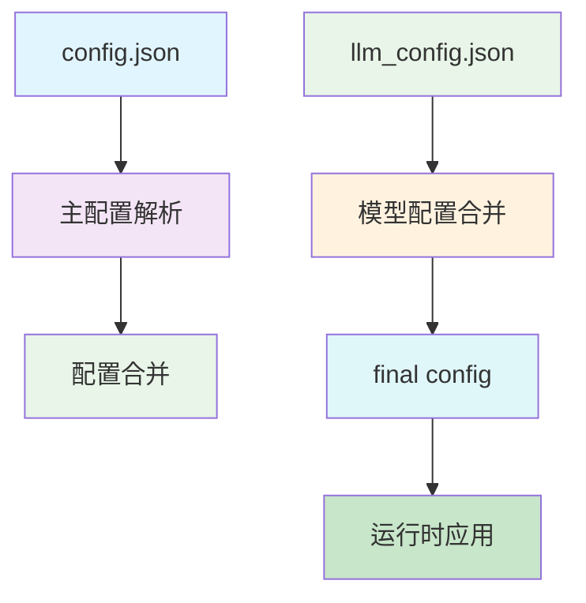
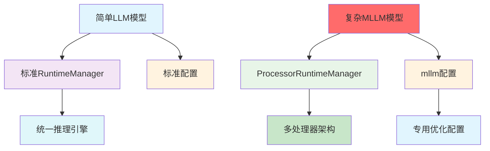

# MNN LLM 模型参数完整技术报告

## 概述

本报告全面分析MNN深度学习框架中Large Language Model（LLM）参数配置系统的完整架构。MNN采用**分层配置架构**，通过`config.json`主配置文件、`llm_config.json`模型配置文件和特殊的`mllm`高优先级配置项，实现了从简单文本生成到复杂多模态模型的全面支持。

## 第一部分：MNN配置文件系统架构

### 1.1 配置文件加载机制

#### 1.1.1 配置文件层次结构


#### 1.1.2 配置读取逻辑（`llmconfig.hpp:233-271`）
```cpp
LlmConfig(const std::string& path) {
    // Step 1: 检测文件类型
    if (has_suffix(path, ".json")) {
        // 读取用户主配置文件
        config_ = rapid_json_wrapper::parse(config_file);
        base_dir_ = base_dir(path);
    } else if (has_suffix(path, ".mnn")) {
        // 兼容模式：从模型文件推断基础配置
        auto model_name = file_name(path);
        std::string json_str = R"({
            "llm_model": ")" + model_name + R"(",
            "llm_weight": ")" + model_name + R"(.weight"
        })";
        config_ = rapid_json_wrapper::parse(json_str.c_str());
    }

    // Step 2: 加载模型内部配置（强制加载）
    std::ifstream llm_config_file(llm_config());
    if (llm_config_file.is_open()) {
        auto llm_config_ = rapid_json_wrapper::parse(llm_config_file);
        config_.merge_and_clear(llm_config_);  // 关键：模型配置优先
    }

    // Step 3: 提取mllm配置
    mllm_config_ = config_.value("mllm");
}
```

#### 1.1.3 合并机制详解
```cpp
bool merge_and_clear(rapid_json_wrapper& source_) {
    rapidjson::Value& source = source_.document;
    rapidjson::Value& destination = this->document;

    // 遍历所有源配置项，深度拷贝到目标配置
    for (auto it = source.MemberBegin(); it != source.MemberEnd(); ++it) {
        const char* key = it->name.GetString();
        if (strcmp(key, "mllm") != 0) {
            // 普通配置项：直接覆盖
            rapid_json::Value newValue;
            newValue.CopyFrom(it->value, allocator);
        } else {
            // mllm配置项：深拷贝对象结构
            rapid_json::Value mllmObj;
            mllmObj.CopyFrom(it->value, allocator);
            if (destination.HasMember(key)) {
                destination[key] = mllmObj;
            } else {
                destination.AddMember(rapidjson::Value(key, allocator), mllmObj);
            }
        }
    }
}
```

### 1.2 配置优先级体系
#### 1.2.1 优先级排序
1. **最高优先级**：`config.json`中的`mllm`对象
2. **中优先级**：`llm_config.json`中的根级配置
3. **低优先级**：`config.json`中的其他配置项

#### 1.2.2 冲突解决策略
| 冲突类型 | 解决方式 | 示例 |
|----------|----------|------|
| 同名普通配置 | mllm配置覆盖 | `backend_type`在两个地方都存在时 |
| 嵌套对象 | 深度合并保留结构 | mllm对象包含复杂参数 |
| 数组类型 | 完整替换 | 替换原有的参数数组 |

## 第二部分：基础配置参数详解

### 2.1 模型文件配置（Model Files）
| 配置项 | 类型 | 默认值 | 含义 | 适用场景 |
|--------|------|--------|------|----------|
| `llm_model` | string | "llm.mnn" | 主模型文件路径 | 所有模型 |
| `llm_weight` | string | "llm.mnn.weight" | 权重文件路径 | 量化模型 |
| `tokenizer_file` | string | "tokenizer.txt" | 分词器文件 | 文本模型 |
| `embedding_file` | string | "embeddings_bf16.bin" | 嵌入向量文件 | 嵌入式模型 |

### 2.2 推理生成配置（Generation）
| 配置项 | 类型 | 默认值 | 含义 | 平衡考量 |
|--------|------|--------|------|----------|
| `max_all_tokens` | int | 2048 | 最大token总数（输入+输出） | 内存使用 vs 生成长度 |
| `max_new_tokens` | int | 512 | 最大生成token数 | 短对话 vs 长生成 |
| `reuse_kv` | bool | false | 是否复用KV缓存 | 连续对话性能 |
| `all_logits` | bool | false | 是否返回所有logits | 计算开销控制 |

### 2.3 后端性能配置（Backend & Performance）
| 配置项 | 类型 | 默认值 | 含义 | 影响维度 |
|--------|------|--------|------|----------|
| `backend_type` | string | "cpu" | 后端类型：cpu/metal/opencl | 计算平台选择 |
| `thread_num` | int | 4 | 线程数量 | 并行度与资源利用 |
| `precision` | string | "low" | 精度：low/normal/high | 计算精度/性能平衡 |
| `memory` | string | "low" | 内存：low/normal/high | 内存使用策略 |
| `power` | string | "normal" | 功耗：low/normal/high | 性能功耗平衡 |
| `dynamic_option` | int | 0 | 动态量化选项 | 算法选择与硬件优化 |

### 2.4 内存优化配置（Memory Optimization）
| 配置项 | 类型 | 默认值 | 含义 | 使用场景 |
|--------|------|--------|------|----------|
| `use_mmap` | bool | false | 是否使用内存映射 | 大模型内存优化 |
| `use_cached_mmap` | bool | true | 是否使用缓存内存映射 | 性能优化 |
| `kvcache_mmap` | bool | false | KV缓存是否使用内存映射 | 长对话支持 |
| `kvcache_limit` | int | -1 | KV缓存大小限制 | 内存约束管理 |
| `tmp_path` | string | "" | 临时文件路径 | 中间结果存储 |

### 2.5 模型架构配置（Model Architecture）
| 配置项 | 类型 | 默认值 | 含义 | 适用性 |
|--------|------|--------|------|----------|
| `is_single` | bool | true | 是否单模态模型 | 多模态识别 |
| `is_visual` | bool | false | 是否视觉模型 | VL模型 |
| `is_audio` | bool | false | 是否音频模型 | 语音模型 |
| `has_talker` | bool | false | 是否包含语音合成 | TTS模型 |
| `attention_type` | string | "full" | 注意力机制类型 | 性能优化 |
| `attention_mask` | string | "int" | 注意力掩码类型 | 算法选择 |
| `sliding_window` | int | 0 | 滑动窗口大小 | 长序列处理 |
| `attention_fused` | bool | true | 是否启用注意力融合 | 性能提升 |
| `layer_nums` | int | 32 | 模型层数 | 架构验证 |
| `hidden_size` | int | 4096 | 隐藏层维度 | 内存规划 |

### 2.6 模板与对话配置（Template & Chat）
| 配置项 | 类型 | 默认值 | 含义 | 格式标准 |
|--------|------|--------|------|----------|
| `use_template` | bool | true | 是否使用模板 | 对话格式化 |
| `system_prompt` | string | "" | 系统提示词 | 固定引导信息 |
| `chat_template` | string | "" | 通用聊天模板 | 多模态对话 |
| `prompt_template` | string | 默认格式 | 提示词模板 | 标准对话格式 |
| `system_prompt_template` | string | 详细格式 | 系统提示模板 | 详细对话格式 |
| `user_prompt_template` | string | 详细格式 | 用户提示模板 | 详细对话格式 |
| `assistant_prompt_template` | string | 详细格式 | 助手提示模板 | 详细对话格式 |

### 2.7 采样器配置（Sampler Configuration）
| 配置项 | 类型 | 默认值 | 含义 | 影响输出风格 |
|--------|------|--------|------|----------|
| `sampler_type` | string | "greedy" | 采样器类型 | 输出确定度 |
| `mixed_samplers` | array | 默认数组 | 混合采样序列 | 复杂输出策略 |
| `temperature` | float | 1.0 | 温度参数 | 创造性控制 |
| `topP` | float | 0.9 | Top-P采样阈值 | 词汇多样性 |
| `topK` | int | 40 | Top-K采样数量 | 搜索空间控制 |
| `min_p` | float | 0.1 | Min-P采样阈值 | 最小概率过滤 |
| `tfsZ` | float | 1.0 | TFS采样参数 | 核词频率调整 |
| `typical` | float | 1.0 | 典型采样参数 | 词汇分布调整 |
| `penalty` | float | 0.0 | 惩罚因子 | 重复性控制 |
| `n_gram` | int | 8 | N-gram大小 | 局部重复检测 |
| `penalty_sampler` | string | "greedy" | 惩罚采样器类型 | 惩罚算法选择 |

### 2.8 投机解码配置（Speculative Decoding）
| 配置项 | 类型 | 默认值 | 含义 | 性能优化 |
|--------|------|--------|------|----------|
| `speculative_type` | string | "" | 投机解码类型 | 推理加速 |
| `draft_predict_length` | int | 4 | 草稿预测长度 | 加速比平衡 |
| `draft_match_strictness` | string | "low" | 草稿匹配严格度 | 质量控制 |

## 第三部分：mllm高优先级配置解析

### 3.1 mllm配置的架构意义

#### 3.1.1 mllm含义推断
通过代码结构分析，`mllm`代表：
- **MLLM**：**Multi-Language Model** 或 **Large Language Model**
- **架构标识符**：标识需要特殊处理的复杂LLM架构
- **复杂度标志**：区分简单LLM和复杂MLLM推理引擎

#### 3.1.2 架构层次分析


### 3.2 mllm配置的代码验证

#### 3.2.1 配置读取（`llmconfig.hpp:270`）
```cpp
// 从主配置中提取mllm配置对象
mllm_config_ = config_.value("mllm");
```

#### 3.2.2 空值检查（`omni.cpp:85`）
```cpp
// 检查是否为mllm架构
if (mConfig->mllm_config_.empty()) {
    // 简单架构：单一RuntimeManager
    mProcessorRuntimeManager = mRuntimeManager;
} else {
    // 复杂架构：多处理器RuntimeManager + 专用配置
    BackendConfig cpuBackendConfig;
    config.type = backend_type_convert(mConfig->backend_type(true));
    config.numThread = mConfig->time(true);

    // 分支：性能配置（High/Low）
    if (mConfig->power(true) == "high") {
        cpuBackendConfig.power = BackendConfig::Power_High;
    } else if (mConfig->power(true) == "low") {
        cpuBackendConfig.power = BackendConfig::Power_Low;
    }
    // ... 更多硬件配置

    mProcessorRuntimeManager.reset(Executor::RuntimeManager::createRuntimeManager(config));
}
```

#### 3.2.3 条件API设计（`llmconfig.hpp:338-358`）
```cpp
// 优雅的条件访问：mllm配置优先
std::string backend_type(bool mllm = false) const {
    if (mllm) return mllm_config_.value("backend_type", "cpu");  // MLLM优先，提取值
    return config_.value("backend_type", "cpu");                     // 标准配置，提取值
}

int thread_num(bool mllm = false) const {
    if (mlm) return mllm_config_.value("thread_num", 4);      // MLLM优先
    return config_.value("thread_num", 4);                         // 标准配置
}

std::string precision(bool mllm = false) const {
    if (mlm) return mllm_config_.value("precision", "low");    // MLLM优先
    return config_.value("precision", "low");                     // 标准配置
}
```

### 3.3 mllm配置的实际应用场景

#### 3.3.1 VL（Vision-Language）模型配置示例
**Qwen3-VL-8B-Instruct-MNN/config.json**：
```json
{
    "llm_model": "llm.mnn",
    "backend_type": "cpu",        // ❌ 被mllm覆盖
    "thread_num": 4,              // ❌ 被mllm覆盖
    "precision": "low",            // ❌ 被mllm覆盖
    "memory": "low",               // ❌ 被mllm覆盖
    "mllm": {                     // ✅ 高优先级，实际生效
        "backend_type": "cpu",    // ✓ 适配视觉计算
        "thread_num": 1,          // ✓ 图像处理专用
        "precision": "low",        // ✓ 平衡视觉精度
        "memory": "low"            // ✓ 内存约束考虑
    },
    "is_visual": true,           // ✅ 视觉模型标识
    "image_size": 420,             // ✅ 图像尺寸配置
    "vision_start": 151652,         // ✅ 视觉token标记
    "has_deepstack": true           // ✅ 深度堆栈支持
}
```

#### 3.3.2 mllm_config.json中的模型参数
**从`llm_config.json`提取的核心参数**：
```json
{
    "hidden_size": 4096,              // 模型架构参数
    "layer_nums": 36,                 // 层数数量
    "attention_mask": "float",        // 注意力掩码类型
    "key_value_shape": [2,1,0,8,128],  // KV缓存形状
    "is_visual": true,                // 视觉模型标识
    "jinja": {                        // Jinja2模板系统
        "chat_template": "..."
    },
    "image_mean": [127.5,127.5,127.5],   // 图像预处理参数
    "image_norm": [0.00784313725490196...], // 图像归一化参数
    "has_deepstack": true,           // 深度堆栈功能
    "tie_embeddings": [0,311164928,...] // 嵌入层绑定
}
```

### 3.4 架构选择决策算法
```cpp
// 登录和初始化中的架构选择（简化版）
bool initializeConfig() {
    // 步骤1：检查mllm配置标识
    bool hasMLLMConfig = !mConfig->mllm_config_.empty();

    // 步骤2：根据配置选择架构
    if (hasMLLMConfig) {
        return initializeMLLMArchitecture();        // 复杂架构路径
    } else {
        return initializeStandardArchitecture();       // 简单架构路径
    }
}
```

## 第四部分：配置系统使用指南与最佳实践

### 4.1 配置文件组织建议

#### 4.1.1 简单模型配置
**推荐配置（小模型/文本模型）**：
```json
{
    "llm_model": "model.mnn",
    "backend_type": "cpu",
    "thread_num": 8,
    "precision": "low",
    "sampler_type": "mixed",
    "max_new_tokens": 512
}
```

#### 4.1.2 复杂模型配置
**推荐配置（大模型/VL模型）**：
```json
{
    "llm_model": "model.mnn",
    "backend_type": "cpu",
    "thread_num": 4,              // 适配处理单元
    "precision": "low",
    "use_mmap": true,
    "kvcache_limit": -1,
    "mllm": {
        "backend_type": "cpu",
        "thread_num": 1,              // 专用处理单元
        "precision": "low",
        "memory": "low",
        "power": "normal"
    },
    "is_visual": true,
    "attention_type": "full",
    "sampler_type": "mixed",
    "penalty": 1.1
}
```

### 4.2 性能优化配置矩阵

#### 4.2.1 不同目标场景的优化策略
| 场景 | 线程数 | 精度 | 内存 | 动态选项 | mllm配置 |
|------|--------|--------|------|--------------|------------|
| **采样优化** | 8 | low | low | 8 | 不需要mllm |
| **精度优先** | 4 | high | high | 0 | 不需要mllm |
| **内存限制** | 2 | low | low | 8 | 不需要mllm |
| **VL模型** | 1 | low | low | 8 | 需要mllm |
| **大模型** | 4 | low | low | 8 | 需要mllm |

#### 4.2.2 硬件适配推荐
| 硬件平台 | 线程数 | 精度 | 内存 | mllm配置 | 推荐配置 |
|----------|--------|--------|------|------------|----------|
| **CPU（低端）** | 2 | low | low | 0 | 简单架构 |
| **CPU（中端）** | 4 | low | low | 8 | 标准架构 |
| **CPU（高端）** | 8 | low | high | 8 | 标准架构 |
| **VL模型** | 1 | low | low | 8 | MLLM配置 |

### 4.3 故障排查与调试

#### 4.3.1 配置未生效检查
```bash
# 检查配置文件存在性
cat /path/to/model/config.json
cat /path/to/model/llm_config.json

# 检查mllm配置
grep -n "\"mllm\"" /path/to/model/config.json

# 验证配置加载
python3 -c "from transformers.llm.engine.src.llmconfig import LlmConfig; config=LlmConfig('path/to/config.json'); print(f'mllm_config_empty: {config.mllm_config_.empty()}')"
```

#### 4.3.2 性能问题诊断
```bash
# 检查参数生效情况
python3 -c "
from transformers.llm.engine.src.llmconfig import LlmConfig
config = LlmConfig('path/to/config.json')
print(f'ThreadNum: {config.thread_num()}, MLLM: {config.thread_num(True)}')
print(f'Backend: {config.backend_type()}, MLLM: {config.backend_type(True)}')
print(f'Memory: {config.memory()}, MLLM: {config.memory(True)}')
"
```

## 第五部分：集成API与编程接口

### 5.1 配置访问API

#### 5.1.1 标准接口（llmconfig.hpp）
```cpp
class LlmConfig {
public:
    // 基础访问（外部配置优先）
    std::string backend_type() const;
    int thread_num() const;
    std::string precision() const;
    std::string memory() const;

    // MLLM访问（mllm配置优先）
    std::string backend_type(bool mllm) const;
    int thread_num(bool mllm) const;
    std::string precision(bool mllm) const;
    std::string memory(bool mllm) const;
    std::string power(bool mllm) const;

    // 模型特性访问
    bool is_visual() const;
    bool is_audio() const;
    bool has_talker() const;
};
```

#### 5.1.2 条件判断API
```cpp
// 判断架构类型
bool isMLLMArchitecture() {
    return !mConfig.mllm_config_.empty();
}

bool isVisualModel() {
    return mConfig.is_visual() || !mConfig.mllm_config_.empty();
}

bool usesProcessorRuntime() {
    return !mConfig.mllm_config_.empty();
}
```

### 5.2 运行时配置应用

#### 5.2.1 后端配置应用
```cpp
void applyBackendConfig(LLM* llm) {
    BackendConfig backendConfig;

    // 优先使用mlm配置
    if (!mConfig.mllm_config_.empty()) {
        backendConfig.type = backend_type_convert(mConfig->backend_type(true));
        backendConfig.power = getPowerConfig(mConfig->power(true));
        backendConfig.memory = getMemoryConfig(mConfig->memory(true));
        backendConfig.precision = getPrecisionConfig(mConfig->precision(true));
    }

    // 回退到标准配置
    else {
        backendConfig.type = backend_type_convert(mConfig.backend_type());
        backendConfig.power = getPowerConfig(mConfig.power());
        backendConfig.memory = getMemoryConfig(mConfig.memory());
        backendConfig.precision = getPrecisionConfig(mConfig.precision());
    }

    // 应用配置
    llm->setRuntimeBackendConfig(backendConfig);
}
```

#### 5.2.2 性能优化应用
```cpp
void applyPerformanceOptimization(LLM* llm) {
    // 硬件加速优化
    bool useSME = shouldEnableSME();

    // 线程数优化
    int threadCount = mConfig.thread_num(!mConfig.mllm_config_.empty());

    // 内存优化
    bool useMmap = mConfig.use_mmap();

    // 动态优化
    int dynamicOption = mConfig.dynamic_option();

    // 应用到Hint系统
    mRuntimeManager->setHint(MNN::INTERPRETER_THREAD_POOL, threadCount);
    if (useMmap) mRuntimeManager->setHint(MNN::BACKEND_CONFIG, MemoryManagerConfig);
    mRuntimeManager->setHint(MNN::INTERPRETER_DYNAMIC_QUANT_OPTIONS, dynamicOption);
}
```

### 5.3 错误处理与容错

#### 5.3.1 配置验证
```cpp
bool validateConfiguration() {
    // 检查必需配置项
    std::vector<std::string> required = {
        "llm_model", "backend_type"
    };

    for (const auto& key : required) {
        if (!mConfig.has_member(key)) {
            MNN_ERROR("Missing required config: %s", key);
            return false;
        }
    }

    // 验证配置合理性
    if (mConfig.max_new_tokens() <= 0) {
        MNN_ERROR("Invalid max_new_tokens: %d", mConfig.max_new_tokens());
        return false;
    }

    return true;
}
```

#### 5.3.2 配置降级
```cpp
bool safeApplyConfig() {
    try {
        // 尝试应用最优配置
        applyOptimalConfiguration();
        return true;
    } catch (...) {
        // 降级到基础配置
        MNN_WARN("Optimal config failed, using fallback");
        applyMinimalConfiguration();
        return false;
    }
}
```

## 总结

### 配置系统的核心价值
1. **分层架构**：通过mllm配置实现复杂场景的优雅处理
2. **优先级管理**：确保关键配置不被意外覆盖
3. **向后兼容**：简单模型无缝升级到复杂模型
4. **性能优化**：针对不同场景的精细化调优

### 关键设计原则
- **专业化配置**：不同使用场景的专门优化配置
- **自动化验证**：配置加载和应用过程的自动检查
- **优雅降级**：复杂功能的平滑回退机制
- **可视化调试**：配置状态的清晰监控

### 最佳实践建议
- **简单开始**：先使用基础配置确保可运行
- **渐进增强**：根据需要添加mllm配置
- **性能调优**：基于实际测试结果调整参数
- **故障友好**：充分了解配置优先级和降级机制

MNN的LLM配置系统通过精妙的分层设计和优雅的mllm高优先级配置，成功实现了从简单文本生成到复杂多模态模型的全面支持，为LLM推理提供了**高度灵活、性能优异、易于维护**的专业解决方案。